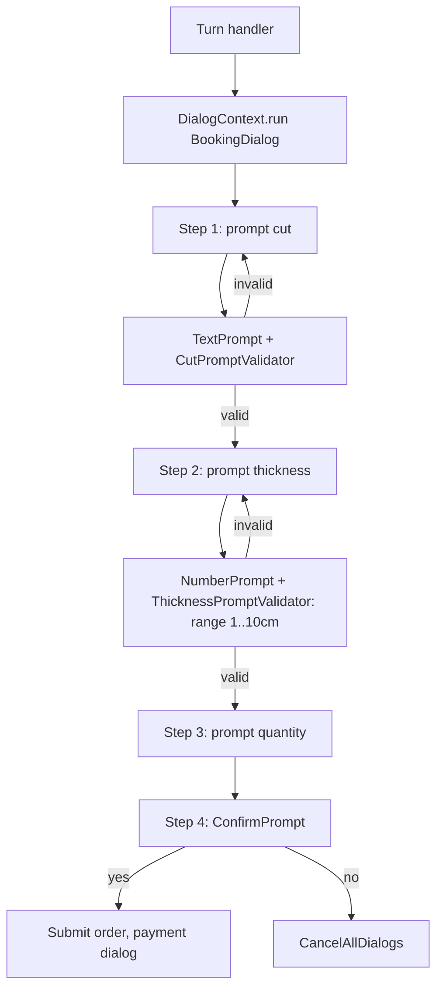
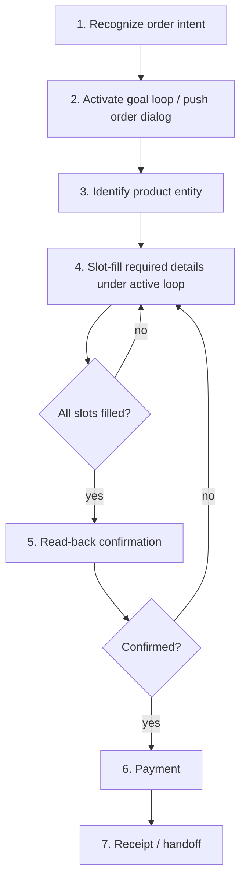
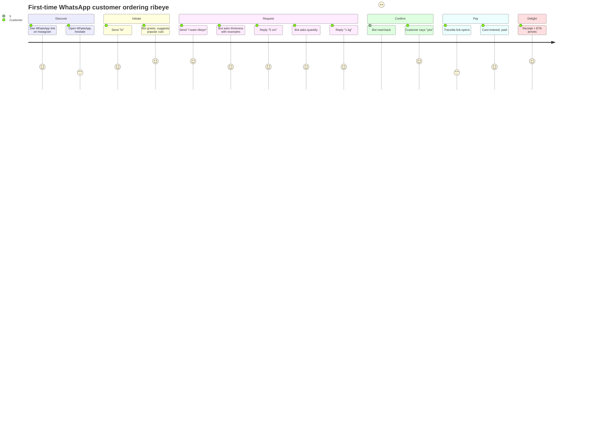
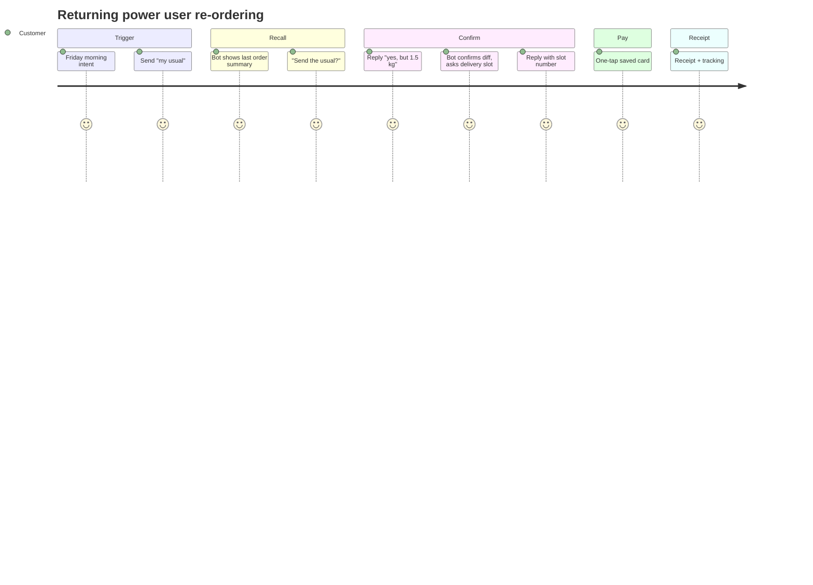

# Researcher 1 — Workflow & Journey Research: Intent Clarification Engine

**Author:** Researcher 1 (Product Research Team)
**Date:** 2026-05-17
**Scope:** How four open-source conversational commerce frameworks structure the ordering workflow and route short / ambiguous mid-flow replies.
**Frameworks studied:** Rasa Open Source (3.x), Botpress (v12 + modern), Microsoft Bot Framework (v4 SDK), Tock (theopenconversationkit/tock).
**Benchmarked against:** Maître.ai's current LLM-classifier + state-machine + bypass-handler architecture.

---

## 1. Executive Summary

Across all four frameworks, the dominant pattern for a reliable ordering workflow is *not* "classify every turn from scratch." It is **state-anchored slot filling under an active loop**: once the bot has decided it is collecting product details, the dialogue manager binds subsequent turns to the slot it is currently asking for, and only relinquishes that binding under explicit conditions (slot filled, user interruption recognized as an intent strong enough to break out, or explicit abort). Rasa's `FormPolicy` / `active_loop`, Bot Framework's `WaterfallDialog` + `Prompt`, Botpress v12's Slot-skill transitions (`on Extracted` / `on Not Found` / `on Already Extracted`), and Tock's `StoryStep` mechanic are four different syntaxes for the same idea. Maître.ai's "bypass handlers" already encode this pattern for three states (`awaiting_cart_fields`, `awaiting_delivery_slot`, `awaiting_confirmation`) — but the failure mode in the bug transcript is that the *first* product-request turn never enters the active loop, so turn 2's short answer has no slot to attach to. Adopting a Rasa-style **goal-aware active loop** that activates the moment the first product intent is recognized — not after the user has already filled enough slots to commit a cart — is the structural fix.

---

## 2. Per-framework workflow analysis

### 2.1 Rasa Open Source 3.x

**Architecture.** Rasa is the most academically faithful "two-stack" dialogue system: a *symbolic* NLU pipeline (tokenizer → featurizer → DIETClassifier for joint intent + entity extraction) feeds a *dialogue manager* whose policies — `RulePolicy`, `MemoizationPolicy`, `TEDPolicy` — vote on the next system action. Forms are not a separate engine; they are an `active_loop` flag on the tracker state plus a `FormValidationAction` custom action. While the loop is active, the `RulePolicy` short-circuits all other policies for slot-filling turns. ([legacy-docs-oss.rasa.com/forms](https://legacy-docs-oss.rasa.com/docs/rasa/forms/))

**Ordering workflow.**

```mermaid
flowchart TD
    A[User: "I want ribeye"] --> B[DIETClassifier: intent=order_meat, entity=ribeye]
    B --> C{RulePolicy: form trigger?}
    C -->|yes| D[Activate order_form, set active_loop]
    D --> E[Ask required_slot: thickness]
    E --> F[User: "5 cm"]
    F --> G[FormValidationAction.extract_thickness]
    G --> H{validate_thickness ok?}
    H -->|yes| I[SlotSet thickness=5cm, ask next slot: quantity]
    H -->|no| E
    I --> J[All required_slots filled?]
    J -->|no| E
    J -->|yes| K[Deactivate loop, run action_submit_order]
    K --> L[Confirm + payment]
```

**Short / ambiguous replies mid-flow.** While `active_loop` is set, Rasa runs `extract_<slot>` first; if the slot mapping is `from_text`, *any* user utterance is taken as the slot value verbatim — including "5 cm". This is the key behavior: Rasa does **not** re-classify intent on every turn when the form is active, because the policy stack defers to the form. The slot mapping decides what counts as a fill. To handle context-specific unhappy paths (e.g. "why do you need to know that?"), the docs explicitly recommend adding `requested_slot` to the domain as a categorical slot with `influence_conversation: true` — i.e. the *current ask* becomes part of state. ([legacy-docs-oss.rasa.com/forms#handling-conditional-slot-logic](https://legacy-docs-oss.rasa.com/docs/rasa/forms/), [dev.to/petr7555/rasa-unhappy-paths](https://dev.to/petr7555/rasa-unhappy-paths-d49))

**Evidence link.** `RasaHQ/rasa-demo/actions/actions.py` — `SalesForm` (`subscribe_newsletter_form`) shows `validate_<slot>` methods returning `SlotSet` events; the `data/rules.yml` shows the `active_loop` transition rules.

**Strengths.** Deterministic, debuggable; the `tracker.active_loop` flag is a single source of truth; built-in re-ask on validation failure; "interactive learning" workflow to discover unhappy paths empirically.

**Limitations.** YAML-heavy; the policy stack is opaque to product people; Hebrew/RTL requires a custom tokenizer (e.g. Stanza or HebPipe) — no first-party Hebrew model. ([rasa.com/blog/non-english-tools-for-rasa](https://rasa.com/blog/non-english-tools-for-rasa)). Rasa Pro's CALM (LLM-flow) deprecates `FormPolicy` in favor of `collect` steps, so the long-term direction is convergent with Maître's LLM-first stance — but the active-loop semantics survive.

---

### 2.2 Botpress (v12 + modern)

**Architecture.** Two generations coexist. **v12** (`github.com/botpress/v12`) is a classic symbolic stack: visual flow builder, nodes connected by labeled transitions, an NLU module that emits `event.nlu.intent.name` and `event.nlu.slots`, and a built-in **Slot skill** that wraps slot-filling state. **Modern Botpress** (`github.com/botpress/botpress`, the LLM-era cloud product) replaces NLU with LLM-driven "Autonomous Nodes" that decide transitions, but the underlying flow primitive is the same. ([Botpress Flow Logic docs](https://botpress.com/docs/studio/concepts/cards/flow-logic), [Alibaba Cloud crash-course](https://www.alibabacloud.com/blog/advanced-concepts-in-botpress-a-crash-course_596225))

**Ordering workflow.**

```mermaid
flowchart TD
    A[User: "I want ribeye"] --> B[NLU: intent=order_product, entity=ribeye]
    B --> C[main flow node: start_order]
    C --> D[Slot skill: ask thickness]
    D --> E{slot extracted?}
    E -->|on Extracted| F[Slot skill: ask quantity]
    E -->|on Not Found| G[reprompt counter++]
    G --> H{retries < N?}
    H -->|yes| D
    H -->|no| I[fallback flow]
    E -->|on Already Extracted| F
    F --> J[Slot skill: ask delivery]
    J --> K[confirm_node]
    K --> L[payment_node]
```

**Short / ambiguous replies mid-flow.** The **Slot skill** node binds the next user turn to a specific slot. Botpress documents three deterministic outgoing transitions per slot node: `on Extracted`, `on Not Found`, `on Already Extracted`, with an optional validation action — *if* `temp.valid !== true` the skill **retries the same slot** rather than advancing. ([Botpress v12 issue #1216 / #1396](https://github.com/botpress/v12/issues/1216), [issue #2269](https://github.com/botpress/botpress/issues/2269)). Crucially the user's reply *is not* re-classified against the global intent set unless the user types a phrase the NLU scores above a configured "jump intent" threshold — short numeric/unit answers like "5 cm" almost never trigger a re-classification because their NLU confidence is low and they are caught by the active slot's extractor first.

**Evidence link.** `botpress/v12/modules/builtin/src/backend/skills/slot.ts` — the slot skill state machine; documents `on Extracted` / `on Not Found` / `on Already Extracted` transitions.

**Strengths.** Visual, PM-readable; retries are configurable per slot; the "Already Extracted" branch elegantly handles the case where the user volunteers slot data ahead of the ask ("I want ribeye 5cm thick please" — both `cut` and `thickness` get filled in one turn).

**Limitations.** Hebrew/RTL is community-only on v12; modern Botpress relies on LLM understanding so RTL is fine but the flow definitions are JSON not YAML; no first-class confirmation/payment primitives (must be wired by hand).

---

### 2.3 Microsoft Bot Framework (v4 SDK)

**Architecture.** Bot Framework's mental model is the **Dialog Stack**: a runtime stack where each pushed `Dialog` is the active dialog and receives all input. The Dialog SDK ships three composable types: `ComponentDialog` (container), `WaterfallDialog` (sequence of `async step(stepContext)` functions executed one per turn), and `Prompt` (a 2-step micro-dialog that asks → validates → returns). Each `Prompt` accepts a **`PromptValidator`** — a function that receives `PromptValidatorContext { recognized, options }` and returns `bool`. If validation fails, the retry-prompt is sent and the same step is repeated. NLU is pluggable (LUIS, CLU, Orchestrator, or a custom recognizer). ([Microsoft Learn — waterfall dialogs](https://learn.microsoft.com/en-us/azure/bot-service/bot-builder-concept-waterfall-dialogs))

**Ordering workflow.**



**Short / ambiguous replies mid-flow.** When a `Prompt` is on top of the stack, **the dialog context routes every incoming turn to that prompt's recognizer** — CLU/LUIS intent recognition does *not* fire unless the bot's turn handler explicitly invokes it before `dc.continueDialog()`. In the `CoreBot` sample, the top-level interruption pattern is: each waterfall step checks `LuisRecognizer` results *before* delegating to the child dialog, and only intents like `Cancel` / `Help` short-circuit the stack. Otherwise the active `Prompt` consumes "5 cm" via the `NumberPrompt` recognizer with units extraction. ([Microsoft Learn — prompts](https://learn.microsoft.com/en-us/azure/bot-service/bot-builder-prompts), [c-sharpcorner.com — Prompt and Waterfall](https://www.c-sharpcorner.com/article/prompt-and-waterfall-dialog-in-bot-v4-framework-bot-builder-net-core/))

**Evidence link.** `microsoft/BotBuilder-Samples/samples/javascript_nodejs/13.core-bot/dialogs/bookingDialog.js` — the `destinationStep`, `originStep`, `travelDateStep`, `confirmStep` waterfall, plus `dateResolverDialog.js`'s `DateTimePrompt` with a `dateTimePromptValidator`.

**Strengths.** Strongest stack discipline of the four; the dialog-stack metaphor is correct ("push/pop" is exactly what `awaiting_*` states represent); `Prompt` + `PromptValidator` is the cleanest two-line implementation of "re-ask if invalid"; CLU's joint intent+entity extraction is comparable to DIET.

**Limitations.** Verbose; you write each step explicitly; Hebrew is supported by CLU but RTL rendering is channel-side; the *interruption* pattern (top-level intent classifier that can preempt the stack) is a hand-wired convention, not a framework primitive — every sample wires it slightly differently.

---

### 2.4 Tock

**Architecture.** Tock (theopenconversationkit/tock) is the OSS dialogue platform that powers SNCF Connect's voice + chat assistant. Its core abstraction is the **Story**: a Kotlin/Node DSL declaration `story("order") { ... }` bound to a main intent. Stories own dialog state via `BotBus`. The killer primitive is the **`StoryStep`** — an enum-like marker indicating which sub-step of the story is currently expected; secondary intents and entity values are routed *to the step*, not the story root. ([Tock — Bot intégré](https://doc.tock.ai/tock/master/dev/bot-integre.html))

**Ordering workflow.**

```mermaid
flowchart TD
    A[User: "I want ribeye"] --> B[NLU: main intent=order]
    B --> C[story order activated, currentStep=ASK_THICKNESS]
    C --> D[Bot asks thickness]
    D --> E[User: "5 cm"]
    E --> F{currentStep == ASK_THICKNESS?}
    F -->|yes| G[Extract number+unit entity, set thickness]
    G --> H[currentStep=ASK_QUANTITY]
    H --> I[Bot asks quantity]
    I --> J[currentStep=CONFIRM]
    J --> K[Confirm + pay]
```

**Short / ambiguous replies mid-flow.** Tock distinguishes **primary intents** (will switch stories) from **secondary intents** (only fire if already in the matching story). Inside a story, the framework checks the `currentStep` first; if a `mandatory entity` is missing, the bot re-prompts before progressing. The story handler can call `resetDialogState()` to abandon. Numeric/unit answers are typically parsed by a Duckling-style entity provider, not re-classified as a new top-level intent. ([Tock docs — building stories](https://doc.tock.ai/tock/master/dev/build-stories/), [tock-bot-open-data](https://github.com/theopenconversationkit/tock-bot-open-data))

**Evidence link.** `theopenconversationkit/tock-bot-open-data` — the SNCF demo's `SearchStory.kt` defines `currentStep` transitions for `departureCity`, `arrivalCity`, `travelDate`. Same pattern, different domain.

**Strengths.** Production-hardened (SNCF, French government bots); the `StoryStep` enum is the cleanest "what is the bot waiting for" type in the four frameworks; first-class i18n with multi-language story responses; runs in JVM or Node.

**Limitations.** Kotlin-centric (Node SDK is a bridge); smaller community than Rasa/Bot Framework; less documentation in English; Hebrew/RTL not a first-class concern but the entity layer is language-agnostic.

---

## 3. The unified workflow rhythm

Distilled across all four frameworks, the ordering rhythm is **seven phases**:



The discriminating decision is at **Phase 2**: every framework activates a *goal loop* the moment intent is recognized, and only that loop is allowed to interpret subsequent short replies until the goal is satisfied or explicitly abandoned. This is the architectural anchor missing from Maître's current pipeline for the *first* turn of an ordering session.

---

## 4. Customer journey maps

### 4.1 First-time customer (discovery → confirmed order)



### 4.2 Returning power user (recall + quick order)



Power users punch through phases 1–4 in a single turn; the bot must accept compound inputs and still confirm before charging.

---

## 5. The bug-transcript test (the acceptance criterion)

**Transcript under test (translated):**

| # | Speaker | Utterance |
|---|---------|-----------|
| 1 | Customer | "I want ribeye" (`אני רוצה אנטריקוט`) |
| 2 | Bot | "How thick?" |
| 3 | Customer | "5 cm" |
| 4 | Bot | "Is 5cm the thickness for the sirloin you wanted?" (CONFUSED — wrong product, lost context) |
| 5 | Customer | "yes" |
| 6 | Bot | "Hi, how can I help?" (TOTAL CONTEXT LOSS) |

The transcript shows two failures: **(a)** turn 4 mis-binds the thickness to a different product, **(b)** turn 6 restarts the session entirely. Both happen because no goal loop was activated at turn 1.

### 5.1 Rasa Open Source

- **Turn 1:** DIET classifies `intent=order_meat`, entity `cut=ribeye`. `RulePolicy` fires `order_form`, pushes `active_loop=order_form`, `requested_slot=thickness`.
- **Turn 3 ("5 cm"):** Because `active_loop=order_form` is set, the policy stack hands the turn to the form. `extract_thickness` (mapping `from_text` or a numeric+unit entity) returns `5 cm`. `validate_thickness` passes. `requested_slot` advances to `quantity`.
- **Turn 5 ("yes"):** If `requested_slot=confirm`, a `ConfirmPrompt`-equivalent yes/no slot fills. The form deactivates and `action_submit_order` runs.
- **Loss path?** The only way Rasa loses context is if a different intent scores above the `core_fallback_threshold` *and* a rule explicitly handles interruption. By default, "5 cm" cannot ever produce intent `nlu_fallback` because the form takes precedence.
- **Verdict: would NOT lose context.**

### 5.2 Botpress (v12 Slot skill)

- **Turn 1:** Intent `order_product` matched, transition to `start_order` flow. Slot skill node `ask_thickness` activated.
- **Turn 3:** Slot skill calls its extractor on "5 cm". `temp.valid = true` (numeric+unit pattern). Transition `on Extracted` → `ask_quantity` node.
- **Turn 5:** Final `Confirm` slot or choice node returns `yes`. Submit order.
- **Loss path?** Only if `event.nlu.intent.confidence` for a different intent exceeds the configured "intent suggestion" threshold *and* the flow has a global "jump on intent" transition. "5 cm" is too short to score a strong intent — Slot skill keeps the active binding.
- **Verdict: would NOT lose context.**

### 5.3 Microsoft Bot Framework

- **Turn 1:** Top-level `MainDialog` runs LUIS/CLU; `BookFlight` intent recognized, `BookingDialog` pushed to stack. Step 1 (cut) is satisfied from the entity; step 2 (thickness) prompts.
- **Turn 3:** `NumberPrompt` is at top of stack. `dc.continueDialog()` routes turn to the prompt. `numberPromptValidator` parses "5 cm" → `5`. Waterfall advances to quantity step.
- **Turn 5:** `ConfirmPrompt` parses "yes". Booking submits.
- **Loss path?** Only if the bot's `onMessage` handler runs LUIS *before* `dc.continueDialog()` and the LUIS intent confidence for `Cancel`/`Help` exceeds threshold (the standard interruption hook). "5 cm" produces no such top-level intent.
- **Verdict: would NOT lose context.**

### 5.4 Tock

- **Turn 1:** Main intent `order` matched, `OrderStory` activated, `currentStep = ASK_THICKNESS`.
- **Turn 3:** Tock checks `currentStep` first. The story handler reads the `number` + `unit` entities from Duckling. `thickness` set, `currentStep = ASK_QUANTITY`.
- **Turn 5:** `currentStep = CONFIRM`, a `yes_no` secondary intent fires only within the story scope.
- **Loss path?** A *primary* intent (not secondary) classified on turn 3 would override. "5 cm" cannot match a primary intent unless one is misconfigured.
- **Verdict: would NOT lose context.**

### 5.5 Contrast with Maître.ai's current architecture

Maître's current pipeline:

```
inbound turn → Claude Haiku classifier → IntentKind → engine.transition()
                                                       │
                                                       └── if state ∈ {awaiting_cart_fields,
                                                                        awaiting_delivery_slot,
                                                                        awaiting_confirmation}
                                                                        → bypass handler
                                                                        else → LLM router
```

The bypass handler is **exactly** the active-loop pattern of the other four frameworks — it short-circuits classification and routes deterministically. The bug is that **the loop is activated too late**. The state transitions to `awaiting_cart_fields` only *after* the engine has decided a cart exists. On turn 1, `"אני רוצה אנטריקוט"` ("I want ribeye") gets classified by Haiku, and because it can be plausibly read as `ask_about_cut` ("the customer is asking about the ribeye cut"), the concierge LLM role-plays a Q&A response instead of opening a cart. State stays at `browsing`. Turn 3's "5 cm" then hits the *full LLM classifier* again; it's a 4-char numeric input with no semantic anchor, so Haiku guesses — and guesses wrong (turn 4's confused mis-attribution to "sirloin" looks like the LLM hallucinating the previously discussed product). Turn 5's "yes" reaches the classifier with no remembered question, gets routed to `greeting`/`smalltalk`, and the engine resets (turn 6).

**Root cause:** Maître treats the cart-open transition as a fact derived from accumulated slots, whereas the four reference frameworks treat it as a **commitment** triggered the instant an ordering intent is recognized. Once committed, subsequent short turns are *defined to be* slot fills, not new classifications.

---

## 6. Comparative workflow matrix

| Dimension | Rasa OSS 3.x | Botpress v12 | MS Bot Framework v4 | Tock |
|---|---|---|---|---|
| **Entry handling** | Intent → `RulePolicy` activates form | Intent transition to flow with Slot skill | Top-level intent → push `ComponentDialog` | Primary intent → activate Story |
| **Intent classification** | DIETClassifier (joint intent+entity) | Built-in NLU or external (Dialogflow/LUIS) | Pluggable (LUIS / CLU / Orchestrator / custom) | Built-in NLP (OpenNLP/Stanford/Rasa-compat) |
| **Slot filling mechanism** | `active_loop` + `required_slots` + `validate_<slot>` | Slot skill node with `on Extracted` / `on Not Found` / `on Already Extracted` | `Prompt` family (`TextPrompt`, `NumberPrompt`, `ChoicePrompt`, `ConfirmPrompt`, `DateTimePrompt`) | `StoryStep` enum + `mandatory entities` |
| **Short-answer routing (mid-flow)** | Form short-circuits all other policies via `RulePolicy` | Slot skill binds turn; only "jump intent" can preempt | Active prompt at top of stack consumes turn unless top-level interruption handler fires | `currentStep` matches before re-classifying as new story |
| **Fallback policy** | `nlu_fallback` intent + `FallbackClassifier` | Default catch-all transition + retry counter | `DefaultRecognizer` / no-match → retry prompt | `unknown` intent → `unknown` story or fallback story |
| **Recall / reorder** | Custom action reads `tracker.events` | Custom action queries DB | Custom dialog + state accessor | Custom story handler + persisted user profile |
| **Confirmation pattern** | Final required slot of type `bool` or explicit `utter_confirm` + `action_submit` | Dedicated confirm node before transaction node | `ConfirmPrompt` as final waterfall step | `currentStep = CONFIRM` with yes/no secondary intent |
| **Payment integration** | Custom action → external API (no first-party primitive) | Custom action card / external webhook | Custom dialog + adaptive card (no first-party primitive) | Connector-specific action |
| **Hebrew / RTL** | NLU is language-agnostic; needs custom tokenizer (Stanza/HebPipe); no first-party Hebrew model ([rasa.com/blog/non-english-tools-for-rasa](https://rasa.com/blog/non-english-tools-for-rasa)) | NLU bundles MS / FastText; Hebrew via community models; RTL rendering is channel-side | CLU supports Hebrew tier; RTL is channel responsibility | Entity layer language-agnostic; Hebrew via Duckling/custom; RTL channel-side |

---

## 7. Progression model — beginner → power user

| Stage | Customer behavior | What unlocks | Bot affordance |
|---|---|---|---|
| **Beginner** (turns 1–3 in their first session) | Sends "hi", "do you have ribeye?", "how much?" | Bot must hand-hold: ask one slot per turn, include example values ("e.g., 3cm, 5cm"), allow free-text fallback. | Re-prompts with examples; explains terms; offers menu cards. |
| **Intermediate** (sessions 2–4) | Sends "I want ribeye 5cm thick, 1kg" (multi-slot in one turn). Skips greetings. | Bot recognizes compound entity extraction; only asks for missing slots; persists `customer_profile.preferences`. | "I'll send your usual cut style — confirm quantity?" |
| **Power user** (sessions 5+) | Sends "my usual", "same as last time, +1kg", a single emoji, or just a slot number from a delivery menu. | Bot pulls last order, offers one-tap confirm, accepts deltas ("+1kg") relative to last order; saved-card one-tap. | Read-back diff vs. last order; single-click confirm; receipt push. |

Applied to ordering, the structural requirement is that **the same active-loop machinery serves all three stages** — the beginner gets re-prompts with examples, the power user fills every slot in one compound turn and the loop deactivates immediately after read-back. The state machine should not bifurcate.

---

## 8. Key insights for PMs

1. **Adopt a Rasa-style `active_loop` semantics for cart sessions.** The moment any ordering intent (`order_product`, `add_to_cart`, `request_quantity`) is recognized with confidence above a threshold, the engine should push an `awaiting_product_details` state and bind subsequent turns to it. This is the single biggest fix.
2. **Maître's bypass-handler pattern is already correct architecture — it is only mis-applied to the *first* turn of an order.** The three current bypass states (`awaiting_cart_fields`, `awaiting_delivery_slot`, `awaiting_confirmation`) map cleanly to phases 4, 4b, 5 of the unified rhythm; we are missing a bypass for phase 3 (product-detail collection).
3. **"Goal awareness" should mean a typed enum on the conversation state — not an LLM inference.** Borrow Tock's `StoryStep` and Bot Framework's dialog stack: store `currentGoal: { kind: 'order'; subStep: 'thickness' | 'quantity' | 'confirm' }` on the conversation document. The classifier reads it; the handler trusts it.
4. **Every "what is the bot waiting for?" answer must be a slot, not an intent.** Short replies ("5 cm", "yes", "1 kg") should never reach the LLM classifier when a slot is requested. They go to a per-slot extractor (numeric+unit regex first, LLM extractor only on failure).
5. **The classifier needs a "currently asked slot" feature.** Even if we keep the LLM classifier, prepend the *current question* and the *expected slot type* into the prompt — most production frameworks gate routing on this state field, not raw user text.
6. **Add an "Already Extracted" branch like Botpress.** When the user volunteers thickness+quantity in one turn ("I want ribeye 5cm 1kg"), the engine should fill both and skip to the next unfilled slot — not re-ask.
7. **Re-prompts must include the prior question as anchor text.** Bot Framework's `retryPrompt` and Rasa's `utter_ask_<slot>` are templated to repeat the question on validation failure; this is the user-facing answer to "the bot forgot what it asked me."
8. **Confirmation read-back is non-negotiable.** All four frameworks gate payment behind an explicit yes/no confirmation that lists the full order. We must do the same — and treat the confirm slot as another active-loop slot, not a new turn that gets re-classified.
9. **Define a small set of "global interruption" intents that may preempt the active loop.** Bot Framework's `Cancel`/`Help` pattern. For Maître: `cancel`, `talk_to_human`, `start_over`. Everything else stays within the loop.
10. **Track unhappy-path coverage as a product metric.** Rasa's docs explicitly recommend "interactive learning" — replaying real conversations against the bot — because hand-written rules miss interruptions. We should capture every `nlu_fallback` (or its Maître equivalent) and triage them weekly.

---

## 9. Edge cases identified (workflow-side)

| # | Edge case | Triggers when | How frameworks handle it | Recommendation for Maître |
|---|---|---|---|---|
| 1 | **Ultra-short mid-flow reply** ("5 cm", "yes", "1") | User answers the bot's question literally. | Rasa: form extractor; Botpress: Slot skill; MS BF: `Prompt`; Tock: `currentStep`. All consume it without re-classifying. | Slot-bound handler must run *before* LLM classifier when state has a requested slot. |
| 2 | **Compound multi-slot turn** ("ribeye 5cm 1kg") | Power user front-loads info. | Rasa: form fills multiple slots in one turn; Botpress: "Already Extracted" branch skips ahead; MS BF: developer must check `Recognized.Entities` per step. | Add an `extractAllAvailableSlots` pass on each turn and skip slot questions whose answer is already known. |
| 3 | **Mid-flow topic change** ("actually, do you have lamb?") | User changes product mid-cart. | Rasa: `ActionExecutionRejection` + rule routes to chitchat then resumes; MS BF: top-level intent classifier preempts; Botpress: jump-intent transition. | Detect intent-confidence spike → ask "switch to lamb and drop ribeye?" — explicit confirmation before clearing state. |
| 4 | **Mid-flow question about the bot/business** ("are you open Sunday?") | User asks an FAQ during slot filling. | Rasa: chitchat rule responds without deactivating loop; Tock: secondary intent answers in-story. | Add a "loop-safe FAQ" intent: answer + re-prompt the requested slot. |
| 5 | **Ambiguous yes/no** ("ok", "sure", "👍", "k") | Confirmation step. | All four use a `ConfirmPrompt`/yes_no slot with multi-token mapping. | Maintain a yes/no vocabulary (Hebrew + English) at the slot extractor, not the LLM. |
| 6 | **Out-of-stock product mid-flow** | Inventory check fails after slot fill. | None handle this natively — all require a custom action that re-asks product. | Define a `product_unavailable` event that re-enters the product-selection step but preserves quantity/thickness. |
| 7 | **User aborts** ("never mind", "cancel") | Intentional drop-out. | Rasa: `action_deactivate_loop`; Botpress: jump intent to fallback flow; MS BF: `cancelAllDialogs`. | Map to existing `cancel_order` intent; clear state with confirmation. |
| 8 | **Session timeout / re-entry** ("hi again" 3 days later mid-flow) | User returns to a stale state. | Rasa: tracker session config resets after timeout; MS BF: storage TTL. | TTL on cart session; on re-entry offer "resume your ribeye order?" before classifying. |
| 9 | **Unit-less numeric** ("5" when asked thickness) | User omits unit. | Bot Framework number prompt with validator: re-prompt with unit; Rasa validate_<slot> rejects. | Slot extractor must distinguish "5" (ambiguous) from "5 cm" (valid) and re-ask with unit hint. |
| 10 | **Out-of-domain reply** ("the weather is nice") | User goes off-topic. | All four route to fallback / chitchat without breaking active loop. | Loop-safe fallback responder + re-prompt requested slot. |

---

## 10. Open questions

1. **Should the active-loop semantics be implemented as a *new* engine primitive, or should it be expressed by adding `awaiting_product_details` as a fourth bypass state?** (My recommendation is the latter — minimal change, maximum reuse — but architectural call belongs to CTO/Architect.)
2. **What is the confidence threshold for "ordering intent recognized" that opens the active loop?** Too low and we trap users who were just asking; too high and we miss the bug-transcript case again.
3. **For the "loop-safe FAQ" intent (edge case #4), which questions should the bot answer mid-cart vs. which should defer?** Hours, allergens, delivery zones likely yes; "tell me about your sourcing philosophy" likely no.
4. **Do we want Botpress-style "Already Extracted" multi-slot fills in MVP, or defer to v2?** It requires every slot extractor to run on every turn, not just the requested one — modest extra cost, big UX win for power users.
5. **How do we score success?** Suggested KPI: % of ordering sessions that complete payment without an intent-classification reset event between turns 1 and confirmation. Sub-KPI: median number of "I didn't understand" re-prompts per completed order.

---

## Sources

- [Rasa Forms documentation (legacy-docs-oss)](https://legacy-docs-oss.rasa.com/docs/rasa/forms/)
- [Rasa Slot Filling (legacy-docs)](https://legacy-docs.rasa.com/docs/core/slotfilling/)
- [Rasa "Unhappy Paths" tutorial — dev.to/petr7555](https://dev.to/petr7555/rasa-unhappy-paths-d49)
- [Rasa Core re-asks for slot upon form interruption — issue #7751](https://github.com/RasaHQ/rasa/issues/7751)
- [Rasa SDK — next slot inconsistency on unhappy path — issue #389](https://github.com/RasaHQ/rasa-sdk/issues/389)
- [Rasa community forum — deactivating form when bool slot filled](https://forum.rasa.com/t/deactivate-a-form-loop-when-certain-slot-bool-is-filled-even-if-other-slots-are-not-filled/47091)
- [Rasa — Non-English Tools for Rasa NLU](https://rasa.com/blog/non-english-tools-for-rasa)
- [Botpress Flow Logic docs](https://botpress.com/docs/studio/concepts/cards/flow-logic)
- [Botpress v12 — Slot filling and disabled NLU — issue #1216](https://github.com/botpress/v12/issues/1216)
- [Botpress v12 — Slot filling validation skipped on already-extracted — issue #1396](https://github.com/botpress/v12/issues/1396)
- [Botpress — Custom validation not working for Slot Skill — issue #2269](https://github.com/botpress/botpress/issues/2269)
- [Alibaba Cloud — Advanced concepts in Botpress: a crash course](https://www.alibabacloud.com/blog/advanced-concepts-in-botpress-a-crash-course_596225)
- [Microsoft Learn — About component and waterfall dialogs](https://learn.microsoft.com/en-us/azure/bot-service/bot-builder-concept-waterfall-dialogs)
- [Microsoft Learn — Implement sequential conversation flow](https://learn.microsoft.com/en-us/azure/bot-service/bot-builder-dialog-manage-conversation-flow)
- [Microsoft Learn — Prompt users for input](https://learn.microsoft.com/en-us/azure/bot-service/bot-builder-prompts)
- [c-sharpcorner — Prompt and Waterfall Dialog in Bot v4](https://www.c-sharpcorner.com/article/prompt-and-waterfall-dialog-in-bot-v4-framework-bot-builder-net-core/)
- [BotBuilder-Samples — 13.core-bot (JS)](https://github.com/microsoft/BotBuilder-Samples/tree/main/samples/javascript_nodejs/13.core-bot)
- [Tock — Bot intégré (master docs)](https://doc.tock.ai/tock/master/dev/bot-integre.html)
- [Tock — tock-bot-open-data SNCF example](https://github.com/theopenconversationkit/tock-bot-open-data)
- [Tock — theopenconversationkit/tock repo](https://github.com/theopenconversationkit/tock)
- [Maître.ai — `docs/conversation-phases.md`](/Users/user/sourceControl/Maitre-ai/docs/conversation-phases.md)
- [Maître.ai — `docs/intent-catalog.md`](/Users/user/sourceControl/Maitre-ai/docs/intent-catalog.md)
