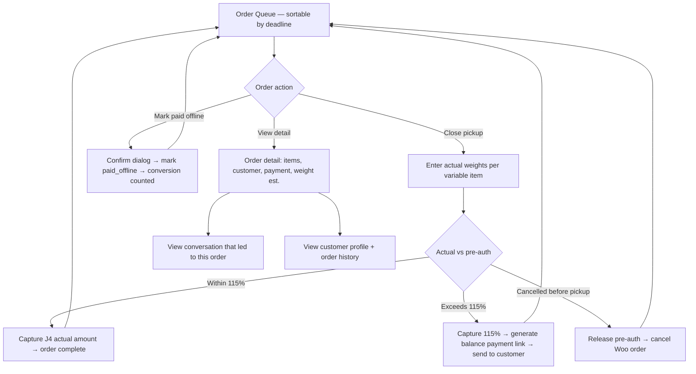
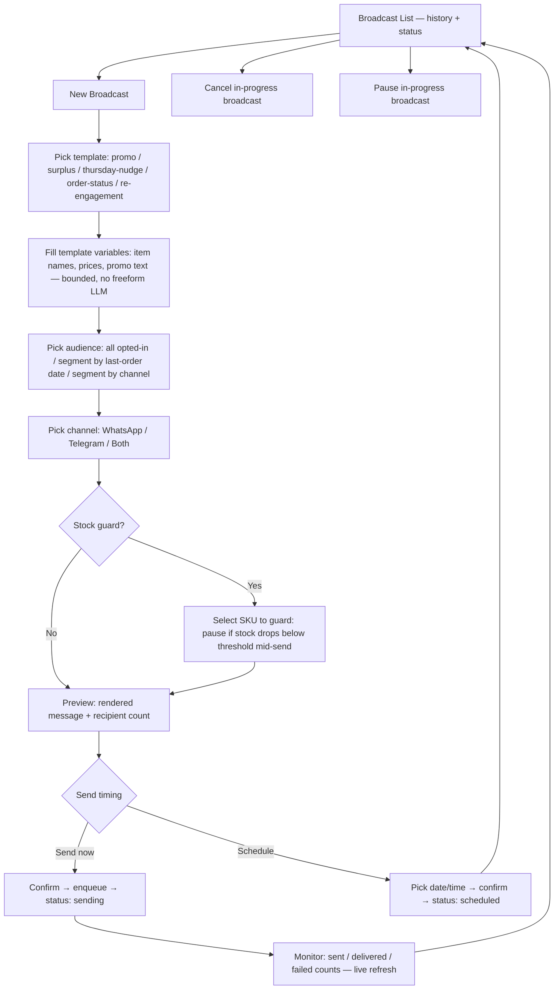
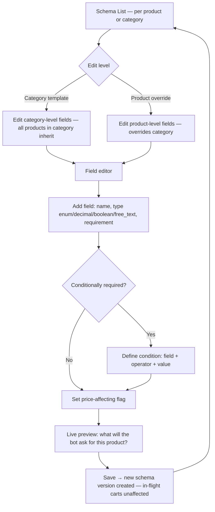
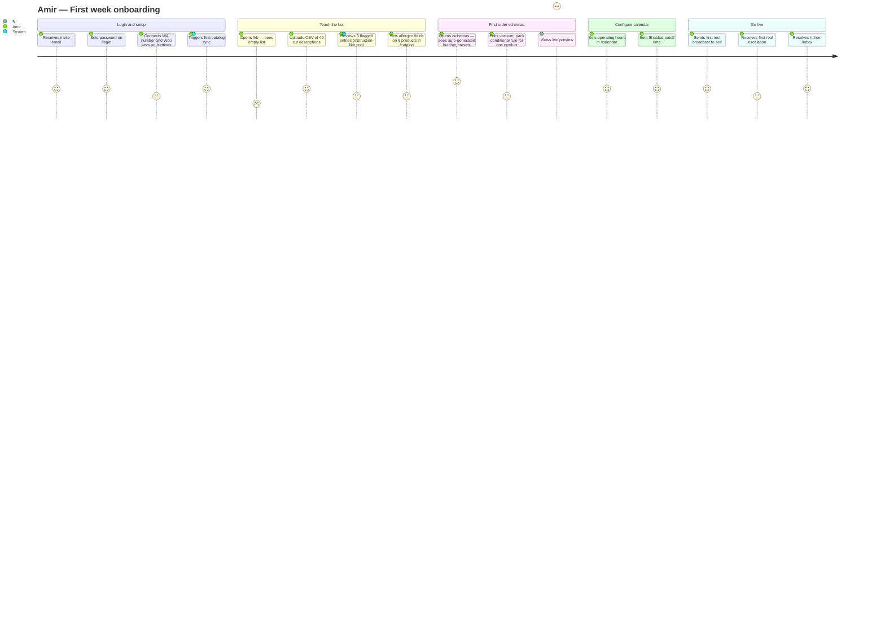
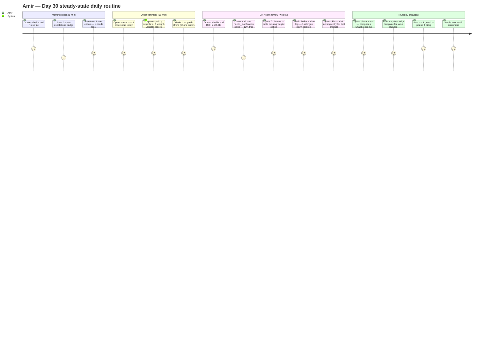

# Research Findings: Workflow & Journey — Admin SPA
## Product: Maître.ai Admin SPA (Sprint 7) | Researcher: researcher_1 | Date: 2026-04-27

---

### 1. Executive Summary

The Maître.ai Admin SPA is the shop owner's cockpit for a WhatsApp conversational commerce system. Unlike a standard WooCommerce or Shopify admin, it must expose bot-specific operations — KB authoring, order schema editing, escalation handling, and bot health monitoring — alongside the standard commerce operations (orders, broadcasts). The SPA ships in Sprint 7 with 9 pages. The most important insight from workflow analysis: **the owner's job is not just to manage — it's to teach and tune the bot**. KB authoring, allergen declarations, and schema editing are all "teach the bot" actions that have no equivalent in any standard commerce admin. The daily operations workflow is fast (orders + inbox take ~10 minutes/day once the bot is trained), but the initial setup workflow (KB + schemas + allergens) is where the owner spends the first week. Every page must guide a non-technical shop owner through an experience that no existing tool prepares them for.

---

### 2. End-to-End Admin Workflow

#### 2.1 Complete Admin Navigation Map

```mermaid
flowchart TD
    LOGIN[/login — Email + password] --> DASH[/dashboard — Pulse/Money/Ops/BotHealth]
    DASH --> INBOX[/inbox — Escalations + live convos]
    DASH --> ORDERS[/orders — Queue + capture]
    DASH --> KB[/kb — Knowledge base authoring]
    DASH --> BROADCAST[/broadcasts — Promo composer]
    DASH --> SCHEMAS[/schemas — Schema editor]
    DASH --> CATALOG[/catalog — Products mirror]
    DASH --> CALENDAR[/calendar — Hours + holidays]
    DASH --> SETTINGS[/settings — Config + users + kill switch]

    INBOX -->|Resolve ticket| DASH
    ORDERS -->|Capture pickup weight| ORDERS
    KB -->|Preview in bot| KB
    SCHEMAS -->|Live preview| SCHEMAS
    BROADCAST -->|Send or schedule| BROADCAST
    CATALOG -->|Edit allergens| CATALOG
    SETTINGS -->|Kill switch| DASH
```

#### 2.2 KB Authoring Workflow

```mermaid
flowchart TD
    KBL[KB Entry List] --> KBA{Action?}
    KBA -->|New entry| KBC[Create form: title, body, SKU, type]
    KBA -->|Edit existing| KBE[Edit form pre-filled]
    KBA -->|CSV bulk upload| KBCSV[CSV picker → validate → preview diff → confirm upsert]
    KBA -->|Search/filter| KBF[Filter by type: cut/topic/occasion/allergen]

    KBC --> KBF1[Fill: title HE/EN, body markdown, cooking method, pairings, serving size, substitutes]
    KBF1 --> KBA2[Set allergen fields: gluten_free / kosher / halal / dairy_free / vegan / nut_free]
    KBA2 --> KBP[Preview: see how bot will answer "what is X"]
    KBP --> KBS[Save → entry flagged if body contains instruction-like text → owner review]
    KBE --> KBF1

    KBCSV --> KBCSVV{Validation pass?}
    KBCSVV -->|Errors| KBCSVE[Show row-by-row errors + download error CSV]
    KBCSVV -->|Clean| KBCSVP[Preview: N new, M updated, 0 deleted]
    KBCSVP --> KBCSVC[Confirm → bulk upsert]

    KBS --> KBL
    KBCSVC --> KBL
```

#### 2.3 Order Management and Pickup Capture Workflow



#### 2.4 Broadcast Compose and Send Workflow



#### 2.5 Schema Editor Workflow



---

### 3. Persona Journey Maps

#### 3.1 Amir — Day 1 Onboarding (New owner, first week)



#### 3.2 Amir — Day 30 Daily Operations (Steady state)



---

### 4. Competitive Admin Dashboard Analysis

| Platform | Order management | Knowledge/content | Bot health metrics | Broadcast | Schema/product config | Hebrew/RTL |
|---|---|---|---|---|---|---|
| WooCommerce admin | Full order CRUD | Product editor (no bot layer) | None | None | Variable/attribute editor | Partial (plugins) |
| Shopify admin | Full order CRUD | Product metafields | None | Basic email | Metafield editor | Partial |
| Wati (WhatsApp BSP) | Basic order view | FAQ/flow builder | Basic conversation counts | Template broadcast | None | Yes |
| respond.io | Conversation inbox | Canned responses | Some conversation metrics | Broadcasts | None | Yes |
| Interakt | Order overview | Basic FAQ | Delivery rate only | Template broadcast | None | Yes |
| **Maître.ai S7** | **Order queue + weight capture + offline-paid** | **KB authoring + allergen fields + CSV + review flags** | **Validator verdicts + LLM cost + jailbreak counts + hallucination flags** | **Template + stock guard + audience segment** | **Per-product field editor + conditions + live preview** | **Full RTL — every page tested** |

**Baseline to beat:** Every BSP shows broadcast delivery rates and conversation counts. None show: validator verdict distribution, LLM cost breakdown (concierge vs validator), jailbreak/refusal counts, allergen claim blocks, or schema-driven bot questioning.

---

### 5. Progression Model

| Stage | Timeline | Owner focus | Key pages used | What they add |
|---|---|---|---|---|
| Beginner | Week 1 | Setup: KB, schemas, calendar, allergens | /settings, /kb, /schemas, /catalog, /calendar | CSV bulk KB upload, butcher presets accepted, Shabbat cutoff set |
| Intermediate | Weeks 2–4 | Operations: orders, escalations, first broadcasts | /dashboard, /orders, /inbox, /broadcasts | Daily order capture routine, first promo sent, escalation response pattern learned |
| Advanced | Month 2+ | Optimization: Bot Health → tune schemas/KB based on data | /dashboard (Bot Health), /schemas, /kb | Reads validator needs_clarification rate, adds missing schema fields, adds KB entries for gaps the bot couldn't answer |
| Power | Month 3+ | Growth: cohort broadcasts, surplus promos, schema library | /broadcasts (segment targeting), /schemas (category templates) | Uses audience segmentation, sets surplus thresholds in /catalog, builds category-level schema templates |

---

### 6. Key Insights

1. **The "teach the bot" workflow is the first-week owner job** — KB authoring, allergen fields, and schema editing are more important than order management in Week 1.
2. **Dashboard must be action-oriented, not just informational** — every tile needs at least one direct action link (Pulse → /inbox, Bot Health → /schemas or /kb).
3. **Order capture is the most time-sensitive daily action** — /orders must be optimized for speed (scan queue → enter weights → done in under 5 min).
4. **The broadcast safety gate (stock guard) is a must-have, not a nice-to-have** — sending a promo for an OOS item is a trust-destroying event.
5. **Bot Health tile is the weekly tuning signal** — validator verdict rate + hallucination flags are the data the owner uses to know which schema fields to add and which KB entries to write.
6. **RTL is not just alignment** — interactive elements (dropdowns, date pickers, tables) need explicit RTL testing; Hebrew column headers truncate differently than English.
7. **Empty states are critical for new owners** — every page needs a helpful empty state with a clear first action, not just "No data".
8. **Schema editor live preview** is the "aha moment" for new owners — seeing exactly what the bot will ask for their product makes the abstract tangible.

---

### 7. Edge Cases Identified

| # | Page | Edge Case | Severity | Competitor Handling | Recommendation |
|---|---|---|---|---|---|
| AE1 | /kb | Owner saves KB entry with "ignore previous instructions" in body | High | None | Flag on save, require review before going live |
| AE2 | /kb | CSV upload with duplicate SKUs in the file | Medium | Import all, last wins silently | Show diff: N new, M updated, show which rows conflict |
| AE3 | /kb | Preview shows bot response for entry not yet saved | Low | N/A | Preview button disabled until entry is saved |
| AE4 | /orders | Two staff members capture the same order simultaneously | High | Double-capture | Optimistic lock on capture action — show "being captured by [name]" |
| AE5 | /orders | Actual weight exceeds 115% pre-auth cap | High | Manual resolution | Capture 115%, generate balance link, show clear status |
| AE6 | /broadcasts | Broadcast started, SKU goes OOS mid-send | Critical | Send anyway | Stock guard pauses automatically, owner notified in dashboard |
| AE7 | /broadcasts | Owner picks "All opted-in" but has 0 opted-in customers | Medium | Send to 0 with no warning | Show "0 recipients" prominently before confirm, offer to cancel |
| AE8 | /schemas | Owner deletes a required field that an in-flight cart depends on | High | Schema change breaks in-progress orders | Show "X active carts use this schema version" warning before save |
| AE9 | /catalog | Allergen field saved as true for product that has no KB entry | Medium | N/A — silently saved | Allow (the guard is in the backend), no special warning needed |
| AE10 | /settings | Kill switch activated while active payment is in-progress | High | N/A | Kill switch disables new payment links only; existing in-flight payments complete |

---

### 8. Open Questions

1. Can the owner compose a free-text broadcast message for Meta-template variables, or are all variables bounded to a picklist? (Sprint plan says "bounded, no freeform LLM paragraphs" — but is the bound a picklist or a character limit?)
2. Does the schema editor support reordering fields via drag-and-drop, or just add/remove?
3. What is the maximum number of fields per product schema? Is there an owner-visible limit?
4. On /orders, can staff members see revenue totals, or only order items? (PRD §10 says owner sees revenue; staff masked.)
