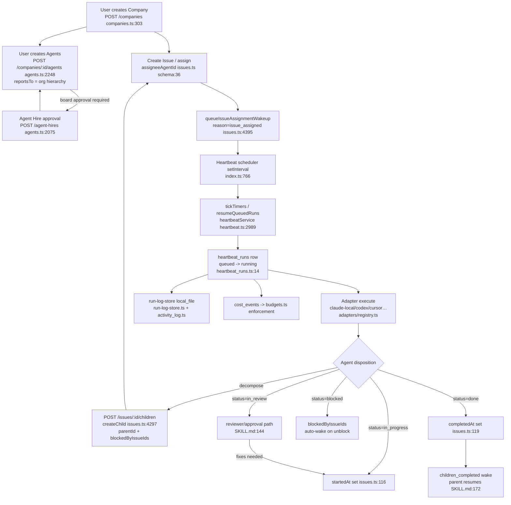

# MyHive — Researcher 1 (Workflow & Journey) Findings

**Product:** MyHive — self-hosted dashboard to create, orchestrate, and monitor AI agent teams doing real engineering work, JIRA-style 5-column board as primary surface.
**Source analyzed:** `~/sourceControl/paperclip/` (the existing Paperclip control plane).
**Date:** 2026-06-09
**Author role:** Researcher 1 — Workflow & Journey

---

## Executive Summary

Paperclip is already, in substance, ~80% of MyHive. It is a self-hosted Postgres + Express + React control plane where you create **companies**, populate them with **agents** organized into a **reporting hierarchy** (`agents.reportsTo` self-reference), assign **issues** (tickets), and a **heartbeat engine** wakes each agent on a `setInterval` scheduler to execute real work through pluggable **adapters** (`claude-local`, `codex-local`, `cursor-local/cloud`, `gemini-local`, `grok-local`, `opencode-local`, `acpx-local`, `pi-local`, `openclaw-gateway`). Work products, run logs, costs, and an activity log are all persisted.

Crucially for MyHive, Paperclip **already ships a Kanban board** (`ui/src/components/KanbanBoard.tsx`) with drag-to-update-status, backed by a 7-value issue status enum. The board is the natural primary surface MyHive wants. The single biggest gap between Paperclip and MyHive's spec is the **column model**: Paperclip's board renders all 7 raw statuses as fixed, non-configurable columns and has **no first-class "Plans" column** — plans live as a special issue *work mode* (`workMode: "planning"`) plus a plan-keyed document and a decomposition record, not as a distinct board lane. MyHive's 5-column board is a **view/projection problem on top of the existing status enum**, not a schema rebuild.

Delegation is real and first-class: an agent decomposes an assignment by `POST /issues/:id/children` (creating sub-issues with `parentId`, assignees, and `blockedByIssueIds` dependency edges), and the heartbeat dependency scheduler auto-wakes dependents when blockers reach `done`. Plans→tasks conversion is governed by the `paperclip-converting-plans-to-tasks` skill and recorded in the `issue_plan_decompositions` table.

**Bottom line for PMs:** MyHive should **fork/reuse Paperclip's backend wholesale** (schema, heartbeat engine, adapters, run-log store, activity log, budgets, delegation) and **rebuild only the board projection layer** — a 5-column view that (a) introduces a "Plans" lane fed by planning-mode issues showing only the overview, and (b) maps the remaining statuses into Open / In Development / In Review / Done.

---

## 1. End-to-End Workflow (with file:line evidence)

### a. Create company
- Route: `server/src/routes/companies.ts:303` — `router.post("/", validate(createCompanySchema), …)`.
- Schema: `packages/db/src/schema/companies.ts:3-35`. Company owns `issuePrefix` (default `"PAP"`), `issueCounter`, monthly budget cents, and `requireBoardApprovalForNewAgents`.

### b. Create agent / team (org structure)
- Direct create route: `server/src/routes/agents.ts:2248` — `router.post("/companies/:companyId/agents", …)`. If `company.requireBoardApprovalForNewAgents` is set, it 409s and forces the **hire-approval** path instead (`server/src/routes/agents.ts:2261-2265`).
- Hire-approval route (board-gated): `server/src/routes/agents.ts:2075` — `router.post("/companies/:companyId/agent-hires", …)`, carries `reportsTo` (`agents.ts:2168`).
- Agent schema: `packages/db/src/schema/agents.ts:14-45`. Reporting line = `reportsTo: uuid(...).references(() => agents.id)` (`agents.ts:24`); `role`, `title`, `capabilities`, `adapterType` (default `"process"`), `adapterConfig`, `budgetMonthlyCents`, `status` (default `"idle"`).
- Creation emits `agent.created` to the activity log (`server/src/routes/agents.ts:2326-2337`).

### c. Assign work / issue
- Issue create: `server/src/routes/issues.ts` (`POST /companies/:companyId/issues`, validator `createIssueSchema`, `packages/shared/src/validators/issue.ts:385`). Assignment via `assigneeAgentId` / `assigneeUserId` (`issues.ts` schema `packages/db/src/schema/issues.ts:36-37`).
- Assigning queues a wakeup: `queueIssueAssignmentWakeup({ reason: "issue_assigned", … })` (seen at `server/src/routes/issues.ts:4395-4403` on child create; same helper on top-level create).

### d. Agent heartbeat executes
- Engine factory: `server/src/services/heartbeat.ts:2989` — `export function heartbeatService(db, options)`. (File is 11,151 lines.)
- Scheduler wiring: `server/src/index.ts:719-833`. Guarded by `config.heartbeatSchedulerEnabled`. A `setInterval(…, config.heartbeatSchedulerIntervalMs)` (`index.ts:766-832`) calls each tick:
  - `heartbeat.tickTimers(now)` (`index.ts:768`) — enqueues due runs,
  - `routines.tickScheduledTriggers(now)` (`index.ts:779`),
  - `heartbeat.reapOrphanedRuns({ staleThresholdMs: 5*60*1000 })` → `promoteDueScheduledRetries()` → `resumeQueuedRuns()` → `reconcileStrandedAssignedIssues()` (`index.ts:791-796`),
  - liveness + watchdog + productivity reconciliation (`index.ts:811-828`).
- A run is recorded in `heartbeat_runs` (`packages/db/src/schema/heartbeat_runs.ts:6-82`): `status` (`queued`→`running`→finished), `invocationSource`, `startedAt/finishedAt`, `exitCode`, `usageJson`, `resultJson`, session ids, log pointers (`logStore`, `logRef`, `logSha256`), liveness state, retry chain (`retryOfRunId`).
- The actual execution shells out to the agent's adapter (`server/src/adapters/registry.ts` wires `claudeExecute`, `codexExecute`, `cursorExecute`, etc.). Per-agent live runtime in `agent_runtime_state` (`packages/db/src/schema/agent_runtime_state.ts:5-27`): `sessionId`, token/cost totals, `lastRunStatus`, `lastError`.
- The wake payload the agent receives is built by `buildPaperclipWakePayload` / `buildPaperclipTaskMarkdown` (`server/src/services/heartbeat.ts:2371`, `:2649`).

### e. Status transitions
- Issue status column: `packages/db/src/schema/issues.ts:33` — `status: text("status").notNull().default("backlog")`.
- Status side-effects on update: `server/src/services/issues.ts:110-126` — `in_progress` stamps `startedAt`, `done` stamps `completedAt`, `cancelled` stamps `cancelledAt`.
- Transition validity: `server/src/services/issues.ts:103-108` — `assertTransition(from, to)` **only rejects unknown target statuses**; there is no strict state machine (any valid status → any valid status). Discipline is enforced by *agent guidance/recovery*, not by hard transition rules (see `packages/adapter-utils/src/server-utils.ts:696` "Execution contract" disposition rules and `server/src/services/recovery/`).
- Board drag updates status via `onUpdateIssue(issueId, { status: targetStatus })` (`ui/src/components/KanbanBoard.tsx:335`).

### f. Done
- `done` → `completedAt` set (`server/src/services/issues.ts:119-121`). When all direct children reach a terminal state, the parent's assignee is woken with `PAPERCLIP_WAKE_REASON=issue_children_completed` (`skills/paperclip/SKILL.md:172`). Dependency scheduler auto-wakes issues whose `blockedByIssueIds` blockers became `done` (`server/src/__tests__/heartbeat-dependency-scheduling.test.ts`; logic in `heartbeat.ts`).

### Mermaid — Paperclip's real end-to-end workflow

---

## 2. Status Lifecycle → MyHive 5-Column Mapping

### Paperclip statuses (the enum)
Source of truth: `packages/shared/src/constants.ts:177-185` (`ISSUE_STATUSES`) and `packages/db/src/schema/issues.ts:33`. Also enumerated in `server/src/services/issues.ts:90` and `ui/src/components/KanbanBoard.tsx:35-43`.

`backlog, todo, in_progress, in_review, done, blocked, cancelled` — 7 statuses.

Plus an orthogonal dimension: `workMode ∈ {standard, planning}` (`packages/shared/src/constants.ts:200`, `issues.ts` schema `:34`). A **plan** is an issue with `workMode = "planning"` carrying a `plan`-keyed document (`packages/db/src/schema/issue_documents.ts`, key column `:13`) and tracked decomposition (`issue_plan_decompositions` `:10`). This is the seed of MyHive's "Plans" column.

### Mapping table

| MyHive Column | Paperclip status / construct | Mapping cleanliness | Evidence |
|---|---|---|---|
| **1. Plans** (overview only, phases hidden) | Issue with `workMode="planning"` + `plan`-keyed `issue_documents` doc; sub-tasks live as children but are NOT the plan card | **PARTIAL / NEW VIEW** — Paperclip has no "Plans" lane; planning issues sit in `backlog`/`todo`/`in_review` by status. MyHive must project planning-mode issues into a dedicated lane and suppress child/phase rendering on the card. | `constants.ts:200`, `issue_documents.ts:13`, `issue_plan_decompositions.ts:10`, `skills/paperclip-converting-plans-to-tasks/SKILL.md` |
| **2. Open** | `backlog` + `todo` | **CLEAN (merge of 2)** — `todo` = "ready/actionable, not checked out"; `backlog` = "parked". MyHive collapses both into Open. | `skills/paperclip/SKILL.md:139-141`, `KanbanBoard.tsx:33` (`KANBAN_COLD_STATUSES` already groups `backlog`) |
| **3. In Development** | `in_progress` (+ `blocked` overlay) | **CLEAN for in_progress.** `blocked` has no MyHive column — best shown as a badge/sub-state of In Development (it is execution-owned work waiting on a named blocker). | `issues.ts:116`, `SKILL.md:142`, blocked semantics `SKILL.md` blocked entry |
| **4. In Review** | `in_review` | **CLEAN.** Paperclip's `in_review` is explicitly "moved to reviewer/approver; returns to in_progress if fixes needed" — identical to MyHive's spec ("returns to In Development if fixes needed"). | `SKILL.md:144`, recovery `server/src/services/recovery/service.ts:1921` |
| **5. Done** | `done` (+ `cancelled`) | **CLEAN for done.** `cancelled` is terminal-but-abandoned; MyHive can show it under Done (greyed) or hide it. | `issues.ts:119-124`, `KanbanBoard.tsx:33` |

**Where it does NOT map cleanly:**
- **No native Plans lane.** Plans are a *mode*, not a *status*. MyHive needs a projection rule: `workMode="planning" AND status NOT IN (done,cancelled)` → Plans column, rendering only the plan document overview (hide `issue_plan_decompositions.requestedChildren` / child issues).
- **`blocked` and `cancelled` are extra statuses** with no dedicated MyHive column (7 statuses → 5 columns). Recommend: `blocked` = badge within In Development; `cancelled` = collapsed under Done.
- **`assertTransition` is permissive** (`issues.ts:103-108`) — MyHive's 5-column board can drag freely, but to enforce the "In Review → In Development on fix" rule cleanly, MyHive may want a thin transition guard layer the backend currently lacks.

---

## 3. The Board / Kanban UI

- **Yes, Paperclip has a board.** Component: `ui/src/components/KanbanBoard.tsx` (379 lines), rendered inside `ui/src/components/IssuesList.tsx:65-71`, which is used by `ui/src/pages/Issues.tsx:182`.
- **Columns:** Fixed array `boardStatuses` = the 7 raw statuses (`KanbanBoard.tsx:35-43`), one column per status, in enum order. Cold statuses (`backlog`, `done`, `cancelled`) can auto-collapse via `KANBAN_COLD_STATUSES` (`KanbanBoard.tsx:33`) and `boardColdLaneMode` (`IssuesList.tsx:133,147`).
- **Interaction:** dnd-kit drag-and-drop; dropping a card on a column calls `onUpdateIssue(id, { status })` (`KanbanBoard.tsx:321-337`, `resolveKanbanTargetStatus` `:49-54`).
- **Configurability:** **Low.** Users can toggle list vs board (`viewMode: "list" | "board"`, `IssuesList.tsx:128`), card density (`boardCardDensity`, `:132`), cold-lane behavior, and per-column page size (`boardColumnPageSize`, `KANBAN_COLUMN_PAGE_SIZE_OPTIONS` `KanbanBoard.tsx:28`). They **cannot** add/remove/reorder/rename columns or define custom column→status groupings. Columns are 1:1 with the hardcoded status enum.
- **Implication for MyHive:** The 5-column board is a **rewrite of the column projection** (group statuses, add a Plans lane), reusing the same dnd-kit card/column mechanics, `StatusIcon`, `PriorityIcon`, live-run indicators (`liveIssueIds`, `KanbanBoard.tsx:246-254`), and pagination.

---

## 4. Agent + Team Creation Flow & Org Structure

- **Agent definition:** `packages/db/src/schema/agents.ts:14-45`. Fields: `name`, `role` (default `general`), `title`, `icon`, `status` (`idle`/paused/etc.), `capabilities`, `adapterType` + `adapterConfig` (which engine/model), `runtimeConfig`, `defaultEnvironmentId`, `budgetMonthlyCents`/`spentMonthlyCents`, `permissions`.
- **Org chart / reporting lines:** `agents.reportsTo` self-FK (`agents.ts:24`) + index `agents_company_reports_to_idx` (`agents.ts:42`). There is a dedicated **org-chart renderer**: `server/src/routes/org-chart-svg.ts` (43 KB) and UI page `ui/src/pages/Org.tsx`. Config history is versioned in `agent_config_revisions` (`packages/db/src/schema/agent_config_revisions.ts`).
- **Creation UI:** `ui/src/pages/NewAgent.tsx` + `ui/src/pages/Agents.tsx` / `AgentDetail.tsx`.
- **Team templates:** `packages/teams-catalog/` and route `server/src/routes/teams-catalog.ts` — pre-built team configs (a "hire a team" catalog). `company-creator` skill scaffolds whole companies.
- **Board approval gate for hires:** `companies.requireBoardApprovalForNewAgents` (`companies.ts:19`) routes creation through `agent-hires` → approvals (`agents.ts:2261`, `2075`).
- **Membership / access:** `agent_memberships`, `company_memberships`, `instance_user_roles`, `principal_permission_grants` schemas exist for RBAC.

---

## 5. Delegation — How an Agent Decomposes & Delegates

- **Mechanism:** An agent (or user) calls `POST /issues/:id/children` → `svc.createChild(parent.id, {...})` (`server/src/routes/issues.ts:4297-4349`). The child inherits project/workspace context, can be assigned to a *different* agent (`assigneeAgentId`, with `assertCanAssignTasks` `:4318`), and creation queues a wakeup for the new assignee (`queueIssueAssignmentWakeup` `:4395`).
- **Dependency edges:** children/issues carry `blockedByIssueIds` (`skills/paperclip/SKILL.md` dependencies section). The heartbeat **dependency scheduler** auto-starts any assigned issue with no open blockers and auto-wakes dependents when a blocker hits `done` (`server/src/__tests__/heartbeat-dependency-scheduling.test.ts`; ranking logic at `heartbeat.ts:7597-7598`).
- **Plan → tasks conversion (governed):** `skills/paperclip-converting-plans-to-tasks/SKILL.md` — "Every concrete deliverable is an issue; wire real blockers via `blockedByIssueIds`; assign for specialty by looking up reporting lines/roles; order then parallelize." A plan issue (`workMode="planning"`) gets an accepted plan revision and a `issue_plan_decompositions` row (`packages/db/src/schema/issue_plan_decompositions.ts:10-48`) recording `requestedChildren`, `childIssueIds`, and `status` (`in_flight` → completed). The `suggest_tasks` thread interaction (`packages/shared/src/constants.ts:228-234`, `SKILL.md:208`) lets an agent propose tasks the board accepts, which then become real child issues.
- **Anti-pattern guard:** agents are told to use child issues for parallel/long work instead of busy-polling (`SKILL.md:96`, `server-utils.ts:696`), and the recovery subsystem flags issues left without a valid disposition (`server/src/services/recovery/service.ts:1921`).

---

## 6. REUSE MATRIX

| Subsystem | Classification | Rationale | File refs |
|---|---|---|---|
| **Adapter layer** (`claude_local`, codex, cursor, gemini, grok, opencode, acpx, pi, openclaw-gateway) | **REUSE-AS-IS** | Clean pluggable registry; each adapter exports `execute`/`testEnvironment`/`sessionCodec`. Exactly what MyHive needs to run "real engineering work." No changes required to ship MyHive. | `server/src/adapters/registry.ts`, `packages/adapters/{claude-local,codex-local,…}`, `agents.adapterType` `packages/db/src/schema/agents.ts:26` |
| **Heartbeat / execution engine** | **REUSE-AS-IS** | The core value: scheduler + queue + run lifecycle + retries + liveness/watchdog + dependency auto-wake. Mature (11k LOC, deep test suite). Rebuilding this is the project's biggest risk; don't. | `server/src/services/heartbeat.ts:2989`, scheduler `server/src/index.ts:766-832`, `packages/db/src/schema/heartbeat_runs.ts` |
| **Activity log** | **REUSE-AS-IS** | Generic `actorType/action/entityType/entityId/details` append-only audit. Powers MyHive's "monitor" surface directly. | `packages/db/src/schema/activity_log.ts`, `server/src/services/activity-log.ts`, route `server/src/routes/activity.ts` |
| **Run-log store** | **REUSE-AS-IS** | `RunLogStore` interface with `local_file` impl (sha256, compression, offset reads). Pluggable (could add S3 later). Powers per-run log viewing in MyHive. | `server/src/services/run-log-store.ts`, log pointers `heartbeat_runs.ts:24-29` |
| **DB schema** | **REUSE-WITH-CHANGES** | ~88 tables already cover companies/agents/issues/goals/plans/budgets/plugins. Reuse the issue+agent+heartbeat core verbatim. *Changes:* add (optional) a board-view/column-config table if MyHive wants configurable column→status groupings; otherwise the only delta is a projection rule, not a schema change. `assertTransition` permissiveness may warrant a transition-rules addition. | `packages/db/src/schema/*` (issues `:22`, agents `:14`, goals `:12`, issue_plan_decompositions `:10`) |
| **Board UI** | **REBUILD** | Current board is 7 fixed columns = raw statuses, no Plans lane, columns not configurable. MyHive's 5-column model (with Plans projection + status grouping + In-Review↔In-Development loop) requires a new column-projection layer. Reuse the dnd-kit card/column primitives, icons, live indicators, pagination. | `ui/src/components/KanbanBoard.tsx:35-43`, `ui/src/components/IssuesList.tsx:65-148` |
| **Agent-creation UI** | **REUSE-WITH-CHANGES** | Functional create/hire/org-chart UI exists; reuse the forms, adapter pickers, reporting-line editor. *Changes:* MyHive branding + possibly simplifying the (very rich) options for the "create a team" first-run flow. | `ui/src/pages/NewAgent.tsx`, `Agents.tsx`, `Org.tsx`, `server/src/routes/agents.ts:2248`, `teams-catalog.ts` |
| **Auth** | **REUSE-AS-IS** | better-auth (sessions/accounts/users/verification) + agent JWT + board API keys + RBAC memberships. Standard, self-hostable, complete. | `packages/db/src/schema/auth.ts`, `server/src/auth/`, `server/src/middleware/better-auth.ts`, `agent-auth-jwt.ts` |
| **Budget enforcement** | **REUSE-AS-IS** | Per-company/per-agent monthly cents, policies, incidents, cost-event rollup, cancel-work hooks. Directly supports MyHive's "monitor + control cost" promise. | `server/src/services/budgets.ts`, `packages/db/src/schema/{budget_policies,budget_incidents,cost_events}.ts`, `agents.budgetMonthlyCents` `agents.ts:30` |
| **Plugin system** | **REUSE-AS-IS** (optional at launch) | Full plugin host (manifest, jobs, webhooks, DB, event bus, capability validator). Powerful but heavy; MyHive can keep it dormant and enable later. Not on the critical path for the 5-column board MVP. | `packages/db/src/schema/plugins.ts`, `server/src/services/plugin-host-services.ts`, route `server/src/routes/plugins.ts` |

---

## 7. Key Insights for the PMs

1. **MyHive is mostly a re-skin + board-projection on top of Paperclip, not a new build.** The backend (heartbeat engine, adapters, schema, budgets, auth, logs, delegation) is reusable as-is. Treat the engine as a dependency, not a deliverable. The risk-and-effort center of gravity is the **5-column board view**, which is a frontend projection problem.

2. **MyHive's 5 columns are a *projection* of 7 statuses + 1 work mode.** Open = `backlog`+`todo`; In Development = `in_progress` (with `blocked` as a badge); In Review = `in_review`; Done = `done` (`cancelled` collapsed). The only genuinely new lane is **Plans**, which is `workMode="planning"` issues rendered with overview-only (children/phases hidden). No schema change needed to build this — it is filter + render rules.

3. **Plans-without-phases is already a modeled concept.** A planning-mode issue carries a `plan`-keyed document (the overview) and a separate `issue_plan_decompositions` record holding the child breakdown. MyHive's "show overview, hide phases on the Plans card" is literally "render the plan document, don't render the decomposition children" — both already exist as distinct rows.

4. **The In-Review→In-Development feedback loop matches Paperclip's `in_review` semantics exactly.** Paperclip defines `in_review` as "paused pending reviewer; returns to in_progress if fixes needed." MyHive can adopt this verbatim. However, Paperclip does **not** hard-enforce transition legality (`assertTransition` only rejects unknown statuses) — if MyHive wants to *guarantee* the loop (e.g., block illegal drags), add a thin transition-rules guard the backend currently lacks.

5. **Delegation/decomposition is production-grade and dependency-aware.** Agents create child issues (`POST /issues/:id/children`) with `blockedByIssueIds`; the heartbeat scheduler auto-starts unblocked work and auto-wakes dependents on unblock. MyHive's "agent decomposes and delegates to other agents" is shipped behavior, governed by the `paperclip-converting-plans-to-tasks` skill. No build required — just expose it in the UI.

6. **Org structure / reporting lines are first-class** (`agents.reportsTo`) with an SVG org-chart renderer and versioned agent config. MyHive's "create a team with reporting lines" maps directly; reuse `Org.tsx` + `org-chart-svg.ts` + the teams-catalog "hire a team" templates.

7. **Monitoring is already covered three ways:** activity log (audit), heartbeat_runs (execution status + live indicators on cards via `liveIssueIds`), and budgets/cost_events (spend). MyHive's "monitor" promise is mostly assembly of existing data, not new instrumentation.

8. **Biggest schema question for MyHive: configurable columns or not?** Paperclip's columns are hardcoded to the status enum. If MyHive wants user-defined column→status groupings (e.g., teams customizing lanes), it needs a new `board_columns`/view-config table. If the 5 columns are fixed product-wide, no schema change — pure frontend.

---

## 8. Open Questions

1. **Are MyHive's 5 columns fixed product-wide, or user-configurable per company/board?** This is the single biggest scoping fork (frontend-only vs. new schema + config UI). Paperclip provides no precedent for configurable columns.
2. **How should `blocked` and `cancelled` be surfaced** in a 5-column world — badge + collapsed-under-Done, or hidden, or a 6th "overflow" lane? (7 statuses don't divide into 5 cleanly.)
3. **Should MyHive enforce a strict transition state machine** (e.g., disallow Plans→Done drags, enforce In Review→In Development on reject)? Paperclip deliberately keeps transitions permissive and relies on agent guidance + recovery — MyHive must decide whether to harden this.
4. **Does the "Plans" card show decomposition progress** (e.g., "3/7 sub-tasks done") even though phases are hidden, or strictly the overview text only? The data (`issue_plan_decompositions.childIssueIds`) supports either.
5. **Is the plugin system in scope for MyHive v1**, or kept dormant? It is the heaviest subsystem and not needed for the board MVP.
6. **Multi-tenant vs single-instance:** Paperclip is "companies inside one self-hosted instance." Does MyHive keep companies as the org unit, or rename/rescope (e.g., "Hive"/"Workspace")? Affects only labels if structure is reused.
7. **Approval gating depth:** Paperclip has board approvals, hire approvals, execution-policy review stages. How much of this governance surface does MyHive expose in v1 vs. hide?
