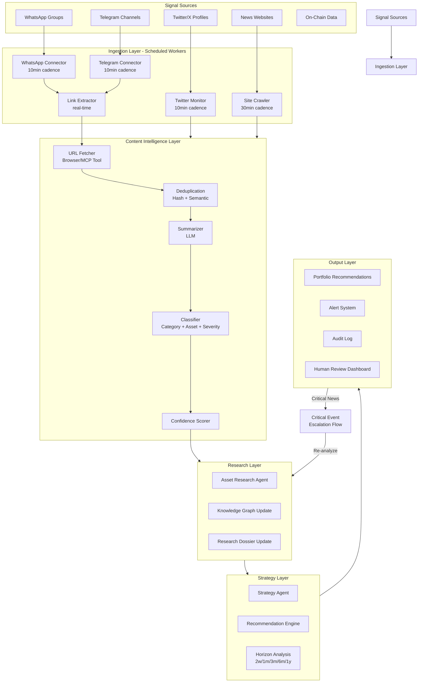
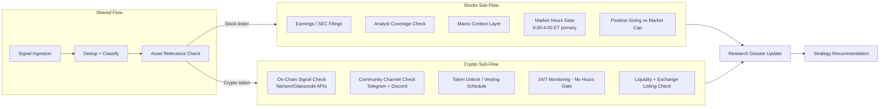
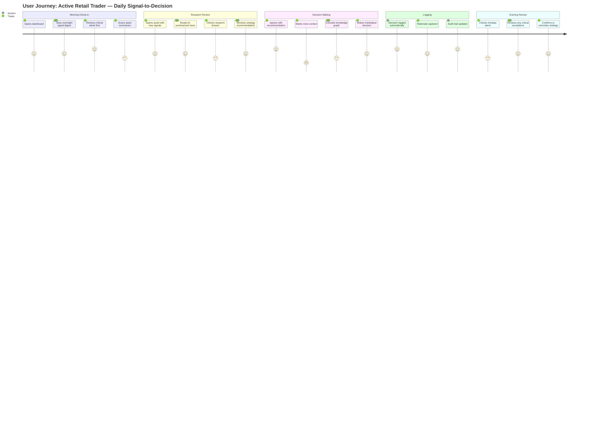
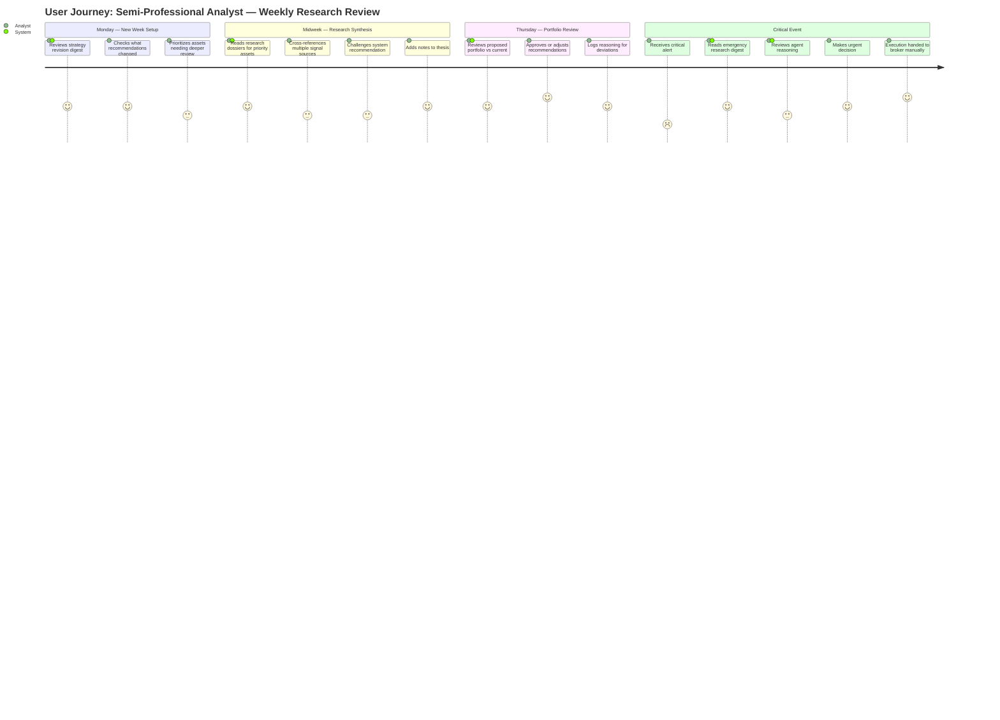
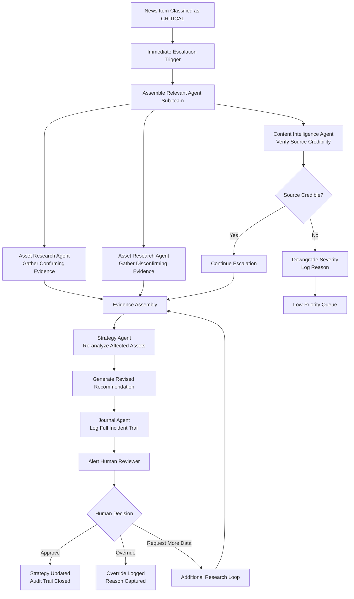
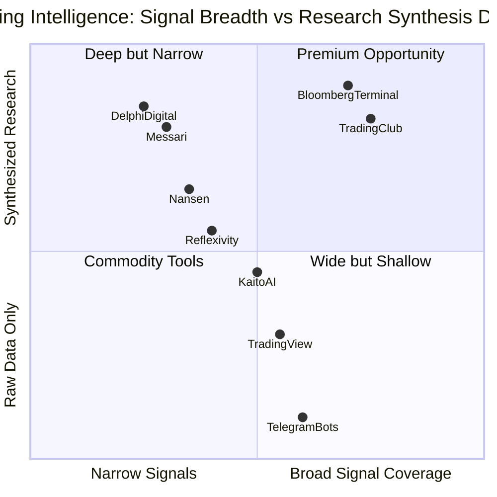

# Research Findings: Workflow & Journey Analysis
## Product: Trading Club | Researcher: researcher_1 | Date: 2026-03-07

---

### 1. Executive Summary

The serious retail and semi-professional trader's workflow in 2026 is a fragmented, manually-assembled stack of 4–8 separate tools, none of which talk to each other. The information arrives in real time across WhatsApp groups, Telegram channels, Twitter, and news feeds — but the synthesis, classification, and strategy update work is done by hand, in the trader's head, with no audit trail. Existing platforms (Messari, Nansen, Kaito AI, TradingView) are strong on data but weak on synthesis, prioritization, and multi-asset workflow management. The competitive baseline a new platform must clear is: real-time ingestion, credible summarization, and a structured portfolio recommendation that shows its reasoning. The multi-agent system fits best as the "research desk" that pre-digests signals so the trader can focus on decision-making rather than information management. Escalation for critical news must be treated as a first-class workflow — not an afterthought.

---

### 2. The Trader's Current Workflow (2025–2026)

#### 2.1 How a Serious Retail Trader Operates Today

A typical active retail trader managing 20–50 positions across stocks and crypto runs the following manual workflow:

**Morning Routine (30–90 minutes daily):**
1. Check overnight crypto moves (CoinGecko, CoinMarketCap, or exchange app)
2. Scan Twitter/X for alpha from followed accounts (20–40 accounts typical)
3. Check Telegram channels (5–15 groups: project channels, signal groups, community channels)
4. Check WhatsApp groups (3–8 groups: personal trading circles)
5. Open TradingView for chart context on assets with notable moves
6. Scan news (CryptoSlate, The Block, Reuters, Bloomberg free tier)
7. Manually update personal tracking sheet or Notion
8. Make hold/adjust/exit decisions based on above

**Intraday (reactive, not systematic):**
- Phone notifications from Telegram, Twitter, WhatsApp drive real-time awareness
- No structured prioritization — urgency determined by gut feel
- High risk of missing critical news during work hours

**Weekly (strategy review, typically weekend):**
- Review portfolio performance
- Re-read research notes (if any)
- Adjust position sizing mentally
- No structured re-check of strategy thesis

**The core problem: synthesis is entirely manual and undocumented.**

#### 2.2 Signal Categories and Current Ingestion Methods

| Signal Category | Source | Current Tool | Gap |
|----------------|--------|-------------|-----|
| On-chain activity | Blockchain | Nansen, Glassnode | Expensive, complex to interpret |
| Social sentiment | Twitter/X | Kaito AI, manual | No cross-source correlation |
| Project news | Official channels | Telegram, RSS | No summarization or severity rating |
| Macro news | News sites | Google News, newsletters | No asset-specific filtering |
| Community signals | WhatsApp, Telegram | None (raw) | No extraction or classification |
| Technical signals | Price/volume | TradingView | No integration with fundamental research |
| Regulatory news | Legal sites, Twitter | None | Often missed entirely |
| Earnings (stocks) | SEC, earnings calls | Seeking Alpha | Not connected to portfolio positions |

#### 2.3 Competitive Workflow Analysis

| Tool | Strength | Workflow Failure | User Verdict |
|------|----------|-----------------|--------------|
| **Messari** | Deep fundamental research, token profiles | No real-time signal monitoring; research is static | "Great for initial DD, useless for monitoring" |
| **Nansen** | On-chain intelligence, wallet tracking | Crypto-only; no social layer; steep learning curve | "Essential for on-chain but can't use it alone" |
| **Kaito AI** | Twitter/X signal aggregation for crypto | Crypto-only; no Telegram/WhatsApp; no portfolio context | "Good for Twitter noise reduction, not a full system" |
| **TradingView** | Charting, alerts, community ideas | No fundamental research integration; no AI synthesis | "Charts are great, everything else is forums" |
| **Delphi Digital** | Institutional-quality research | Report-based, not real-time; very expensive | "Read their reports, can't use as a daily tool" |
| **Reflexivity** | AI-generated market reports | Generic market summaries, not asset-specific | "Interesting but too high-level to act on" |
| **Telegram bots** | Real-time price alerts | No context, no research, all noise | "Too many false alarms, stopped trusting it" |
| **Bloomberg Terminal** | The gold standard | $25k+/year; not accessible to retail | "What I wish I could afford" |

**Key finding:** No tool in the market combines real-time multi-source signal ingestion + AI synthesis + portfolio-context recommendations + structured revision history. The closest approximation requires 3–4 tools and manual synthesis.

---

### 3. Diagrams

#### 3.1 End-to-End Trading Research Workflow

#### 3.2 Stocks vs. Crypto Workflow Divergence

#### 3.3 User Journey — Active Retail Trader

#### 3.4 User Journey — Semi-Professional Analyst

#### 3.5 Critical News Escalation Flow

#### 3.6 Competitive Landscape Quadrant

---

### 4. Monitoring Cadence Recommendation

| Source | Recommended Cadence | Rationale | Risk if Slower |
|--------|--------------------|-----------|----|
| WhatsApp | 10 minutes | Community-first alpha often goes stale in 15-20 min | Missed entry/exit window |
| Telegram | 10 minutes | Project announcements are time-critical | Same |
| Twitter/X | 10 minutes | Breaking news, influencer moves, viral threads | Breaking news missed |
| News Sites | 30 minutes | Longer-form content; freshness less critical | Acceptable lag |
| On-chain data | 15 minutes (if integrated) | Smart money moves are often front-running signals | Alpha decay |
| Strategy re-check | Every 2-3 days | Prevents over-trading on noise | Strategy drifts without review |

---

### 5. User Progression Model

| Stage | User Profile | What They Need | What the Platform Must Deliver |
|-------|-------------|---------------|-------------------------------|
| **Onboarding** | Just added first 5 assets | Simple signal digest, basic recommendations | Clean summary UI, easy asset addition |
| **Basic** | 10-20 assets, daily check-in | Morning digest, severity alerts, simple strategy view | Reliable monitoring, explainable recommendations |
| **Intermediate** | 20-50 assets, active strategy | Multi-horizon strategy, revision history, custom sources | Research dossiers, thesis tracking, alert customization |
| **Power** | 50-200 assets, professional-grade | Full audit trail, strategy confidence intervals, custom agent configuration | Knowledge graph access, custom monitoring rules, API access |

---

### 6. Key Insights for PMs

1. **The workflow must reduce cognitive load, not add to it.** Traders already have too many tools. The morning digest must be the entry point — not a dashboard that requires navigation.
2. **The re-check cadence (every 2-3 days) is actually a competitive differentiator.** No existing tool actively reminds traders that a thesis is getting stale.
3. **The critical escalation flow is where traders lose the most money today.** When critical news hits, they see it in five places simultaneously, can't tell what's real, and either overreact or freeze.
4. **WhatsApp and Telegram are underserved as research inputs.** Every existing tool ignores them. They are where retail alpha actually circulates.
5. **Stocks and crypto users share the workflow structure but differ in signal types.** Build once, configure per asset class — don't fork the product.
6. **The portfolio recommendation must show its work.** Traders will not act on a black-box recommendation. Confidence level + supporting evidence + counter-evidence is table stakes.
7. **Audit trail is not a compliance feature — it's a trust feature.** Traders want to know why a recommendation changed, not just that it changed.

---

### 7. Edge Cases Identified

| Edge Case | Severity | Current Handling | Recommendation |
|-----------|----------|-----------------|----------------|
| Same news arrives across 3+ sources simultaneously | Medium | Manual dedup by user | Semantic deduplication + source linking |
| Critical news outside market hours (crypto: always; stocks: weekend) | High | Missed or handled manually | 24/7 monitoring with configurable alert thresholds |
| Asset in portfolio removed from exchange / delisted | Critical | No tool handles this | Delisting detection as a first-class event type |
| Contradictory signals from high-credibility sources | High | Trader paralysis | Explicit "conflicting signals" state with evidence summary |
| News is real but already priced in | Medium | No tool addresses this | Timestamp + price correlation to flag "priced in" probability |
| Trader adds 50 assets at once (bulk import) | Medium | Most tools break or are slow | Async bulk research generation with progress tracking |
| Trader overrides system recommendation | Low | No capture mechanism | Override logging with reason capture — required for audit |
| Signal volume spike (market crash / black swan) | Critical | System overload risk | Queue prioritization + critical-first processing under load |

---

### 8. Open Questions

1. Should on-chain data be phase 1 or phase 2? The cost and complexity of Nansen/Glassnode API integration is significant.
2. How should the platform handle assets that appear in messages but are not in the user's tracked portfolio? (Auto-add to watchlist vs. ignore vs. flag for review)
3. Is the morning digest the right primary entry point, or should the platform be notification-first (push to phone)?
4. What is the right level of explainability for the recommendation — a sentence, a paragraph, a full dossier?
