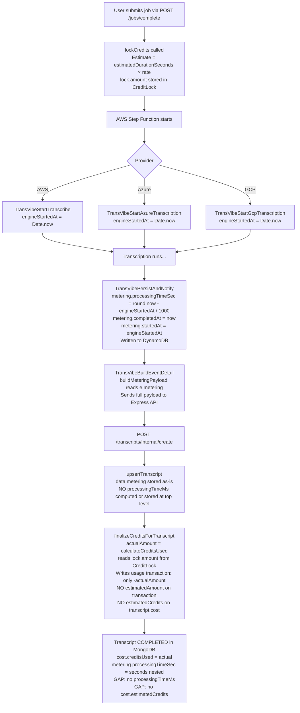
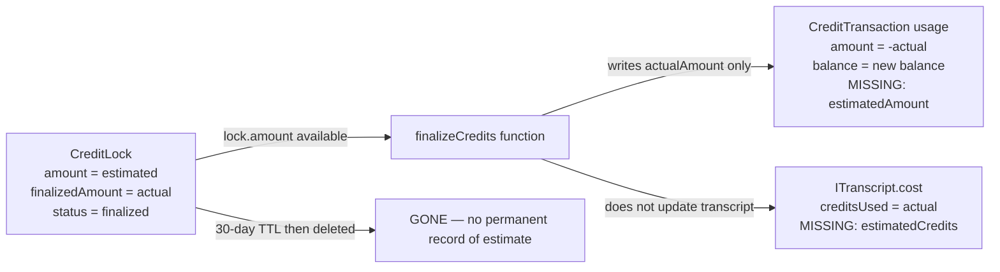
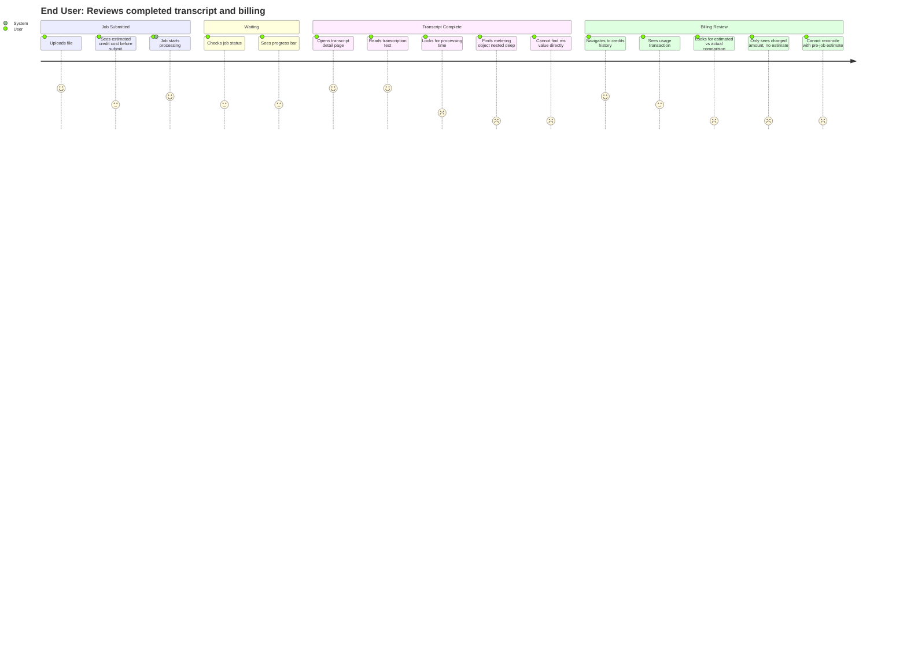

# Research Findings: Workflow & Journey
## Product: TransVibe Credit & Performance Transparency | Researcher: researcher_1 | Date: 2026-03-23

---

### 1. Executive Summary

The TransVibe backend already produces all the raw data needed for both features — processing time is computed inside `TransVibePersistAndNotify.mjs` as `metering.processingTimeSec`, and credit estimates (`lock.amount`) coexist with actual charges (`actualAmount`) inside `finalizeCredits()`. The gap is purely one of **persistence and surfacing**: neither value is promoted to a queryable, user-facing field on the transcript document or the credit transaction record. The fix requires model additions in two files, one service-layer write in `finalizeCredits`, and one lookup in `upsertTranscript`. No algorithm changes, no new external dependencies.

---

### 2. End-to-End Pipeline Flow

#### 2.1 Processing Time — Where the Data Lives

| Step | Lambda / Service | Data Produced | Stored Where |
|------|-----------------|---------------|-------------|
| Job start | `TransVibeStartTranscribe.mjs` / `TransVibeStartAzureTranscription.mjs` / `TransVibeStartGcpTranscription.mjs` | `engineStartedAt: Date.now()` | Step Function event context |
| Job complete | `TransVibePersistAndNotify.mjs` | `metering.processingTimeSec = round((now - engineStartedAt) / 1000)`, `metering.completedAt = now`, `metering.startedAt = engineStartedAt` | DynamoDB job record |
| Event build | `TransVibeBuildEventDetail.mjs` | Reads `e.metering.*` and re-packages as `buildMeteringPayload(e)` | Payload sent to Express API |
| Transcript upsert | `transcripts.service.ts :: upsertTranscript` | Stores `data.metering` as-is onto the Transcript document | MongoDB `transcripts` collection |

**Finding:** `metering.processingTimeSec` (integer, seconds) is reliably set for all three providers (AWS, Azure, GCP) because all three start Lambdas set `engineStartedAt`. However, `transcriptionMetadata.processingTimeMs` is populated from `e.metadata.processingTimeMs` — a legacy optional field that is **not set in the current pipeline for any provider**. It is effectively always `undefined`.

**The single reliable source is `metering.processingTimeSec`.** Converting to milliseconds: `processingTimeSec * 1000`. A more precise ms value can be derived as `metering.completedAt - metering.startedAt` when both fields are present.

**Gap:** No top-level `processingTimeMs` field exists on `ITranscript`. The `TranscriptSummary` returned by `getUserTranscripts` (the list endpoint) does not include processing time at all. The `getTranscriptById` endpoint returns the full document including `metering`, so the raw data is accessible but requires the client to navigate the nested `metering` object and perform unit conversion.

#### 2.2 Credit Lock / Finalize Flow — Where Estimated vs Actual Live

| Step | Function | Data Available | Persisted? |
|------|----------|---------------|------------|
| Job submit | `lockCredits()` | `lock.amount` = estimated credits based on `estimatedDurationSeconds` | Yes — `CreditLock.amount` |
| Job complete | `finalizeCreditsForTranscript()` → `finalizeCredits()` | `lock.amount` (from DB) AND `actualAmount` (from `calculateCreditsUsed`) | `lock.finalizedAmount = actualAmount`, but `lock.amount` NOT written to `ICreditTransaction` |
| Usage transaction created | `finalizeCredits()` | `actualAmount` only | `CreditTransaction.amount = -actualAmount` — NO `estimatedAmount` field |
| Transcript cost field | `upsertTranscript()` | `creditsUsed = calculateCreditsUsed()` (actual) | `cost.creditsUsed` — NO `cost.estimatedCredits` field |

**Finding:** Both values exist simultaneously inside `finalizeCredits()` at lines 304-306:
```
lockedAmount: lock.amount,    // the estimate
actualAmount,                  // the actual
difference: lock.amount - actualAmount
```
But only `actualAmount` is written to the `CreditTransaction`. `lock.amount` is logged but not persisted to either the transaction or the transcript.

**Finding:** The `ICreditLock` document already stores both values — `amount` (estimate) and `finalizedAmount` (actual). This is the source of truth for the difference. The problem is that `CreditLock` records expire (30-day TTL) and are not user-facing. Users have no way to see estimate vs actual from a normal transcript view.

---

### 3. Diagrams

#### 3.1 Full Job Pipeline (Processing Time Data Flow)



#### 3.2 Credit Lock / Finalize — Data Gap Diagram



#### 3.3 User Journey: Reviewing Completed Transcript



---

### 4. Data Model Gap Analysis

#### 4.1 ITranscript — Current vs Required

| Field Path | Current State | Required State | Change |
|-----------|--------------|---------------|--------|
| `transcriptionMetadata.processingTimeMs` | Always `undefined` in current pipeline | Remove or keep as legacy | No change needed |
| `metering.processingTimeSec` | Reliably set (integer seconds) | Keep as-is | No change |
| `processingTimeMs` (top-level) | **Does not exist** | Add: computed from `metering.processingTimeSec * 1000` at upsert time | **ADD FIELD** |
| `cost.creditsUsed` | Set to actual credits | Keep as-is | No change |
| `cost.estimatedCredits` | **Does not exist** | Add: value from `CreditLock.amount` at finalization | **ADD FIELD** |

#### 4.2 ICreditTransaction — Current vs Required

| Field | Current State | Required State | Change |
|-------|--------------|---------------|--------|
| `amount` | Negative actual credits deducted | Keep as-is | No change |
| `durationSeconds` | Set from lock | Keep as-is | No change |
| `estimatedAmount` | **Does not exist** | Add: `lock.amount` from CreditLock at finalization time | **ADD FIELD** |

#### 4.3 API Response — Current vs Required

| Endpoint | Current `processingTimeMs` | Current `estimatedCredits` | Required |
|----------|--------------------------|--------------------------|---------|
| `GET /transcripts` (list) | Not in summary | Not in summary | Add `processingTimeMs` to `TranscriptSummary` |
| `GET /transcripts/:id` | Nested in `metering.processingTimeSec` (seconds) | Not present | Add top-level `processingTimeMs`, add `cost.estimatedCredits` |
| `GET /credits/transactions` | N/A | N/A | Add `estimatedAmount` to usage transaction response |

---

### 5. Key Insights

1. **All three providers reliably set `engineStartedAt`** — every AWS, Azure, and GCP start Lambda sets it. The data chain from engine start to `metering.processingTimeSec` is complete and always populated. There is no missing-data risk on the processing time side.

2. **`metering.processingTimeSec` is the canonical source** — `transcriptionMetadata.processingTimeMs` is a phantom field: it exists in the TypeScript interface but is never populated by any Lambda in the current pipeline. Do not use it as a source.

3. **The estimate-vs-actual difference already exists on `CreditLock`** — `ICreditLock.amount` and `ICreditLock.finalizedAmount` are already stored side by side. The only missing work is promoting these values to the transcript and transaction documents before the lock expires.

4. **`finalizeCredits()` is the one place both values coexist** — `lock.amount` and `actualAmount` are in scope simultaneously at line 304-306. This is the ideal injection point for `estimatedAmount` on the usage transaction.

5. **The list API omits metering entirely from the summary** — `TranscriptSummary` has no processing time field. This means even the nested data is inaccessible from the list view without fetching each transcript individually.

6. **CreditLock records are ephemeral (30-day TTL)** — if `estimatedCredits` is not promoted to the transcript document before the lock is deleted, the estimate is permanently lost. This makes the feature time-sensitive relative to the lock TTL.

7. **`processingTimeMs` should be stored, not just computed at read time** — deriving it dynamically from `metering` at every read is fragile if the metering object is ever migrated or cleaned up. Storing it once at creation time is safer.

---

### 6. Edge Cases Identified

| # | Edge Case | Severity | Current Handling | Recommendation |
|---|-----------|---------|-----------------|----------------|
| EC-1 | `metering.startedAt` is null (engineStartedAt not found in event) | Medium | `metering.processingTimeSec` is `undefined` | Fall back to `null`; store `processingTimeMs: null` rather than computing a misleading value |
| EC-2 | Transcript is upserted before `lockId` is resolved (all 4 tiers fail) | Medium | `finalizeCreditsForTranscript` is skipped | `cost.estimatedCredits` will be null; needs to be tolerated gracefully |
| EC-3 | Transcript already exists (upsert path) and `processingTimeMs` is being overwritten | Low | `upsertTranscript` uses `$set` — all fields overwritten | Acceptable — new value is always more accurate |
| EC-4 | CreditLock already finalized before `upsertTranscript` completes | Low | `finalizeCredits` returns `LOCK_NOT_FOUND` | Need alternative path to read `lock.finalizedAmount` from a finalized lock |

---

### 7. Open Questions

1. Should `processingTimeMs` be stored at the transcript top level OR as `metering.processingTimeMs` to keep metering data co-located?
2. When `metering.startedAt` is null, should `processingTimeMs` be omitted (null) or estimated from `completedAt - createdAt` (a reasonable but imprecise fallback)?
3. Should `cost.estimatedCredits` be populated at `upsertTranscript` time (by looking up the CreditLock) or at `finalizeCreditsForTranscript` time (by updating the transcript after finalization)? Both are viable; the latter avoids an extra DB read during upsert.
