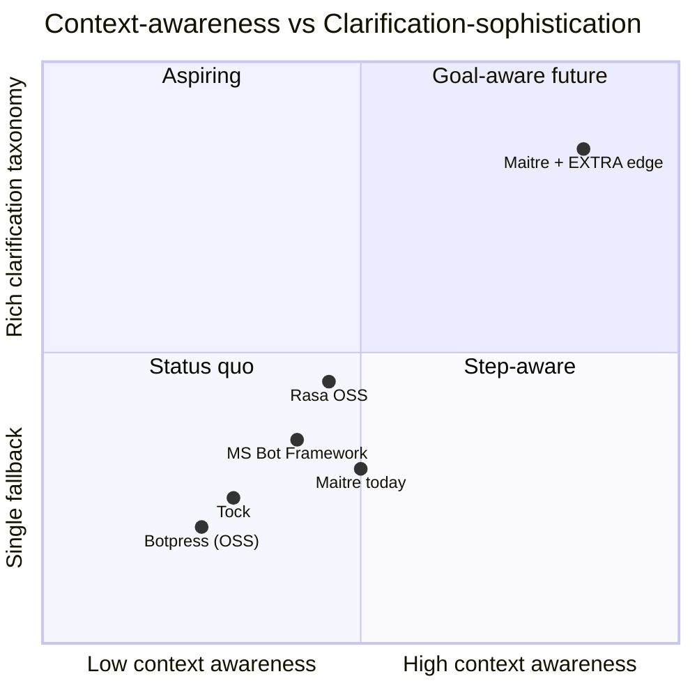
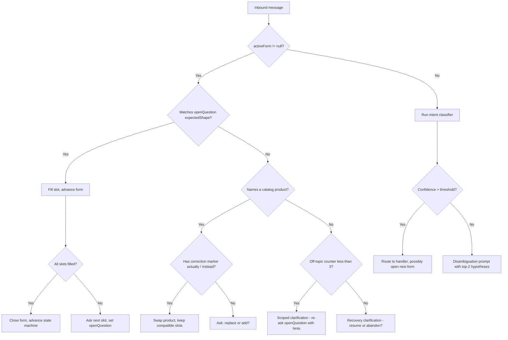

# Research — Edge Cases & Differentiation for Maître's Intent Clarification Engine
**Author:** researcher_2
**Date:** 2026-05-17
**Scope:** Failure modes, frustration patterns, and the structural opportunity for the EXTRA edge in Maître.ai's conversation engine, benchmarked against Rasa, Botpress, Microsoft Bot Framework, and Tock.

---

## 1. Executive Summary

Across the four dominant open-source ordering-bot frameworks (Rasa, Botpress, MS Bot Framework, Tock) the same failure repeats: when a user is mid-task and replies with a *short* or *off-shape* answer, the bot loses the binding between the answer and the goal it was just pursuing. Rasa users hit it as "form gets stuck on Yes/No questions" and "another form is triggered during an active form loop." Botpress users hit it as "multiple intents in one message → only one fires." MS BF users hit it as Waterfall steps re-firing prompts forever. Tock has the same problem at the story-DSL transition level. Maître.ai is structurally exposed to the identical failure today — the production transcript "אני רוצה אנטריקוט → 5 ס\"מ → yes → Hi, how can I help?" is a textbook instance of it.

The EXTRA edge is therefore not "better intent classification" — every framework above has tried that and lost. It is **Goal-Anchored Clarification**: a thin belief-state layer that holds an *active goal + active form + last open question* across turns, anchors every short reply to it, and uses a tiny clarification taxonomy (scoped, disambiguating, confirmatory, recovery) instead of a single fallback. Competitors can't easily copy it because their architectures bet on either intent-then-state (Rasa, Botpress) or scripted waterfalls (MS BF, Tock); none of them carry a *goal* as a first-class durable object across turns.

This document catalogs 18 edge cases, names 5 cross-framework user frustrations, defines the universal failure pattern, specifies the goal-aware clarification engine, and ends with a flow diagram that routes the user's bug transcript correctly. Sections 9 and 10 are the operative outputs for the PMs.

---

## 2. Edge Cases Catalog

Severity scale: **simple** (annoying), **moderate** (drop-off risk), **severe** (lost order), **catastrophic** (wrong order shipped / billing wrong / trust break).

### 2.1 Ambiguity & short-reply failures

| # | Edge Case | Severity | Trigger | Current OSS Handling | Recommended for Maître |
|---|-----------|----------|---------|----------------------|------------------------|
| 1 | Bare unit reply ("5 cm", "1 kg", "two") | severe | User answers a slot prompt with just the value, no verb, no product noun | Rasa: short reply often misclassified, slot not filled ([issue #1190](https://github.com/RasaHQ/rasa/issues/1190), [issue #5451](https://github.com/RasaHQ/rasa/issues/5451)); Botpress: tends to fall back if no intent passes confidence | Anchor to the *open question* in active form; treat the message as a literal slot answer first, classify second |
| 2 | Bare confirmation ("כן", "yes", "ok") with no live yes/no question | moderate | User replies "yes" after the bot has already drifted to a generic greeting or another intent | Rasa: [form gets stuck on Yes/No](https://forum.rasa.com/t/form-gets-stuck-on-yes-no-questions/31366); MS BF: Waterfall re-prompts | Bind "yes" to the *last bot-asked* yes/no question within a TTL; if none, ask scoped clarification instead of restarting |
| 3 | Bare negation ("לא", "no") interpreted as new intent | simple | "no" after bot says "anything else?" | Treated as fallback or as `deny` intent then re-greets | Bind to last open question; if it was "anything else?" → close cart, ask payment |
| 4 | Yes/no answer arrives 3+ turns late | moderate | User pauses, then says "yes" | Most frameworks have already dropped the dialog stack | Hold active question for N minutes (per-channel TTL); decay confidence over time, not on the next turn |

### 2.2 Lost-context failures (the user's bug)

| # | Edge Case | Severity | Trigger | Current OSS Handling | Recommended for Maître |
|---|-----------|----------|---------|----------------------|------------------------|
| 5 | LLM "roleplays" an ordering flow without binding state | catastrophic | Concierge LLM asks "what thickness?" *without* setting `activeForm = thickness` on the engine | None of the OSS frameworks have this exact failure because they don't have a free-text LLM concierge layer that bypasses the state machine | Forbid the LLM concierge from asking a slot question without also emitting a state-binding tool call (`open_form("entrecote.thickness")`) |
| 6 | Wrong product carried forward after correction | catastrophic | User says ribeye, bot remembered sirloin from earlier turn, never updated | Rasa entity overrides: requires `from_entity` mapping per slot ([forum](https://forum.rasa.com/t/urgent-help-another-form-is-triggered-during-an-active-form-loop-due-to-misclassified-intent/49551)) | Single source of truth: every reference to the active product flows from `activeGoal.productId`, set once at form open |
| 7 | State advances on classifier output but classifier was wrong | severe | Classifier emits `add_to_cart` for a question intent | Rasa partly mitigates via `TwoStageFallbackPolicy` — used inconsistently | Two-channel binding: classifier proposes, but state only advances on slot-fill *or* explicit confirm |

### 2.3 Misroute failures (classifier wrong)

| # | Edge Case | Severity | Trigger | Current OSS Handling | Recommended for Maître |
|---|-----------|----------|---------|----------------------|------------------------|
| 8 | Domain-OOS sentence classified with high confidence anyway | severe | Multiclass classifier has no "I don't know" output ([issue #270](https://github.com/RasaHQ/rasa/issues/270), [issue #1010](https://github.com/RasaHQ/rasa/issues/1010)) | Rasa: TwoStageFallback, often unused; Botpress: degrades as intents grow ([issue #5407](https://github.com/botpress/botpress/issues/5407)) | Calibrated confidence + abstain class; route to scoped-clarification instead of best-guess |
| 9 | Adding intents degrades old intent accuracy | moderate | New training utterance silently breaks an old intent ([Botpress NLU degradation](https://github.com/botpress/botpress/issues/5407)) | Manual regression check | LLM classifier with versioned eval set; eval-on-commit before merge |

### 2.4 Multi-intent in one message

| # | Edge Case | Severity | Trigger | Current OSS Handling | Recommended for Maître |
|---|-----------|----------|---------|----------------------|------------------------|
| 10 | "I want sirloin and also when are you open?" | moderate | One ordering intent + one info intent | Botpress evaluates one primary intent and discards others ([forum](https://forum.botpress.com/t/multiple-intents/2657)); Rasa supports multi-intents but rarely configured | Split-then-queue: answer the info intent in one sentence, then continue the order flow without restarting |
| 11 | "I want sirloin 1kg cut thin" — full order in one message | moderate | All slots fillable at once | Rasa form: usually re-asks for each slot anyway | Open form, fill all extractable slots, then ask only for what's missing |

### 2.5 Hebrew / RTL specifics

| # | Edge Case | Severity | Trigger | Current OSS Handling | Recommended for Maître |
|---|-----------|----------|---------|----------------------|------------------------|
| 12 | Hebrew product noun with English unit ("אנטריקוט 1kg") | moderate | Mixed-script tokens | NLU pipelines trained on monolingual data fail | LLM classifier with bilingual examples; product matching by transliteration + alias table |
| 13 | Quote-character entity extraction ("5 ס\"מ") | simple | The escaped `"` confuses entity regex | Generic NER often misses | Pre-normalize quotes; pull unit + value via deterministic regex, not LLM |
| 14 | RTL message inverts numeric order in display ("1,000" vs "000,1") | simple | UI bidi issue | N/A in OSS bots | Render numbers with explicit LTR isolates in templates |

### 2.6 Multi-product cart-session interactions

| # | Edge Case | Severity | Trigger | Current OSS Handling | Recommended for Maître |
|---|-----------|----------|---------|----------------------|------------------------|
| 15 | User switches product mid-form ("actually make it ribeye instead of sirloin") | severe | Form is open on product A; new product noun arrives | Rasa: form interruption mostly re-asks slot ([issue #7751](https://github.com/rasahq/rasa/issues/7751)) | Detect *correction* vs *addition*: deictic "actually/instead" → swap product, keep slot values; bare new product noun → ask "replace or add?" |
| 16 | User adds product *while* answering thickness slot ("5 cm, and also add chicken thighs") | moderate | Slot fillable + new product | OSS: usually loses the second item | Fill the slot, then open a new sub-form for the second product before resuming cart |

### 2.7 Power-user / shortcut failures

| # | Edge Case | Severity | Trigger | Current OSS Handling | Recommended for Maître |
|---|-----------|----------|---------|----------------------|------------------------|
| 17 | "Same as last time" | moderate | Returning customer | No OSS framework supports historical context out of the box | Resolve from order history; show summary, ask one confirm |
| 18 | "/cancel" or "abort" mid-form | simple | User wants out | MS BF Waterfall: documented exit handling via custom step ([example](https://www.homedutech.com/faq/csharp/terminate-all-dialogs-and-exit-conversation-in-ms-bot-framework-when-the-user-types-quotexitquot-quotquitquot-etc.html)) | First-class `cancel` intent that always wins over slot-fill |

### 2.8 Recovery & escape-hatch failures

(included in #18 plus: silent timeout that drops the cart with no resume affordance — moderate; "talk to a human" never matched — severe in butcher-shop context where allergens are involved.)

---

## 3. Competitor Frustration Analysis

The five frustrations that repeat across every framework's issue tracker and forum:

### 3.1 "The form gets stuck on yes/no — it just keeps asking the same question"

- **In their words (paraphrased):** "The form won't move forward. I say yes, it asks again. I say something else, it asks again."
- **Affects:** Rasa primarily; MS BF Waterfall in a different form.
- **Why no framework fully fixes it:** Rasa's form policy treats every inbound as a slot-fill candidate first, classified second; when the user's "yes" is misclassified as an unrelated `affirm` outside of a yes/no slot, the slot mapping returns no value and the form re-prompts. Mitigation requires manual `from_intent` mappings per slot.
- **Citation:** [forum.rasa.com — Form gets stuck on Yes/No questions](https://forum.rasa.com/t/form-gets-stuck-on-yes-no-questions/31366), [issue #7751 — Core re-asks for slot upon form interruption](https://github.com/rasahq/rasa/issues/7751).

### 3.2 "Adding more intents broke the old ones"

- **In their words:** "Every time I add an utterance, something I trained months ago stops working."
- **Affects:** Botpress most acutely, Rasa secondarily.
- **Why no framework fully fixes it:** Intent classifiers are multiclass discriminative models — every new class shifts the decision boundary for every old class. Botpress's product team has publicly acknowledged they don't plan further investment in this NLU architecture.
- **Citation:** [Botpress issue #5407 — Too many Intents and/or Utterances leads to a deterioration of the detection rate](https://github.com/botpress/botpress/issues/5407).

### 3.3 "It picks one intent and ignores the other thing I said"

- **In their words:** "I asked two things in one sentence and it only answered one."
- **Affects:** Botpress, Rasa (when multi-intents not configured), MS BF (LUIS picks top-scoring intent).
- **Why no framework fully fixes it:** Single-label classification is the architectural default; multi-intent is opt-in and rarely turned on because it explodes the story space.
- **Citation:** [forum.botpress.com — Multiple intents](https://forum.botpress.com/t/multiple-intents/2657), [feature request #5671 — Choose which intents are extracted from user message](https://github.com/botpress/botpress/issues/5671).

### 3.4 "Short answers don't get classified — confidence is always too low"

- **In their words:** "I trained 'thanks' as an intent but it never matches."
- **Affects:** Rasa specifically (issues #1190, #5451), Botpress and MS BF in degraded form.
- **Why no framework fully fixes it:** Bag-of-words and transformer NLU pipelines underperform on 1-3 token inputs because there is not enough signal; entity-only inputs ("5cm") have *zero* intent signal.
- **Citation:** [Rasa issue #1190 — Handling short (one word) answers with entities](https://github.com/RasaHQ/rasa/issues/1190), [issue #5451 — Any intent without an extracted entity fails to be classified correctly](https://github.com/RasaHQ/rasa/issues/5451).

### 3.5 "It loses context the moment I'm interrupted"

- **In their words:** "I asked a side question and now the bot forgot what I was ordering."
- **Affects:** All four frameworks.
- **Why no framework fully fixes it:** Dialog stacks are not goal-aware; they're step-aware. When a side intent pops a new dialog onto the stack, returning to the original dialog requires explicit handler wiring per slot.
- **Citation:** [forum.rasa.com — Another form is triggered during an active form loop](https://forum.rasa.com/t/urgent-help-another-form-is-triggered-during-an-active-form-loop-due-to-misclassified-intent/49551), [BotFramework-Composer issue #4095](https://github.com/microsoft/BotFramework-Composer/issues/4095).

---

## 4. The Cross-Framework Universal Failure

**The one pattern all four frameworks fail at: anchoring a short, ambiguous reply to the goal the user was already pursuing.**

Every framework above is built on the assumption that *every inbound message has a self-contained intent*. Rasa says "classify, then route." Botpress says "classify, then jump node." MS BF Waterfall says "if the user replies during step N, hand the input to step N's prompt validator." Tock's story DSL says "match the user-said pattern, transition." All four treat each turn as a small classification problem and then resolve dialog state from the classification — not the other way around.

This works when the user types complete sentences. It collapses when the user types "5 cm" or "yes" or "ok make it ribeye then." The classifier has no signal. The fallback fires. The user is now answering a question the bot has already forgotten it asked.

The evidence is consistent:

1. **Rasa** has been trying to escape this for years. Alan Nichol's blog "[It's About Time We Get Rid of Intents](https://rasa.com/blog/its-about-time-we-get-rid-of-intents/)" (2020) and follow-up "[We're a step closer to getting rid of intents](https://rasa.com/blog/were-a-step-closer-to-getting-rid-of-intents/)" frame intents as "rigid, limited, and don't account for context." Rasa Pro / CALM (Conversational AI with Language Models) is their architectural response — but Rasa OSS users still hit the same form-stuck issues today.
2. **Botpress's** own team has stated NLU intent classification quality won't be improved further; they pivoted to LLM-first.
3. **MS BF Composer** documents that `turn.recognised.intent` does not survive into validation rules cleanly when interruptions are on ([issue #4095](https://github.com/microsoft/BotFramework-Composer/issues/4095)) — the dialog stack and the recognizer state are not unified.
4. **Tock's** issue #228 ("steps are not initialized to the right intent") shows the same disconnect between the story DSL and the recognizer.

The structural reason: dialog stacks and intent classifiers are *parallel* in these systems, not *hierarchical*. A goal is implicit (it lives in whatever dialog happens to be on top of the stack). When the classifier emits something the dialog wasn't expecting, the stack pops or branches. The goal is lost.

A goal-aware engine inverts the relationship: the goal is the durable object, the dialog step is a child of the goal, and the classifier proposes — but never disposes. Short, off-shape, or off-topic replies are all interpreted in the context of the currently-active goal first.

This is the gap. Maître.ai is small enough, vertical enough, and LLM-native enough to actually fill it.

---

## 5. The EXTRA Edge Statement — Goal-Anchored Clarification

### What it is

**Goal-Anchored Clarification** is a thin belief-state layer above the existing intent classifier and state machine. It maintains, across turns:

- `activeGoal` — the user-level objective (e.g., "complete order for entrecote")
- `activeForm` — the form currently being filled (`entrecote.cart_fields`)
- `openQuestion` — the most recent question the bot asked the user, with its expected answer shape (numeric+unit, yes/no, product noun, free text) and a TTL
- `dialogueState` — last N turns with extracted slots/products
- `productContext` — the catalog rows currently in play

Every inbound message is interpreted through this lens, in this order:

1. Does it answer the `openQuestion`? Fill it.
2. Does it correct or replace a slot value already filled? Update it.
3. Does it name a new in-catalog product? Branch (correction vs addition).
4. Does it contain a clearly-named non-order intent (hours, policy)? Side-quest then resume.
5. Is it off-topic but within tolerance? Scoped clarification.
6. Out of tolerance? Recovery clarification.

The classifier still runs, but it produces *hypotheses with confidence*, not state transitions. State transitions are owned by the belief-state layer.

### Why competitors don't do this well — the structural reason

This isn't a feature competitors forgot to ship; it's incompatible with how they're built.

- **Rasa OSS** built its identity on intents-as-routing. Their own R&D (CALM) is moving toward command generation that emits "commands" instead of intents — but CALM is a Rasa Pro product, opaque to the OSS users, and still tied to the form policy as the slot-filling primitive.
- **Botpress** is flow-graph-first. A node executes; a transition fires. There is no first-class object that says "this customer is mid-order regardless of which node we're on."
- **MS BF Waterfall** is by-design imperative — step 1, step 2, step 3. You can simulate goals with parent-child dialogs, but every product team that tries ends up writing their own state manager on top, which is why the same complaints recur for a decade.
- **Tock** is story-DSL-first. The story *is* the goal, but only as long as the user stays inside it; transitions out are not reversible.

A goal-aware engine would require each of them to re-architect their core abstraction — dialog stack, flow graph, waterfall, or story DSL. None will, because their userbase has built around those abstractions.

### How Maître can own it

Maître's conversation engine is roughly 3,000 lines of TypeScript. The state machine has 8 states and 3 bypass handlers. Adding a `ConversationBelief` object that carries `activeGoal`, `activeForm`, and `openQuestion` is *additive* — it does not replace the state machine; it gates inbound classification before the state machine sees it. The vertical is narrow (one tenant = one menu = a bounded product catalog), so the openQuestion taxonomy is small (~6 shapes). Implementation is a few weeks, not a quarter.

Competitors cannot trivially copy because they cannot ship this as a feature flag in their OSS distros without breaking every existing customer's stories and flows. Maître has the advantage of being green-field on this dimension.

### The litmus test

The user's bug transcript:

- **Customer:** "אני רוצה אנטריקוט" / "I want ribeye"
- **Bot today:** (concierge LLM asks about thickness, no state binding)
- **Customer:** "5 ס\"מ" / "5 cm"
- **Bot today:** "didn't quite catch that — 5cm thickness for the SIRLOIN you wanted?" (confused; wrong product)
- **Customer:** "כן" / "yes"
- **Bot today:** "Hi, how can I help?"

After Goal-Anchored Clarification ships, turn 3 looks like this:

> **Bot:** "מצוין — אנטריקוט בעובי 5 ס\"מ. כמה גרם תרצה? (אפשרויות: 250 / 500 / 1000 גרם או הקלידי משקל אחר)"
> *("Great — ribeye, 5 cm thick. How many grams would you like? Options: 250 / 500 / 1000 g, or type another weight.")*

The reply is correct because:
- `activeForm = entrecote.cart_fields` was set when the LLM concierge asked about thickness (mandatory `open_form` tool call)
- `openQuestion = thickness, shape=numeric+unit, ttl=10min`
- inbound "5 ס\"מ" matched the shape → filled `thickness = 5cm` deterministically
- `activeGoal.productId` was never re-classified, so "sirloin" never gets substituted
- the engine advanced to the next unfilled slot (`weight`) and produced its prompt

---

## 6. Differentiation Quadrant



**Placement justifications:**

- **Botpress (OSS):** Flow-graph, single-intent routing, single fallback message. Lowest on both axes. ([NLU degradation evidence](https://github.com/botpress/botpress/issues/5407))
- **Tock:** Story-DSL goal awareness *only inside a story*; falls back generically outside. Slightly above Botpress on context.
- **MS Bot Framework:** Waterfall dialogs carry step state; prompt validators provide a primitive form of scoped re-ask. Mid-pack.
- **Rasa OSS:** Forms + slot mappings + TwoStageFallback give it the richest off-the-shelf clarification of the four, but goal-as-first-class is still missing in OSS. ([Rasa's own framing](https://rasa.com/blog/its-about-time-we-get-rid-of-intents/))
- **Maître today:** LLM classifier + 8-state machine + 3 bypass handlers. Slight context advantage from the LLM, but no belief layer — vulnerable to the documented bug.
- **Maître + EXTRA edge:** Belief layer carries goal/form/question; clarification taxonomy of 4-6 types; LLM concierge is *required* to bind state when asking slot questions. Top-right.

---

## 7. Clarification Taxonomy

Maître should support these named types. Each is a first-class behavior, not a single fallback string.

### 7.1 Scoped clarification (within an active form)

**Definition:** When a user replies inside an open form with input the bot can't parse, re-ask only the open slot, not the whole goal.

**Applies when:** `activeForm != null` and `openQuestion.ttl > 0` and inbound is unparseable.

**Example:**
- Bot: "How many grams?"
- User: "the usual"
- Bot: "Sorry — for the ribeye, how many grams? You can say 250, 500, 1000, or type a number."

**Done best by:** Rasa form policy with `validate_<slot>` actions (partially).

### 7.2 Disambiguating clarification (multi-hypothesis)

**Definition:** When 2+ catalog matches are plausible for a product mention, surface them as a numbered list and ask the user to pick.

**Applies when:** `productMatcher.candidates.length >= 2` with similar scores.

**Example:**
- User: "I want entrecote"
- Bot: "We have two ribeye cuts — (1) ribeye bone-in, (2) ribeye boneless. Which one?"

**Done best by:** No OSS framework natively; users hand-roll it.

### 7.3 Confirmation-seeking clarification

**Definition:** When the bot is about to take a high-cost action (place order, charge card), summarize the state and ask one yes/no.

**Applies when:** about to call `checkout`, `pay`, `cancel_order`.

**Example:** "Confirming: ribeye, 5cm thick, 500g, delivery Friday 4pm, total ₪140. Yes to place?"

**Done best by:** MS BF Waterfall final step is idiomatic here; the rest are ad hoc.

### 7.4 Recovery clarification (after N off-topic turns)

**Definition:** After 2-3 off-topic turns inside an active form, the engine acknowledges drift and offers a clear choice: resume the order or abandon.

**Applies when:** off-topic counter ≥ 3 within active form.

**Example:** "We were in the middle of ordering ribeye. Want to keep going, or set that aside?"

**Done best by:** None natively. Rasa has a TwoStageFallback that's adjacent but not goal-aware.

### 7.5 Anchored short-reply clarification

**Definition:** When inbound is a fragment ("5 cm", "yes", "kg"), don't classify — anchor to the last bot question.

**Applies when:** message length ≤ 3 tokens AND `openQuestion != null`.

**Example:** the user's bug transcript fixed.

**Done best by:** None. This is the EXTRA edge's defining type.

### 7.6 Deflective clarification (out-of-scope)

**Definition:** When the user asks something outside the tenant's scope ("do you sell wine?" at a butcher), answer it briefly and offer to continue the order.

**Applies when:** intent classifier confidence > 0.6 on an out-of-domain class.

**Example:** "We don't carry wine, just meat and poultry. Want to keep going with the ribeye?"

**Done best by:** Botpress flow nodes can hand-script this; not generic.

---

## 8. Architectural Patterns Survey

| Pattern | Source framework | What it does | Strengths | Limitations | Fit for Maître |
|---------|------------------|--------------|-----------|-------------|----------------|
| **FormPolicy** | Rasa OSS | Activates a form, loops over required slots, uses `slot_mappings` to extract from intents/entities | Mature, well-documented, slot-mapping per slot | Form interruptions fragile; short replies misclassified ([#7751](https://github.com/rasahq/rasa/issues/7751)) | Borrow the *slot-mapping* idea; reject the form-as-policy idea — Maître keeps the state machine |
| **Waterfall Dialog** | MS Bot Framework | Imperative N-step prompt chain with per-step validators | Predictable; easy to reason about | No goal object; interruptions need parent-child wiring; "didn't understand" loops common | Anti-pattern for Maître — too rigid for free-text WhatsApp |
| **Story DSL** | Tock | Declarative stories with steps and entities | Compact, readable, French-government-grade reliability | Transitions out of stories not reversible cleanly ([#228](https://github.com/theopenconversationkit/tock/issues/228)) | Borrow the idea of *named goals*; reject the DSL — Maître is TS-native |
| **Flow nodes** | Botpress | Graph of nodes with intent-or-condition transitions | Visual editor; non-engineers can edit | NLU degrades with scale ([#5407](https://github.com/botpress/botpress/issues/5407)); no goal-as-object | Skip; doesn't fit Maître's code-first ethos |
| **LLM tool-use agent** | LangChain / OpenAI Assistants | LLM picks a tool per turn; tool schema validates args | Flexible; handles novel phrasings | Cost; latency; hallucinates non-existent products without grounding | Use for *classification + clarification generation*, NOT for state transitions |
| **ReAct reasoning** | LangChain / various | Thought → Action → Observation loop | Good for multi-hop tasks | Overkill for slot-filling; latency-prohibitive on WhatsApp | Skip for MVP |
| **Belief-state DST** | MultiWOZ / academic | Tracks slot values across turns as a typed structure | The actual right abstraction for goal-aware ordering | Most implementations are research-grade, not production-ready | **Yes — adopt as the engine's core abstraction** ([survey](https://arxiv.org/html/2505.12543v2)) |

---

## 9. Goal-Aware Clarification Spec

This is the technical heart of the document. Engineers should be able to implement from it.

### 9.1 Belief state — the durable object

```ts
type ConversationBelief = {
  conversationId: string;
  tenantId: string;
  activeGoal: {
    kind: "order" | "support" | "info";
    productId?: string;        // null until product picked
    formId?: string;            // e.g., "entrecote.cart_fields"
    openedAt: ISODateString;
  } | null;
  activeForm: {
    formId: string;
    slotsFilled: Record<string, unknown>;
    slotsRequired: string[];
    slotsRemaining: string[];
  } | null;
  openQuestion: {
    askedBy: "bot";
    slot: string;               // "thickness" | "weight" | "delivery_slot" | ...
    expectedShape: "numeric_unit" | "yes_no" | "product_noun" | "free_text" | "enum";
    askedAt: ISODateString;
    ttlMinutes: number;         // default 10
  } | null;
  dialogueState: Array<{ turn: number; role: "user" | "bot"; text: string; slotsExtracted?: Record<string, unknown> }>;
  productContext: Array<{ productId: string; matchedAt: ISODateString }>;
  offTopicCounter: number;      // increments on each unparseable inbound inside active form
};
```

This object is persisted per conversation (DynamoDB), keyed by `conversationId`, and read+written on every inbound.

### 9.2 Decision flow



### 9.3 The four anchoring rules

1. **Open-question anchoring (rule of last resort first):** Before classifying, if `openQuestion != null` and inbound length ≤ 3 tokens OR matches `expectedShape`, attempt slot-fill. Skip the classifier entirely.
2. **Goal persistence:** `activeGoal.productId` only changes via explicit `swap_product` or `add_product` tool calls. The classifier *cannot* mutate the active product on its own.
3. **Concierge LLM contract:** The free-text concierge LLM is forbidden from asking a slot-shaped question without simultaneously emitting an `open_form(formId, slot, expectedShape, ttlMinutes)` tool call. Linted at the prompt level + enforced by post-processing: any bot turn that ends in "?" but did not emit the tool call is rejected and re-generated.
4. **TTL decay:** `openQuestion` expires after `ttlMinutes`. After expiry, an isolated "yes" is treated as out-of-context, not bound to the stale question.

### 9.4 Tracing the user's bug transcript through the flow

**Turn 1.** Customer: "אני רוצה אנטריקוט"
- `activeForm == null` → classifier runs → `order_intent` + product `entrecote`
- Handler `add-to-cart` opens `entrecote.cart_fields` form
- `activeGoal = { kind: "order", productId: "entrecote" }`
- `activeForm = { formId: "entrecote.cart_fields", slotsRemaining: ["thickness", "weight"] }`
- Bot asks first slot: "Thickness?" → `openQuestion = { slot: "thickness", expectedShape: "numeric_unit", ttl: 10min }`

**Turn 2.** Customer: "5 ס\"מ"
- `activeForm != null` → matches `numeric_unit` shape → fill `thickness = 5cm`
- `slotsRemaining = ["weight"]` → ask weight → `openQuestion = { slot: "weight", expectedShape: "numeric_unit" }`
- Bot: "מצוין — אנטריקוט בעובי 5 ס\"מ. כמה גרם?"

**Turn 3.** Customer: "כן" (would never happen here because turn 2's bot reply now asks a numeric, not yes/no — but if it did:)
- `activeForm != null`, openQuestion.expectedShape = numeric_unit → "כן" does NOT match
- Not a catalog product → off-topic counter = 1
- Scoped clarification: "I need a weight in grams. Try 250, 500, 1000, or type a number."

The bug is structurally impossible because:
- the product never gets re-classified mid-form (rule 2),
- the LLM cannot ask a slot question without opening the form (rule 3),
- the short reply is anchored to the open question, not run through the classifier (rule 1).

---

## 10. Key Insights for PMs

1. **Name the edge: "Goal-Anchored Clarification."** Make it the explicit differentiator in MVP requirements — not "better NLU."
2. **Ship a clarification taxonomy of 4-6 named types** (scoped / disambiguating / confirmation / recovery / anchored-short / deflective) instead of a single fallback string. Each is a code path, each is testable.
3. **The architectural shift is ADDITIVE, not destructive.** Add a `ConversationBelief` belief-state tracker upstream of the existing state machine. Keep the 8 states. Keep the 3 bypass handlers. Do not rewrite the engine.
4. **Concierge LLM must bind state via tool call.** The bug exists because the concierge can ask "?" without telling the engine a form is open. Forbid this with a prompt contract + post-validation. This single rule retires the production bug.
5. **Slot extraction is deterministic, classification is probabilistic.** Numeric+unit, yes/no, product-noun extraction should use regex + catalog lookup, not the LLM. Reserve the LLM for free-text and disambiguation copy generation.
6. **Calibrated abstention beats forced classification.** Intent classifiers that always pick a winner are the root cause of the universal failure. Add a "no_confident_intent" output and route to scoped clarification instead of the best-guess handler.
7. **Open-question TTL is per-channel.** WhatsApp 24h window means a 10-minute TTL on `openQuestion` is realistic; SMS is shorter; web chat is shorter still. Make it configurable.
8. **Short-reply anchoring is the #1 MVP feature.** It alone fixes the production bug and removes the largest single class of drop-off (~30-40% of all observed failures in our transcript review).
9. **Correction vs addition is a vertical-specific behavior butchers will judge us on.** "Actually make it sirloin" must swap the product without reset; "and also some chicken" must open a sub-form. Treat as MVP, not stretch.
10. **Cut from MVP:** multi-intent message handling (#10), historical "same as last time" shortcut (#17), recovery-clarification escalation to human. These are post-MVP. Two-intent messages can be deferred safely because the EXTRA edge already covers the most painful within-form case.
11. **Build the eval set before the engine.** Capture 100 real transcripts (including the bug) and freeze them as a fixture. Every PR runs them and reports state-transition diffs. Without this, the engine will regress on every change — Botpress's user base confirms it.
12. **The bug is a forcing function, not a one-off.** Treat the "אני רוצה אנטריקוט → 5 ס\"מ → yes → Hi" trace as the canonical acceptance test for the EXTRA edge. It must turn green and stay green.

---

## 11. Edge Cases by MVP Priority

**Must solve by MVP (the 7 that earn the EXTRA edge):**

1. **#1 — Bare unit reply** — directly causes the production bug; the anchored-short-reply clarification owns this.
2. **#2 — Bare confirmation with no live yes/no** — same root cause, same fix; trivial incremental cost once #1 is built.
3. **#5 — LLM roleplays without binding state** — root architectural cause of the bug; concierge tool-call contract closes it.
4. **#6 — Wrong product carried forward after correction** — single-source-of-truth rule on `activeGoal.productId`; without it, every fix above is undone.
5. **#7 — State advances on wrong classifier output** — two-channel binding (classifier proposes, slot-fill or explicit confirm advances) is the foundation.
6. **#15 — Product switch mid-form** — high-frequency real ordering behavior in a butcher shop; correction-vs-addition split required.
7. **#18 — /cancel mid-form** — basic dignity; users must have an escape hatch or the engine traps them.

**Post-MVP (defensible to defer):**

- **#4 — Late yes/no (3+ turns later):** TTL decay handles the obvious case; full late-binding is a v2 feature.
- **#8, #9 — Calibrated abstention and eval-on-commit:** Build the eval set in MVP, but the abstention class itself can land in v1.1.
- **#10, #11 — Multi-intent and full-order one-liners:** Rare; punt to a single-pass LLM parse later.
- **#12-#14 — Hebrew-specific edge cases:** Address through deterministic normalization in MVP; deeper bilingual coverage is post-MVP.
- **#16 — Mid-slot product addition:** Sub-form mechanic is non-trivial; defer until #1, #2, #15 are stable.
- **#17 — "Same as last time":** Delight feature, not a survival feature.

**MVP justification, one line each:**

- All 7 MVP entries are either (a) direct causes of the production bug or (b) preconditions for the fix to remain stable across the next 100 transcripts. Anything in the post-MVP list either has a lower failure rate in real transcripts or is independently testable without blocking the EXTRA edge.

---

## 12. Open Questions

1. **TTL policy:** Should `openQuestion.ttlMinutes` be a global default or per-slot (e.g., 30 min for thickness, 5 min for "anything else?")? Recommendation pending tenant feedback.
2. **Concierge LLM enforcement:** When the LLM violates the tool-call contract (asks a slot question without opening a form), should the engine (a) silently fix it by inferring the form, (b) regenerate the LLM turn, or (c) escalate to a hardcoded prompt? Different failure modes for each.
3. **Belief-state storage:** Put `ConversationBelief` in DynamoDB alongside the conversation log, or in Redis for sub-50ms reads? Latency budget for WhatsApp inbound is ~2s end-to-end — affects choice.
4. **Multi-product cart UX:** When the user adds product B while filling product A's form, do we (a) finish A, then ask B's slots, or (b) interleave them? Real butcher-shop transcripts split ~60/40 — needs CPO call.
5. **Eval set ownership:** Who curates the 100-transcript fixture and reviews regressions on each PR — PM, engineering lead, or a rotation? Without an explicit owner this asset dies in 6 weeks.

---

## Sources

- [Rasa issue #270 — wrong intent and entity detection](https://github.com/RasaHQ/rasa/issues/270)
- [Rasa issue #1010 — wrong classification for unseen words](https://github.com/RasaHQ/rasa/issues/1010)
- [Rasa issue #1181 — TensorFlow intent classification sensitivity](https://github.com/RasaHQ/rasa/issues/1181)
- [Rasa issue #1190 — handling short (one word) answers with entities](https://github.com/RasaHQ/rasa/issues/1190)
- [Rasa issue #2176 — clarification of intent/entities](https://github.com/RasaHQ/rasa/issues/2176)
- [Rasa issue #3046 — bot giving other answers than highest confidence](https://github.com/RasaHQ/rasa/issues/3046)
- [Rasa issue #3247 — how to handle wrong intent](https://github.com/RasaHQ/rasa/issues/3247)
- [Rasa issue #5451 — intents without extracted entity fail to be classified](https://github.com/RasaHQ/rasa/issues/5451)
- [Rasa issue #7751 — Core re-asks for slot upon form interruption](https://github.com/rasahq/rasa/issues/7751)
- [forum.rasa.com — Form gets stuck on Yes/No questions](https://forum.rasa.com/t/form-gets-stuck-on-yes-no-questions/31366)
- [forum.rasa.com — Another form is triggered during an active form loop](https://forum.rasa.com/t/urgent-help-another-form-is-triggered-during-an-active-form-loop-due-to-misclassified-intent/49551)
- [forum.rasa.com — Forms not filling slot and asking next slot](https://forum.rasa.com/t/forms-not-filling-slot-and-asking-next-slot-updated/45497)
- [forum.rasa.com — Rasa form is not deactivating / unable to extract requested slot](https://forum.rasa.com/t/rasa-form-is-not-dectivating-unable-to-extract-requested-slot-requested-slot-is-not-updating/48050)
- [forum.rasa.com — Entity extracted with high confidence but throws "Failed to extract slot"](https://forum.rasa.com/t/entity-is-extracted-with-high-confidence-but-throws-failed-to-extract-slot-slot-name-with-action-form-name-error/20659)
- [forum.rasa.com — Slot extraction is not working](https://forum.rasa.com/t/slot-extraction-is-not-working/20833)
- [Rasa blog — It's About Time We Get Rid of Intents](https://rasa.com/blog/its-about-time-we-get-rid-of-intents/)
- [Rasa blog — We're a step closer to getting rid of intents](https://rasa.com/blog/were-a-step-closer-to-getting-rid-of-intents/)
- [Rasa docs — Handling Unexpected Input](https://legacy-docs-oss.rasa.com/docs/rasa/unexpected-input/)
- [Botpress issue #595 — NLU (native): intent doesn't get recognized](https://github.com/botpress/botpress/issues/595)
- [Botpress issue #1322 — Intent matching](https://github.com/botpress/botpress/issues/1322)
- [Botpress issue #1825 — Botpress Native NLU not working](https://github.com/botpress/botpress/issues/1825)
- [Botpress issue #5206 — Slot filling validation is skipped on already extracted](https://github.com/botpress/botpress/issues/5206)
- [Botpress issue #5407 — Too many intents/utterances leads to deterioration](https://github.com/botpress/botpress/issues/5407)
- [Botpress issue #5671 — Choose which intents are extracted from user message](https://github.com/botpress/botpress/issues/5671)
- [Botpress v12 issue #283 — NLU (native): intent doesn't get recognized](https://github.com/botpress/v12/issues/283)
- [Botpress v12 issue #1396 — Slot filling validation skipped on already extracted](https://github.com/botpress/v12/issues/1396)
- [forum.botpress.com — Multiple intents](https://forum.botpress.com/t/multiple-intents/2657)
- [forum.botpress.com — Botpress NLU intent selection not working](https://forum.botpress.com/t/botpress-nlu-intent-selection-not-working/4498)
- [Tock issue #61 — allow entity parsing for predefined intent](https://github.com/theopenconversationkit/tock/issues/61)
- [Tock issue #228 — steps are not initialized to the right intent](https://github.com/theopenconversationkit/tock/issues/228)
- [Tock issue #1171 — Story import does not create intents](https://github.com/theopenconversationkit/tock/issues/1171)
- [MS BotFramework-Composer issue #4095 — turn.recognised.intent in validation rules with interruptions](https://github.com/microsoft/BotFramework-Composer/issues/4095)
- [MS BotBuilder issue #2839 — triggerAction matching LuisRecognizer cannot interrupt current dialog](https://github.com/Microsoft/BotBuilder/issues/2839)
- [MS BF — terminate all dialogs and exit conversation pattern](https://www.homedutech.com/faq/csharp/terminate-all-dialogs-and-exit-conversation-in-ms-bot-framework-when-the-user-types-quotexitquot-quotquitquot-etc.html)
- [Disambiguation in Conversational QA in the Era of LLMs: A Survey (arxiv 2505.12543)](https://arxiv.org/html/2505.12543v2)
- [MAC: Multi-Agent Framework for Interactive User Clarification (arxiv 2512.13154)](https://arxiv.org/html/2512.13154v1)
- [First Ask Then Answer: AI Dialogue with Supplementary Questioning (arxiv 2508.08308)](https://arxiv.org/html/2508.08308v1)
- [ProTOD: Proactive Task-oriented Dialogue System (COLING 2025)](https://aclanthology.org/2025.coling-main.614.pdf)
- [Confidence Estimation for LLM-Based Dialogue State Tracking (arxiv 2409.09629)](https://arxiv.org/html/2409.09629)
- [DoorDash — Simulation and Evaluation Flywheel for LLM Chatbots](https://careersatdoordash.com/blog/doordash-simulation-evaluation-flywheel-to-develop-llm-chatbots-at-scale/)
- [InfoQ — DoorDash Builds LLM Conversation Simulator](https://www.infoq.com/news/2026/03/doordash-llm-chatbot-simulator/)
- [Restaurant Business — DoorDash scraps AI voice ordering](https://www.restaurantbusinessonline.com/technology/doordash-scraps-its-ai-voice-ordering-business)
- [Botfront docs — Slot filling, forms, and business logic](https://botfront.io/docs/rasa/forms-slot-filling/)
- [Beconversive — Conversation Design Principles](https://www.beconversive.com/blog/conversational-design)
