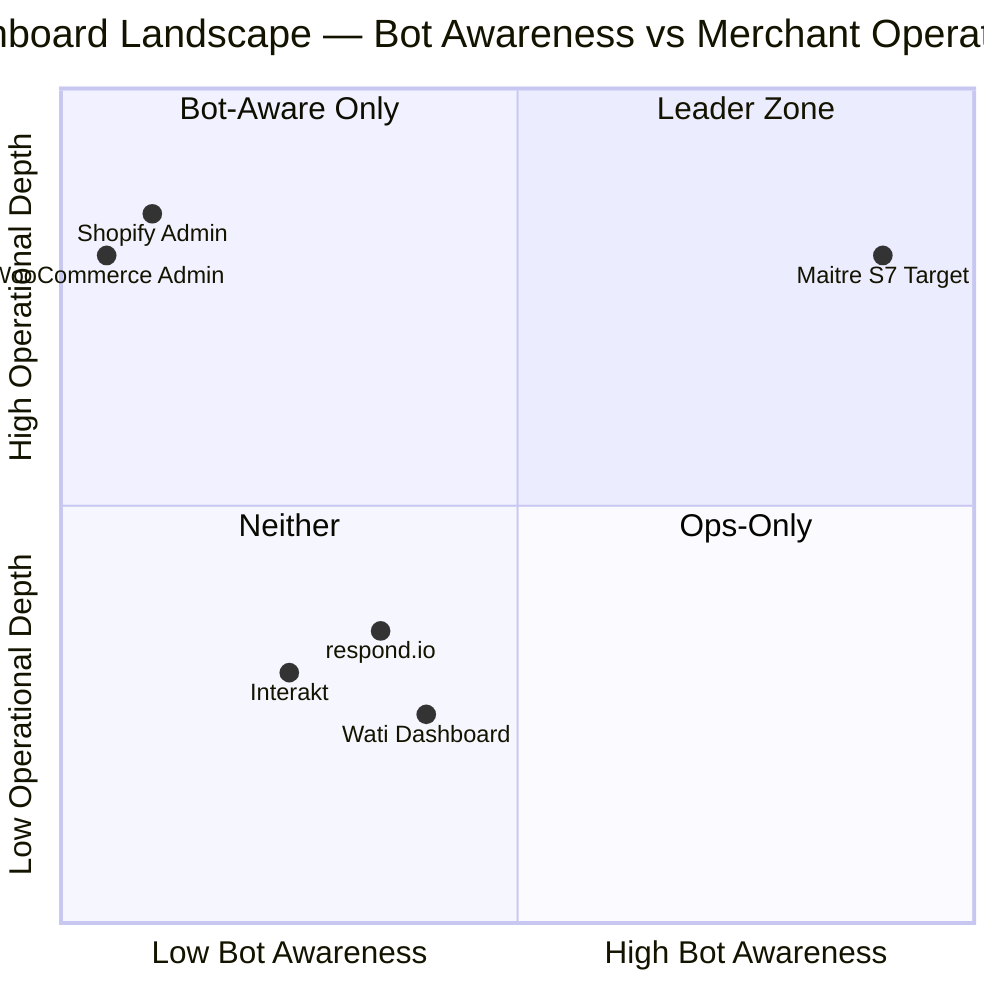
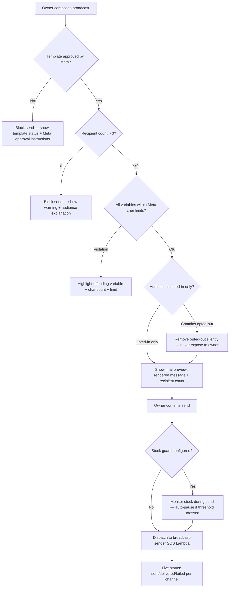

# Research Findings: Edge Cases & Differentiation — Admin SPA
## Product: Maître.ai Admin SPA (Sprint 7) | Researcher: researcher_2 | Date: 2026-04-27

---

### 1. Executive Summary

The Maître.ai Admin SPA has one feature no commerce admin has ever shipped to an SMB: **a window into the bot's brain**. The Bot Health tile exposes validator verdict distribution, LLM cost per conversation, jailbreak attempt counts, and hallucination flags — data that WooCommerce, Shopify, Wati, and respond.io do not show and cannot show because they have no equivalent AI layer. This is the EXTRA differentiator: a shop owner who uses Bot Health as a weekly tuning signal will continuously improve their bot's IQ, creating a compound moat against any competitor who deploys the same tech. The three pages with the highest edge-case risk are: /broadcasts (wrong audience = spam complaint = Meta suspension), /orders (wrong weight capture = financial dispute), and /kb (instruction-injection into KB = bot corruption). All three need explicit safety gates, not just good defaults.

---

### 2. Bot Health Tile — Differentiation Deep Dive

#### What no standard commerce admin has ever shown an SMB owner

| Metric | WooCommerce | Shopify | Wati | respond.io | Maître.ai Bot Health |
|---|---|---|---|---|---|
| Conversation → order conversion rate | No | No | Partial | Partial | ✅ With drop-off funnel |
| Average messages to checkout | No | No | No | No | ✅ |
| LLM cost per conversation | No | No | No | No | ✅ Concierge + validator split |
| Validator verdict distribution | No | No | No | No | ✅ ok / needs_clarification / warning |
| Jailbreak / refusal attempt count | No | No | No | No | ✅ |
| Hallucination flags (output ≠ catalog) | No | No | No | No | ✅ |
| Allergen claim blocks | No | No | No | No | ✅ |
| Tool-call distribution | No | No | No | No | ✅ |
| Schema-driven question completion rate | No | No | No | No | ✅ (needs_clarification = schema gap signal) |

**The EXTRA statement:** *Bot Health is the only admin dashboard metric that tells a shop owner which product schemas to fix and which KB entries to add — closing the loop between what the bot does and what the owner should teach it next.*

**How it beats competitors**: Any competitor deploying the same LLM + KB tech will not have this feedback loop unless they build it. The bot gets smarter as the owner uses the dashboard. The owner gets smarter at training the bot. This is a flywheel no BSP or Shopify plugin offers.

---

### 3. Edge Cases Catalog

#### /dashboard

| # | Case | Sev | Competitor handling | Requirement |
|---|------|-----|--------------------|----|
| ED1 | Dashboard loads but S5/S6 metrics not yet populated (new tenant) | S2 | Show 0s — confusing | Show onboarding progress card instead of empty tiles |
| ED2 | Bot Health tile shows jailbreak spike — 50 attempts in 1 hour | S3 | None | Show alert badge + link to conversation log for that window |
| ED3 | Reconciliation status shows "mismatch" — payment ledger ≠ Tranzilla | S4 | None | Red badge on Money tile with "Contact support" action, not just a number |
| ED4 | Operations tile shows overdue orders — owner hasn't checked in 2h | S3 | None | Overdue orders highlighted in red with escalating urgency color |

#### /inbox

| # | Case | Sev | Competitor handling | Requirement |
|---|------|-----|--------------------|----|
| EI1 | Owner replies from inbox but customer's 24h service window is closed | S3 | Message fails silently | Show service window status on every conversation; block free-form reply, offer template |
| EI2 | Two staff members reply to the same escalation simultaneously | S3 | Double reply sent | Claim/lock model: "Staff member X is typing" |
| EI3 | Escalation ticket has no conversation history (system error) | S2 | Show empty inbox | Show "Conversation history unavailable — customer phone: [number]" with manual contact action |
| EI4 | Escalation customer opts out during the inbox conversation | S2 | No indication | Real-time opt-out flag on conversation thread |

#### /kb

| # | Case | Sev | Competitor handling | Requirement |
|---|------|-----|--------------------|----|
| EK1 | Owner saves KB entry with injection-like text ("ignore previous", "system:") | S4 | None | Flag on save → entry status = "pending review" → not live until owner reviews |
| EK2 | Owner deletes the only KB entry for a SKU that has active orders | S3 | Delete succeeds | Show "This SKU has active orders this week — are you sure?" warning |
| EK3 | CSV upload contains 200 rows — 15 fail validation | S2 | Import 185, silently skip 15 | Show error report: row number, SKU, error reason. Download error CSV. |
| EK4 | Owner sets allergen gluten_free=true on product, later the product changes (new supplier) | S2 | Field stays true | No auto-detection possible; show "Last allergen review: X days ago" on old entries |
| EK5 | Owner previews a KB entry but KB search is not finding it for realistic queries | S2 | None | Preview includes "test query" field: type a customer question and see if this entry surfaces |

#### /orders

| # | Case | Sev | Competitor handling | Requirement |
|---|------|-----|--------------------|----|
| EO1 | Weight capture entered as 1,5 (European decimal) instead of 1.5 | S3 | Invalid entry / wrong charge | Accept comma as decimal separator; show parsed weight before confirm |
| EO2 | Staff captures wrong order (UI confusion with similar customer names) | S4 | Wrong charge | Show customer name + last 4 card + order total on capture confirm dialog |
| EO3 | Actual weight capture submitted, then Tranzilla capture fails | S4 | Weight saved, payment not captured | Show capture failure prominently; allow retry; never mark order complete before payment confirms |
| EO4 | Order placed at 22:00, owner doesn't see it until next morning | S2 | Missed order | Dashboard Operations tile shows "new orders since last login" badge |
| EO5 | Multiple weight-variable items in one order — owner must enter each weight | S2 | Tedious one by one | Batch weight entry form: all variable items in one screen |

#### /broadcasts

| # | Case | Sev | Competitor handling | Requirement |
|---|------|-----|--------------------|----|
| EB1 | Broadcast sent to 0 opted-in customers | S2 | Sends to 0 silently | Show "0 recipients" prominently, prevent send without confirmation |
| EB2 | Owner uses promo template but the template has not been approved by Meta | S4 | Send fails, no feedback | Show template approval status (approved/pending/rejected) before allowing send |
| EB3 | Stock guard SKU goes OOS 5 minutes after broadcast starts | S3 | Broadcast continues | Auto-pause + notify owner with resume/cancel options |
| EB4 | Owner accidentally picks "All customers" instead of "Opted-in only" | S4 | Sends to opted-out = spam + compliance | Force "opted-in only" as the only selectable base; no opt-out segment ever shown |
| EB5 | Broadcast contains a variable that exceeds Meta's character limit | S3 | Rejected at Meta | Validate variable length client-side before send |
| EB6 | Scheduled broadcast fires while owner is on vacation — stock has changed | S3 | Sends anyway | Show "due in X hours" reminder in dashboard; allow cancel from any page |

#### /schemas

| # | Case | Sev | Competitor handling | Requirement |
|---|------|-----|--------------------|----|
| ES1 | Owner saves new schema version — 3 customers have in-flight carts on old version | S3 | N/A | Show "N carts in progress on previous version — they will complete on old schema" info banner |
| ES2 | Owner creates a conditional rule that conflicts with another (circular dependency) | S3 | None | Validate rule graph on save — reject cycles |
| ES3 | Owner adds a required field without a default — old products have no value for it | S2 | None | Warn: "N products in this category have no value for this new required field" |
| ES4 | Live preview shows "I will ask..." but the field was set to optional — owner misunderstands | S2 | None | Preview shows required vs optional fields with distinct visual treatment |

#### /settings (kill switch)

| # | Case | Sev | Competitor handling | Requirement |
|---|------|-----|--------------------|----|
| ESW1 | Kill switch activated while Tranzilla is mid-payment | S4 | N/A | Kill switch disables new payment link generation only; in-flight payments complete |
| ESW2 | Staff member accidentally hits kill switch | S4 | N/A | Kill switch requires owner role + confirmation dialog with "type CONFIRM to disable payments" |

---

### 4. Power-Owner Unmet Needs

These are needs the owner won't articulate on Day 1 but will feel acutely by Month 2:

| Need | Trigger | Current state | Requirement |
|---|---|---|---|
| "Why is the bot asking for clarification so much this week?" | validator needs_clarification rate spike | No visibility | Bot Health tile shows which products have highest needs_clarification rate → link to their schema |
| "Which KB entries are the bot actually using?" | Cost control awareness | No visibility | Bot Health: top 10 KB entries retrieved this week + retrieval miss rate |
| "I added a new product — did I remember to set the schema?" | Catalog grows over time | Manual check | /catalog shows schema coverage badge: "12/14 products have a custom schema" |
| "The bot refused a customer's allergen question — what did it say?" | Allergen claim block event | No visibility | Bot Health: allergen claim blocks count → click → see which product + claim + fallback phrase sent |
| "Can I segment my broadcast to customers who haven't ordered in 30 days?" | Re-engagement need | Not specced | Audience segment by last-order-date filter in /broadcasts |
| "I want to see the conversation that led to this order" | Order dispute | Not obvious | Order detail → "View conversation" button |

---

### 5. Differentiation Opportunity Map

**Quadrant analysis:** Every existing tool is either ops-heavy (WooCommerce/Shopify — low bot awareness) or bot-channel-aware but ops-light (Wati/respond.io — no weight capture, no allergen editor, no schema config). Maître.ai S7 targets the Leader Zone — the only admin that is both a full commerce operations cockpit AND a bot intelligence dashboard. No competitor currently occupies this quadrant.

---

### 6. Broadcast Safety Gate — Flow

---

### 7. Allergen Editor UX Safety

The allergen field editor is a **medical/legal liability control**. The UX must communicate this without being paralyzing:

1. **Default state is safe**: `null` means the bot will say "I don't have confirmed allergen information — contact us directly." This must be explained on first visit to the field — not hidden in a tooltip.
2. **Positive confirmation only**: Setting a field to `true` requires the owner to actively toggle it. The default null state should look like "Not confirmed" not "Not set" — the language communicates the safe fallback.
3. **Review cadence reminder**: Show "Last allergen review: X days ago" on the catalog product list. Entries older than 60 days get a soft warning indicator (not alarming, but visible).
4. **Save confirmation for bulk changes**: If the owner changes allergen fields on 5+ products at once via a bulk edit, show a "You are updating allergen declarations for 5 products — this affects what the bot tells customers" confirmation before saving.
5. **No delete**: Allergen field states can be set to `null` (not confirmed) or `false` (explicitly not applicable), never deleted — the audit trail must persist.

---

### 8. Key Insights

1. **Bot Health is a new product category**, not a dashboard feature — it gives an SMB owner visibility into AI behavior that no tool has ever offered at this price point.
2. **Broadcast safety is the highest-risk page** — a single wrong-audience send can result in a Meta spam complaint, which risks phone number suspension. Safety gates are not nice-to-have.
3. **The schema editor is the owner's IQ lever** — validator needs_clarification rate in Bot Health is a direct signal that the schema editor is the fix. These two features must be linked in the UI.
4. **Weight capture UX is the daily friction point** — decimal input, confirmation, batch entry for multi-item orders — small UX failures here compound into daily frustration.
5. **Allergen fields are legal exposure for the owner** — the UX must communicate "confirmed" vs "not confirmed" clearly, not just true/false/null.
6. **The inbox 24h service window problem is a trust moment** — if the owner tries to reply to a customer and the message fails silently, they lose trust in the platform. Block the action with a clear explanation.
7. **Power-owner needs are all "close the loop" needs** — they want to see which bot failures led to which schema changes. The Bot Health → Schema Editor link is the power feature that creates the tuning flywheel.

---

### 9. Open Questions

1. Should the Bot Health tile show individual conversation IDs for jailbreak attempts, or only aggregate counts? (Privacy consideration for the owner.)
2. Can the owner see which specific KB entry was flagged for suspicious content, or only that "1 entry is pending review"?
3. Should the broadcast re-engagement audience segment (last order > 30 days) be in S7 MVP or post-MVP?
4. Should allergen review reminders be a push notification (email or WA to owner) or only visible in /catalog?
