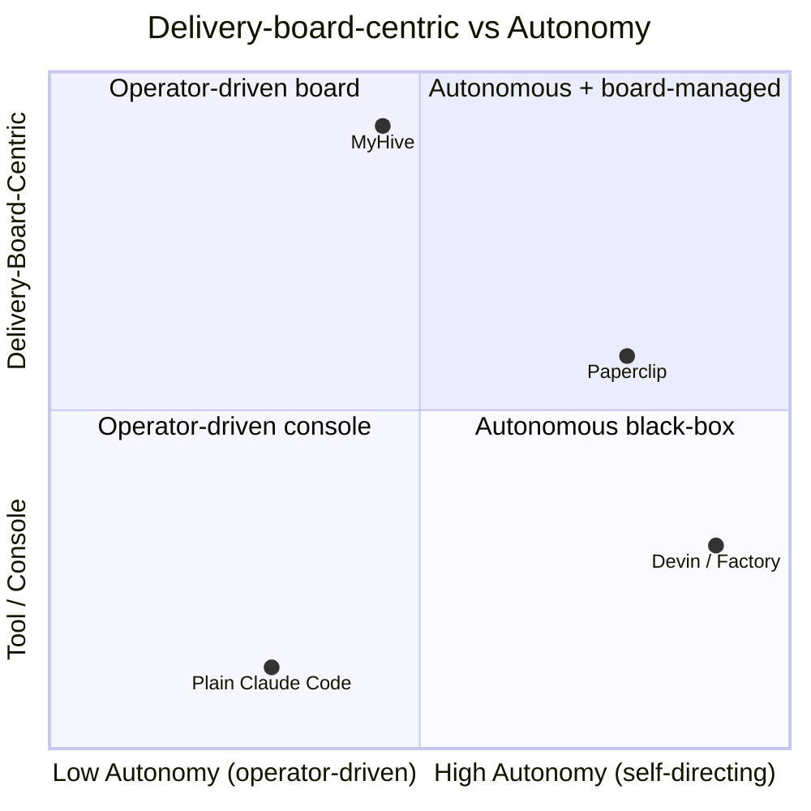

# MyHive — Researcher 2 Findings: Edge Cases & Differentiation

**Researcher:** RESEARCHER 2 (Edge Cases & Differentiation)
**Date:** 2026-06-09
**Subject:** Gaps between Paperclip (`~/sourceControl/paperclip/`) and MyHive's 5-column board model; orchestration edge cases; build-new-vs-fork inputs.
**Evidence base:** Paperclip source @ commit `0a2230b2`, Drizzle/Postgres schema (`packages/db/src/schema/`), server services/routes, React UI (`ui/src/`), README, docs.

MyHive target model: **Plans** (overview only; phases/waves/sub-tasks hidden behind it) → **Open** → **In Development** → **In Review** (code-review agents; loops back to In Development on fixes) → **Done** (committed). Self-hosted, single-operator, board-first.

---

## Executive Summary

Paperclip is a **far more capable orchestration engine than MyHive needs, wrapped in the wrong product frame for a solo operator.** Its README states the thesis directly: *"Manage business goals, not pull requests… It looks like a task manager. Under the hood: org charts, budgets, governance, goal alignment"* (README.md:36-38), and *"Not a single-agent tool… If you have one agent, you probably don't need Paperclip"* (README.md:274).

Three findings dominate:

1. **The control-plane already does everything the user thought it couldn't.** The user's #1 pain — *"couldn't stop / delete a plan from the dashboard"* — is **not a missing backend capability**. Paperclip has `DELETE /issues/:id` (issues.ts:5621), process-group run termination (`cancelRunInternal` → `terminateHeartbeatRunProcess`, heartbeat.ts:10615), and subtree pause/cancel/restore via `tree-holds` (issue-tree-control.ts:76-296). The pain is a **UX-model gap**: these controls are buried in `IssueDetail.tsx` and tree-control modals, are **absent from the Kanban card** (`KanbanCard` only renders a link, KanbanBoard.tsx:211-272), and there is **no first-class "plan" object to stop** — a "plan" is a text document, so "stopping a plan" actually means cancelling an entire issue subtree, a feature most operators never discover.

2. **The "Plans" column requires genuinely new modeling.** Paperclip has **no plan-as-board-entity and no phase/wave concept.** A plan is an *issue document* with `key='plan'` (issues.ts:2219) on a normal issue, optionally promoted into an `issue_plan_decompositions` row (issue_plan_decompositions.ts) that spawns child issues. Those children become **full board cards immediately** — there is no column that holds a plan while hiding its phases/waves. The schema has **zero "phase"/"wave" columns** (only unrelated `workspace_operations.phase`). Decomposition is a flat blocker-dependency graph (`blockedByIssueIds`, `parentId`), not the layered Plans→phases→waves→subtasks structure MyHive wants.

3. **The review loopback MyHive wants already exists — and is better than the board UI exposes.** `issue-execution-policy.ts` implements multi-stage review/approval with a `changes_requested` outcome that **moves the issue from `in_review` back to `in_progress` and reassigns it to the stored `returnAssignee`** (issue-execution-policy.ts:751-770). This is exactly In Review → In Development. But a board **drag** sets `status` directly (`onUpdateIssue(id,{status})`, KanbanBoard.tsx:335), **bypassing the stage machine** — a real correctness edge case MyHive must reconcile.

Net: every orchestration edge case I tried to find Paperclip already handles (atomic ticket claim, runaway-spend pause, zombie/stale-run recovery, heartbeat watchdogs). The opportunity for MyHive is **not capability — it is the product surface**: a board-first, plans-first, single-operator UI that exposes stop/cancel/loopback as one-click affordances on the board itself.

---

## Q1 — The "Plans" Gap

**Does Paperclip separate plan from ticket? Partially — and not the way MyHive needs.**

Paperclip's work hierarchy (from schema):

| Level | Table | Notes |
|---|---|---|
| Goal | `goals` (goals.ts) | self-parent `parentId`, `level` field (`task` default), company-scoped. The strategic "why." |
| Project | `projects` (projects.ts) | optional `goalId`, also `project_goals` M:N join (project_goals.ts). Has `pausedAt`/`pauseReason`. |
| Issue | `issues` (issues.ts) | `companyId`, optional `projectId`+`goalId`, self-ref `parentId` for sub-issues. The board card. |
| Sub-issue | `issues.parentId` | issues.ts:30 — issues nest via self-reference. |

**How a "plan" is represented:** A plan is **not a row of its own.** It is:
- an **issue document** with `key = 'plan'` (issues.ts:2219, `issueDocuments.key = 'plan'`) — i.e., markdown text attached to an issue, version-tracked by `document_revisions`;
- optionally promoted into an **`issue_plan_decompositions`** record (issue_plan_decompositions.ts:10-48) that references an `acceptedPlanRevisionId` (a `documentRevisions` row), tracks `requestedChildren` and `childIssueIds`, and has `status` (`in_flight`/etc.).

So a "plan" is **an agent's text output that gets accepted and fans out into child issues** — semi-first-class (it has a decomposition table and revisions) but it is **anchored to an issue, not a standalone board entity.**

**No phase/wave concept.** `grep` for `phase`/`wave` across the schema returns only `workspace_operations.phase` (unrelated infra). Decomposition produces a **flat set of child issues wired by `blockedByIssueIds`** (per the `paperclip-converting-plans-to-tasks` skill: *"Use the dependency tree… wire real blockers via blockedByIssueIds"*). There is **no layer between plan and issue** to hold phases or waves.

**Where MyHive's "Plans" needs NEW modeling vs reuse:**

| MyHive need | Paperclip reuse | New modeling required |
|---|---|---|
| Plans column holds an overview card | partial — could overload an issue with `key='plan'` doc | **A `plan` entity (or issue subtype) that renders as ONE board card** and whose children do NOT appear as sibling cards. |
| Phases / waves hidden behind the plan | **none** | **Two new hierarchy levels** (phase, wave) between plan and task, OR a `tier`/`depth` field + a board filter that hides depth>0 from the Plans column. |
| Sub-tasks live behind the plan, not on the board | `parentId` exists | **Board query must exclude children of a Plans-column item** — Paperclip's board shows ALL issues by status (KanbanBoard.tsx:299-310), so children would leak into Open/In Dev. |
| Plan has its own lifecycle (draft→accepted→running→done) | `issue_plan_decompositions.status` is close | A clean plan status enum distinct from the 7 issue statuses. |

**Verdict:** The Plans column is the single largest modeling gap. Paperclip can *store* a plan (as a doc + decomposition) but cannot *present* a plan as a board-column citizen that hides its internals. This is real new schema + new board-grouping logic.

---

## Q2 — The Review Loopback Gap

**Paperclip has this, and it is robust.** Evidence in `server/src/services/issue-execution-policy.ts`:

- **Review/approval stages exist as first-class config.** `IssueExecutionPolicy.stages` with `stage.type` (review/approval), `participants`, plus a `reviewPreset` (lines 317-400). Stored on `issues.executionPolicy`/`executionState` (issues.ts:53-54).
- **A decision record models outcomes.** `issue_execution_decisions` (issue_execution_decisions.ts) stores `stageType` + `outcome` + `body` per stage decision; the constant `CHANGES_REQUESTED_STATUS = "changes_requested"` (line 63).
- **The loopback itself:** when the active reviewer requests changes (status set to anything other than `done`/`in_review`), the engine sets `patch.status = "in_progress"`, reassigns to the stored `returnAssignee`, writes `executionState = buildChangesRequestedState(...)`, and records `outcome: "changes_requested"` (lines 751-770). **This is exactly In Review → (fix) → In Development with reassignment back to the developer.**
- **Forward path:** on `done` at a review stage it advances to the next pending stage or completes, with `outcome: "approved"` (lines 698-748). Requires a comment to approve/request-changes (lines 700-701, 752-753).
- **Authorization:** *"Only the active reviewer or approver can advance the current execution stage"* (line 783) — prevents the developer self-approving.

**Code-review agent role concept:** Agents have a generic `role` (agents.ts:23, default `"general"`) and stage `participants` are principals (agent or user). There is **no dedicated "code_reviewer" enum role** — a reviewer is just whichever agent is assigned as a stage participant. MyHive's "code-review agents" map to "agents configured as review-stage participants."

**Approval gates the user mentioned:** confirmed — `approvals` + `issue_approvals` tables (approvals.ts, issue_approvals.ts) model board-level approval gates (`status` pending/decided, `decidedByUserId`). Distinct from the execution-stage review loop. README:222: *"Board approval workflows, execution policies with review/approval stages, decision tracking."*

**Can it loop a ticket backward in status?** Yes — `in_review → in_progress` is a normal, supported transition driven by the stage machine. The only caveat (see edge cases) is that a **board drag** bypasses this machine and sets status raw.

**Verdict:** This is the **smallest gap.** MyHive's review loopback is largely *reuse*. The work is UI: surface the changes-requested action and the loopback animation on the board, and reconcile drag-vs-stage-machine.

---

## Q3 — Control Edge Cases (the user's #1 pain investigated)

**The user's pain — "couldn't stop / delete a plan from the dashboard" — is a discoverability/model gap, not a capability gap.**

What the **backend** provides (all present):
- `DELETE /issues/:id` — full hard delete incl. attachment cleanup + audit log (issues.ts:5621-5659).
- **Run cancellation with process kill:** `cancelRunInternal(runId, reason)` (heartbeat.ts:10615) → `terminateHeartbeatRunProcess` (heartbeat.ts:2745) which calls `terminateLocalService` and kills the **descendant process group** if the parent pid exited (heartbeat.ts:2774).
- **Subtree control:** `POST /issues/:id/tree-holds` with modes `pause | cancel | restore | resume` (issue-tree-control.ts:76-296) — cancels non-terminal issues in a subtree, interrupts active runs, cancels unclaimed wakeups, and can restore.
- **Project pause:** `projects.pausedAt`/`pauseReason` blocks checkout (issues.ts:5670-5680).

What the **UI** provides (present but scattered):
- `api.issues.remove(id)` → DELETE (ui/src/api/issues.ts:185).
- Pause/stop run, "stopRunLabel='Pause work'", run stop → cancelled/done (IssueDetail.tsx:972, 1997-2013).
- Tree-control modal with pause/cancel/restore (IssueDetail.tsx:1289-1291, 209-220).

**Why the pain is real anyway:**
1. **No stop/cancel/delete on the board card.** `KanbanCard` renders only `identifier`, title, priority, assignee, and a `<Link>` (KanbanBoard.tsx:211-272). To stop anything you must navigate into a 168 KB `IssueDetail.tsx` and find the right modal.
2. **No first-class "plan" to stop.** A plan is a document that fanned out into a subtree. "Stop the plan" = "create a subtree cancel hold on the plan's root issue" — a concept-mismatch most operators will not connect to the feature.
3. **The dashboard surface is the wrong altitude.** README frames the dashboard around goals/companies, not a stop-button-per-plan.

### Edge Cases Catalog (simple → severe → catastrophic)

| # | Edge case | Severity | How Paperclip handles / misses it | Recommendation for MyHive |
|---|---|---|---|---|
| 1 | **Cold columns clutter (done/cancelled/backlog crowd the board)** | Simple | Handled — `KANBAN_COLD_STATUSES` + collapsible columns + paging (KanbanBoard.tsx:33, 102-120) | Reuse the collapse/paging pattern; MyHive's 5 columns reduce this anyway. |
| 2 | **Lost review feedback (changes-requested note vanishes)** | Simple→Severe | Handled — requires a comment to request changes (issue-execution-policy.ts:752-753); decision body persisted in `issue_execution_decisions` | Surface the changes-requested comment inline on the card when it loops back. |
| 3 | **Two agents grab the same ticket** | Severe | **Handled well** — `SELECT … FOR UPDATE` row lock + `checkoutRunId`/`executionLockedAt` + compare-and-swap on `expectedCheckoutRunId` (issues.ts:3636, 3695-3747); `sameRunLock` guard (issues.ts:378) | **Reuse verbatim if forking.** If building new, replicate the atomic-checkout pattern — do not hand-roll. |
| 4 | **Board drag bypasses the review stage machine** | Severe | **Missed/risky** — drag calls `onUpdateIssue(id,{status})` raw (KanbanBoard.tsx:335), not the execution-policy path that enforces `returnAssignee` and reviewer authorization | MyHive must route board status changes **through** the stage machine, or disable raw drag between In Review↔In Dev. |
| 5 | **Stuck / zombie tickets (assigned, no live run)** | Severe | Handled — recovery service: `stranded_issue_recovery`, `stale_active_run_evaluation`, `active_run_watchdog`, liveness recovery (recovery/service.ts, issue-graph-liveness.ts; migration 0070 output watchdog) | Reuse if forking; otherwise port the stranded-issue sweep. Critical for unattended solo operation. |
| 6 | **Heartbeat / run never terminates** | Severe | Handled — `heartbeat_run_watchdog_decisions`, output-stale watchdog, process-group SIGTERM/SIGKILL on lost parent pid (heartbeat.ts:2745-2774, 10615) | Must-have for solo unattended runs. Reuse or port. |
| 7 | **Runaway token spend** | Catastrophic (cost) | **Handled well** — `budgetService.getInvocationBlock`, scoped budget policies w/ warning + hard-stop, *"Overspend pauses agents and cancels queued work automatically"* (README:229), `cancelRunInternal("Cancelled due to budget pause")` (heartbeat.ts:10783); `budget_policies`, `budget_incidents`, `cost_events` tables | **Reuse — this is expensive to rebuild correctly.** Expose a per-plan budget cap on the Plans card. |
| 8 | **Orphaned plans (plan accepted, children created, plan abandoned)** | Severe | Partial — `issue_plan_decompositions.status` tracks in_flight; subtree cancel exists but plan isn't a board entity, so orphans aren't visible as orphans | MyHive's first-class Plan entity + plan lifecycle status makes orphans visible and one-click-cancellable. **This is a MyHive differentiator.** |
| 9 | **Can't stop/delete a plan from the dashboard (USER'S #1 PAIN)** | **CATASTROPHIC (UX/trust)** | **Capability present, surface missing** — DELETE + subtree-cancel exist but require deep navigation; no plan entity; no board affordance | **MyHive's flagship fix:** stop/cancel/delete as a one-click control on every Plans-column card, wired to subtree-cancel + run-termination. |
| 10 | **Children leak onto the board (sub-tasks appear as Open cards next to their plan)** | Severe (model) | **Missed for MyHive's model** — board groups ALL issues by status (KanbanBoard.tsx:299-310); children render as siblings | New board query must hide descendants of a Plans-column item. |

---

## Q4 — Differentiation: What MyHive Can Own

Paperclip's own README is the differentiation map. It is explicitly **goal-first, multi-company, team-scale, governance-heavy**:
- *"Manage business goals, not pull requests"* (README:38)
- *"Multi-Company… One deployment, many companies"* (README:102-103)
- *"True multi-company isolation… every entity is company-scoped"* (README:153)
- *"Not a single-agent tool. This is for teams… If you have twenty agents — you definitely do"* (README:274)

For a **solo operator doing engineering work**, that frame is overkill: multi-company isolation, org charts, board-user invite flows, company memberships, governance approval queues, and goal→project→issue ancestry are all weight with no payoff.

**What MyHive can own (Paperclip does not, or does badly for solo):**

1. **Board-first, not goal-first.** The board IS the product, not a "task-manager-looking" skin over a company model. No goals/projects/companies ceremony required to start.
2. **The explicit Plans column.** A first-class plan card that hides phases/waves/subtasks. Paperclip has no such entity; plans are documents that leak children onto the board.
3. **Tight, visible review loopback.** Surface In Review → In Development on the board with the changes-requested reason inline. Reuse Paperclip's stage engine; fix the drag-bypass; make the loop a visible board motion.
4. **Single-operator simplicity.** Drop multi-company, org charts, invite flows, board-user RBAC, governance approval queues. One operator, one deployment, one board.
5. **One-click stop/cancel/delete on every card and plan.** Directly answers the #1 pain. Wire the existing backend kill/cancel/subtree-hold to board affordances.
6. **Real-time agent monitoring / live log view as a primary surface.** Paperclip has live run widgets (`LiveRunWidget.tsx`, `IssueRunLedger.tsx`) but they live inside issue detail. MyHive can make "watch my agents work" a top-level board overlay.

**Is Paperclip's complexity overkill for a solo operator?** Yes. Multi-company isolation, governance approval workflows, scoped org-chart RBAC, board-user invite/JWT flows, and goal-ancestry context are designed for *running a business with many agents across many companies.* A solo engineer wants: a board, agents, plans, a stop button, a budget cap, and a log view. ~70% of Paperclip's surface is unused weight for that user — but the **orchestration core (checkout locking, recovery, budgets, stage machine) is exactly right and hard to rebuild.**

---

## MyHive vs Paperclip vs Autonomous Agents vs Plain Claude Code

- **MyHive:** high board-centricity, moderate autonomy (operator stays in the loop via the board + stop controls).
- **Paperclip:** high autonomy (goal→agents self-run), board is present but secondary to the goal/company model.
- **Devin/Factory-style:** very high autonomy, low board-centricity — a black box that returns PRs.
- **Plain Claude Code:** low autonomy, no board — a console/tool the operator drives turn by turn.

---

## The EXTRA Edge Statement

> **MyHive's edge is the single-operator delivery board that makes orchestration legible and stoppable.** Paperclip already *can* stop a run, cancel a subtree, kill a process group, and loop a review back to development — but it hides those powers behind a goal/company/governance model built for running a business with twenty agents. MyHive wins by inverting the frame: **the 5-column board is the product**, the **Plans column is a first-class entity that hides its phases/waves/subtasks**, the **review loopback is a visible board motion**, and **stop / cancel / delete is one click on every card and plan.** MyHive does not out-engineer Paperclip's control plane — it out-*surfaces* it for the one user Paperclip explicitly says it is not for: the solo operator with one or two agents doing real engineering work.

---

## Build-vs-Fork Argument Table

| Dimension | Fork Paperclip wins | Build new wins |
|---|---|---|
| **Atomic ticket claim / no double-work** | Battle-tested `FOR UPDATE` + CAS checkout (issues.ts:3636-3747) — costly and bug-prone to rebuild | — |
| **Runaway-spend protection** | Full budget engine: scoped policies, hard-stops, auto-pause+cancel (budget_policies, heartbeat.ts:10783) | — |
| **Zombie/stale-run recovery & heartbeat watchdogs** | Mature recovery service + watchdog decisions (recovery/service.ts, heartbeat.ts:2745) | — |
| **Review/approval stage machine + loopback** | Already implements changes_requested → in_progress reassignment (issue-execution-policy.ts:751-770) | — |
| **Adapter ecosystem (Claude/Codex/Cursor/Gemini/OpenClaw)** | ~12 adapters already wired (ui/src/adapters/*) | — |
| **The "Plans" column (plan as board entity, hides phases/waves)** | — | No phase/wave concept; plans are documents; children leak onto board — needs new schema + board grouping |
| **Board-first product frame** | — | Paperclip is goal-first by design (README:38); refactoring the IA fights the grain |
| **Single-operator simplicity** | — | Must *remove* multi-company, org charts, invites, governance RBAC — deletion/refactor cost across 256 KB issues.ts, 168 KB IssueDetail.tsx |
| **One-click stop/delete on board cards** | backend reuse is free | new UI; trivial to build fresh, awkward to retrofit into Paperclip's deep IssueDetail surface |
| **Codebase size / cognitive load** | — | Paperclip is large (97 schema tables, 256 KB route file); a solo MyHive could be a fraction of it |
| **Time-to-first-board** | inherits working engine + UI day one | greenfield rebuild of orchestration core is months |
| **Drag-bypasses-stage-machine bug** | inherited as-is (must patch KanbanBoard.tsx:335) | designed correctly from the start |

**Migration/refactor cost of bending Paperclip to the 5-column + Plans-first model (estimate, 1 SP = 1 dev-day):**

- Collapse 7 statuses → 5 columns, map `backlog`/`todo` → `Open`, hide `cancelled`/`blocked`: **2-3 SP** (board + status enum + tests).
- New **Plan entity + phase/wave hierarchy + board grouping that hides descendants**: **8-13 SP** (schema, migration, decomposition rewrite, board query).
- Route board status changes through the stage machine (fix drag-bypass): **2-3 SP**.
- Strip multi-company / org-chart / governance / invite surfaces for solo mode (or hide behind a flag): **8-13 SP** of deletion + regression risk across the largest files.
- One-click stop/cancel/delete board affordances wired to existing backend: **3-5 SP**.

**Total bend cost ≈ 23-37 SP**, most of it concentrated in the Plans modeling and the solo-mode strip-down — i.e., **the fork's savings (free orchestration engine) are partly eaten by fighting the goal-first/multi-company grain.**

---

## Key Insights for the PMs

1. **The #1 pain is a surface problem, not a capability gap.** Stop/cancel/delete and subtree-cancel all exist in Paperclip's backend and even its UI — they're just buried and there's no "plan" object to stop. MyHive's win is *exposure*, not new infrastructure.

2. **The Plans column is the one true new build.** Paperclip has no plan-as-board-entity and no phase/wave layer (only `issue_documents key='plan'` + flat child decomposition). This is where MyHive must add schema and board-grouping logic regardless of build-vs-fork.

3. **The review loopback is nearly free.** `issue-execution-policy.ts` already loops `in_review → in_progress` with reassignment to `returnAssignee` and reviewer-only authorization. MyHive mostly needs to *surface* it and fix the drag-bypass.

4. **There is a latent correctness bug to inherit or avoid:** board drag sets status raw (KanbanBoard.tsx:335), bypassing the stage machine. Whichever path is chosen, MyHive must route status changes through the policy engine.

5. **Paperclip's orchestration core is genuinely hard and worth reusing:** atomic checkout locking, budget hard-stops with auto-cancel, and zombie/stale-run recovery are the three things a solo operator most needs running unattended — and the three most expensive to rebuild correctly.

6. **~70% of Paperclip is dead weight for the target user.** Multi-company isolation, org charts, governance approval queues, board-user RBAC, and goal-ancestry context serve a "run-a-business-with-twenty-agents" buyer that the README explicitly contrasts with the solo user. MyHive's identity is the inverse.

7. **Fork-vs-build is a wash on raw effort but not on product clarity.** Forking saves the engine (~big) but costs ~23-37 SP bending the goal-first/multi-company model into board-first/solo, plus permanent drag against the upstream grain. Building new is slower to a working engine but yields a codebase that *is* the product. Recommend **fork the engine packages (db, heartbeat, recovery, budgets, execution-policy) but build a new board-first UI and a new Plan entity on top** — keep the hard parts, replace the frame.

8. **MyHive's defensible edge is legibility + stoppability for one operator.** Not autonomy (Devin/Factory own that), not console flexibility (Claude Code owns that), not business orchestration (Paperclip owns that). The board that makes agent work *visible and stoppable* at a glance is the open quadrant.

---

## Open Questions

1. **Phase/wave depth:** Does MyHive want a fixed 2-level (phase→wave) hierarchy under a plan, or arbitrary depth? This determines whether a `tier` integer + filter suffices or a new linked entity is required.
2. **Drag semantics in the 5-column board:** Should dragging a card from In Review → In Development be allowed at all, or must the loopback only happen via a code-review agent's "request changes"? (Affects the stage-machine routing decision.)
3. **What does "committed" mean in Done?** Is Done gated on an actual git commit/PR-merge signal, or just a status flip? Paperclip's `done` is a status; MyHive's "committed" implies a terminal-effect check the Wiring-Expert mindset would demand.
4. **Solo-mode strategy if forking:** Hide multi-company/governance behind a feature flag (lower effort, carries dead code) or hard-remove (higher effort, cleaner)? Affects the 8-13 SP strip-down estimate.
5. **Budget surface:** Per-plan budget cap on the Plans card — reuse Paperclip's scoped `budget_policies` keyed to the plan's subtree, or a simpler global cap for v1?
6. **Real-time log view scope:** Top-level live board overlay (new) vs reuse Paperclip's `LiveRunWidget`/`IssueRunLedger` inside a card drawer?
7. **Plan acceptance gate:** Does a plan need explicit operator approval before it spawns its phases/waves (reuse `approvals`/`issue_approvals`), or does accepting the plan auto-decompose?
