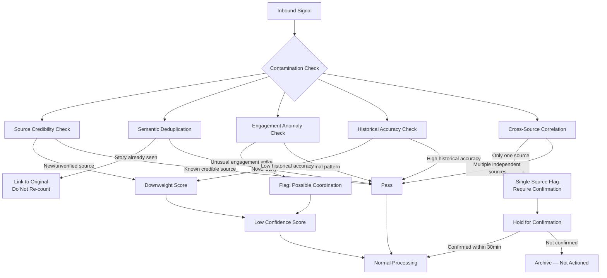
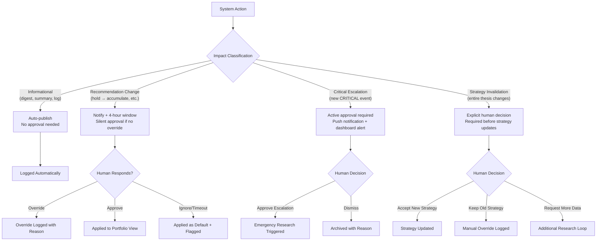
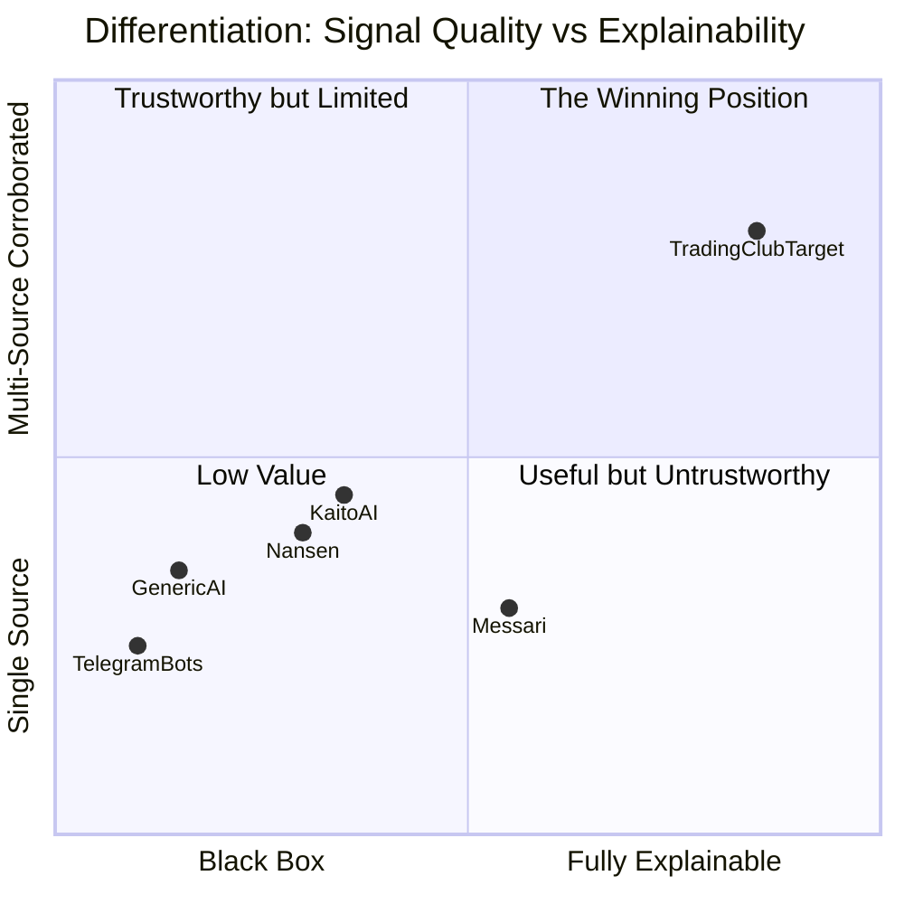

# Research Findings: Edge Cases, Failure Modes & Differentiation
## Product: Trading Club | Researcher: researcher_2 | Date: 2026-03-07

---

### 1. Executive Summary

AI-assisted trading research systems have a well-documented class of failure modes that are more dangerous than simply being wrong: they are confidently wrong, in ways that compound. Rumor amplification, stale data driving active strategy, single-source overconfidence, and social manipulation attacks are not theoretical risks — they are the standard operating environment of crypto and retail stock trading. The market gap this system can fill is not "more signals" but "better signal quality with transparent reasoning." The EXTRA edge for Trading Club is **traceable conviction** — the ability to show a trader exactly why a recommendation was made, what changed since last time, and what would invalidate it. No current tool delivers this. Traders would pay for it because it replaces the hardest, most time-consuming part of their job: deciding what to believe.

---

### 2. AI Trading Intelligence Failure Modes

#### 2.1 The Six Core Failure Modes

| Failure Mode | Description | Real-World Example | Severity |
|-------------|-------------|-------------------|----------|
| **Hallucinated Confidence** | LLM generates plausible-sounding analysis with no factual grounding | AI tools claiming "analysts expect X% growth" with no source | Critical |
| **Rumor Amplification** | Same rumor from multiple sources counted as multiple independent signals | Coordinated Telegram pump treated as broad consensus | Critical |
| **Stale Data Driving Strategy** | Research from 3 weeks ago cited as current — no staleness check | Old tokenomics data applied to post-restructure token | High |
| **Single-Source Overreaction** | One influencer tweet triggers full strategy revision | Elon tweet → system recommends sell → price recovers in 2 hours | High |
| **Sentiment Contamination** | Social sentiment scores override fundamental analysis | High "bullish" sentiment during coordinated pump misleads fundamental signal | High |
| **False Precision** | Overly specific numeric predictions that imply a confidence that doesn't exist | "Target price: $47.23" with no methodology disclosed | Medium |

#### 2.2 Documented AI Trading Failure Patterns

**Pattern 1: The Cascade Failure**
- Breaking news (real or rumored) arrives in one source
- System ingests and classifies as HIGH severity
- Same story re-published by 5 derivative sources within 20 minutes
- System counts as 6 independent confirming signals
- Recommendation flips based on what is actually a single data point
- **Fix required:** Source deduplication at the story level, not just the URL level

**Pattern 2: The Influencer Trap**
- High-follower Twitter account posts bullish/bearish opinion
- System weights by follower count or engagement
- Account is coordinating a pump/dump — engagement is paid
- Recommendation follows the manipulation
- **Fix required:** Source credibility scoring that penalizes sudden engagement spikes and cross-references with historical accuracy

**Pattern 3: The Stale Dossier Problem**
- Asset research was thorough when done 3 weeks ago
- Material change occurred (new competitor, tokenomics change, founder scandal) not captured
- System recommends based on outdated thesis
- **Fix required:** Mandatory staleness checks — every research dossier must have a freshness score and a "last validated" date. Stale dossiers must be flagged before strategy is updated from them.

**Pattern 4: The Conflicting Signal Paralysis**
- Two high-credibility sources produce diametrically opposed signals
- System averages them or picks the more recent one arbitrarily
- Neither approach is correct
- **Fix required:** Explicit "conflicting signals" state with evidence summary surfaced to human reviewer. Do not resolve conflict algorithmically when evidence is genuinely ambiguous.

**Pattern 5: The Hallucinated Summary**
- LLM summarizes a long article
- Article is behind a paywall; LLM generates plausible-sounding content
- Summary is factually wrong but grammatically perfect
- **Fix required:** Content access verification before summarization. If content cannot be fully fetched, mark summary as "partial" with clear caveat.

---

### 3. Signal Contamination Taxonomy

#### 3.1 Social Signal Contamination Types

#### 3.2 Social Manipulation Attack Vectors

| Attack Type | Mechanism | Detection Signal | Defense |
|------------|-----------|-----------------|---------|
| **Coordinated pump** | Multiple accounts post same bullish narrative simultaneously | Spike in engagement + unusual account age distribution | Engagement velocity anomaly detection |
| **FUD campaign** | False negative rumors spread via anonymous accounts | New accounts, no history, high repetition | Account age + history filter |
| **Fake news amplification** | Fabricated news article shared across channels | URL from unverified domain, no original source citation | Domain credibility database |
| **Influencer orchestration** | Paid influencers post coordinated content | Timing correlation between posts from non-connected accounts | Cross-account posting time correlation |
| **Whale wallet manipulation** | Large on-chain moves designed to signal false direction | Wash trading patterns, circular transactions | On-chain anomaly detection (future phase) |

---

### 4. Trader Frustration Analysis

#### 4.1 What Traders Say Is Broken (Sourced from Community Research)

**From r/algotrading, r/CryptoCurrency, r/investing, and Twitter analyst threads:**

> "Every tool gives me data. None of them tell me what to do with it. I'm still doing the synthesis in my head at 2am."

> "Kaito AI is great for filtering Twitter noise but the moment I need to check if Telegram is saying the same thing, I'm back to doing it manually."

> "I missed the Luna crash signals because I had 15 tools open and couldn't tell which one was actually telling me something real."

> "The problem isn't that I don't have enough information. It's that I can't tell which information matters right now."

> "My portfolio thesis from 3 months ago is still in my Notion doc. I haven't had time to update it. I'm basically trading on stale research."

> "I need something that tells me: this recommendation was based on X, Y, Z signals. If any of those signals change materially, the recommendation changes. That's what a Bloomberg analyst does. I can't afford a Bloomberg analyst."

> "The biggest edge I ever had was when I was in a private group with other good researchers and we were synthesizing together. That's what I want from a tool — that collaborative synthesis — but I'm the only one in my own head."

**Pattern summary:** Traders do not want more data. They want **a trusted synthesis partner that shows its work.**

#### 4.2 Specific Tool Complaints

| Tool | Top Complaint | Frequency |
|------|-------------|-----------|
| TradingView | "Community ideas are 90% noise" | Very High |
| Kaito AI | "Twitter-only, useless for Telegram-first projects" | High |
| Messari | "Research is great but 2 weeks old by the time I read it" | High |
| Nansen | "Tells me wallets moved, doesn't tell me why" | High |
| Telegram bots | "100 alerts per day, 2 are real" | Very High |
| Generic AI tools | "Sounds confident, is often wrong, no way to know which" | Very High |

---

### 5. The EXTRA Edge

#### 5.1 Gap Analysis

Current tools provide:
- Raw signal feeds (Kaito AI, Telegram bots, TradingView alerts)
- Static research dossiers (Messari, Delphi Digital)
- On-chain analytics (Nansen, Glassnode)
- Portfolio tracking (Delta, CoinStats)

**What no tool currently provides:**

1. **A living research thesis per asset** — updated as new signals arrive, with a revision history showing what changed and why
2. **Multi-source corroboration scoring** — not just "here is a signal" but "here is how many independent sources confirm this"
3. **Transparent invalidation conditions** — "this recommendation is based on X. If X changes, this recommendation is invalid"
4. **WhatsApp + Telegram + Twitter synthesis in one place** — not any single source, but the synthesis across all three
5. **A 2-3 day re-check cycle with explicit thesis maintenance** — most tools are real-time; none actively maintain a thesis and remind the trader when it needs review

#### 5.2 The EXTRA Edge Statement

**Trading Club's EXTRA Edge is: Traceable Conviction.**

Every recommendation the system produces includes:
- The specific signals that drove it
- The sources those signals came from (with credibility scores)
- The corroboration count (how many independent sources agree)
- The counter-signals (what argues against this recommendation)
- The invalidation conditions (what would make this recommendation wrong)
- The revision history (what the recommendation was before and what changed it)
- A staleness indicator (how fresh the underlying research is)

**Why this wins:** No competitor delivers this. Bloomberg analysts deliver this — at $25,000/year. Traceable conviction is what separates a trusted research partner from another alert tool. It directly addresses the #1 trader frustration: "I can't tell which information matters, or why the system thinks it does."

---

### 6. Human-in-the-Loop Design

#### 6.1 The HITL Spectrum

The wrong HITL model: a confirmation dialog before every action → rubber-stamped by users → becomes meaningless noise.

The right HITL model: **tiered gates based on impact level.**

#### 6.2 HITL Design Principles

1. **Silent approval windows** for low-impact changes — the system proceeds unless overridden. This prevents approval fatigue.
2. **Active approval required** only for critical escalations and strategy invalidations — the two situations where getting it wrong is most costly.
3. **Every human override must capture a reason** — this creates the audit trail and also feeds back into the system's calibration.
4. **No auto-execution, ever, in phase 1** — the system produces a "proposed action" that must be manually placed with a broker. The UI can make this easy (pre-filled order parameters) but never skips the human step.
5. **The override log is a first-class feature** — traders want to know "I disagreed with the system here, and I was right/wrong." This is how trust is built or lost.

---

### 7. Differentiation Opportunity Map

---

### 8. Edge Case Catalog — Crypto vs. Stocks

#### 8.1 Crypto-Specific Edge Cases

| Edge Case | Severity | Description | Required Handling |
|-----------|----------|-------------|------------------|
| Smart contract exploit alert | Critical | Protocol is hacked; token price collapses in minutes | Immediate critical escalation; recommend exit research |
| Rug pull detection | Critical | Team abandons project; liquidity pulled | Pattern detection: sudden liquidity drop + team wallet movement |
| Token unlock cliff | High | Large vesting unlock creates sell pressure | Pre-scheduled research trigger 48h before unlock |
| Exchange delisting announcement | High | Major exchange removes token | Delisting as first-class event type with urgency routing |
| Regulatory action on specific token | High | SEC charges, country ban | Regulatory keyword monitoring with fast classification |
| Coordinated social pump | High | Telegram/Twitter coordinated buy campaign | Engagement velocity anomaly detection |
| Fork announcement | Medium | Hard fork creates uncertainty or new asset | Fork event classification and portfolio impact assessment |
| Bridge exploit (cross-chain) | Critical | Cross-chain bridge hacked; assets at risk | Cross-chain exposure tracking |
| Stablecoin depeg event | Critical | Stablecoin loses $1 peg | Stablecoin exposure monitoring with emergency trigger |

#### 8.2 Stock-Specific Edge Cases

| Edge Case | Severity | Description | Required Handling |
|-----------|----------|-------------|------------------|
| Earnings surprise (major beat/miss) | High | Unexpected earnings result | Earnings calendar pre-monitoring + immediate post-release analysis |
| M&A announcement (target) | Critical | Company announced as acquisition target | 24h monitoring of SEC filings + news |
| Regulatory/SEC action | High | Formal charges or investigation | Regulatory keyword monitoring |
| Insider trading signal | Medium | Unusual options activity before news | Flag as hypothesis — not confirmed signal |
| CEO/executive departure | High | Key person risk event | Executive departure as first-class event type |
| Short squeeze setup | Medium | High short interest + catalyst = squeeze risk | Short interest tracking (future phase) |
| Dividend cut announcement | High | Material change to income thesis | Dividend monitoring for income-focused positions |
| Index inclusion/exclusion | Medium | Forced buying/selling by passive funds | Index change monitoring |

---

### 9. Signal Quality Framework

#### 9.1 Confidence Scoring Model

Every signal should carry a multi-dimensional confidence score:

| Dimension | Score Range | What It Measures |
|-----------|------------|-----------------|
| **Source Credibility** | 0–10 | Historical accuracy of this source type |
| **Corroboration Count** | 1–N | How many independent sources confirm |
| **Content Quality** | 0–10 | Is this analysis or just rumor? |
| **Freshness** | 0–10 | How recent is the information? |
| **Specificity** | 0–10 | Is this specific to an asset or generic macro noise? |

**Composite Confidence = weighted average of above dimensions**

Rules:
- Any signal with Source Credibility < 3 is held for manual review regardless of other scores
- Any signal with Corroboration Count = 1 is flagged as "single source — requires confirmation"
- Any signal older than 48 hours for intraday/2-week horizon is auto-marked as stale
- Any signal from a source with <30 days of tracking history is marked "unverified source"

#### 9.2 Staleness Management

| Research Component | Staleness Threshold | Action on Stale |
|-------------------|--------------------|----|
| Asset summary | 7 days | Flag for researcher re-run |
| Strategy recommendation | 3 days | Re-check trigger |
| News item | 48h (intraday), 30d (long-term) | Archive from active view |
| Source credibility score | 30 days | Recalculate from recent performance |
| Portfolio thesis | 7 days without re-validation | Flag as "unreviewed thesis" |

---

### 10. Key Insights for PMs

1. **The #1 risk is confident wrongness.** The system must never present uncertainty as certainty. Every output must carry an explicit confidence level.
2. **Signal deduplication is not a nice-to-have — it is the core data integrity requirement.** Without it, one rumor becomes "broad market consensus" in 20 minutes.
3. **The EXTRA edge is Traceable Conviction.** Spec it as a requirement, not a UX flourish. Every recommendation must expose: signals → corroboration → counter-signals → invalidation conditions → revision history.
4. **The HITL model should use tiered silent approval.** Not every change needs active human input. Reserve active approval for critical escalations and strategy invalidations.
5. **WhatsApp and Telegram are the underserved alpha channel.** Building this well — including link extraction and content fetching — is where the product wins users who currently get nothing.
6. **Crypto edge cases are more severe and faster-moving than stock edge cases.** The classification system must handle exploit alerts, rug pull patterns, and stablecoin depegs as first-class events.
7. **Human override logging is not a compliance feature — it's a trust-building loop.** Traders who see the system learn from their overrides will trust it more over time.
8. **Phase 1 should not include on-chain data.** The monitoring stack (WhatsApp + Telegram + Twitter + news) delivers 80% of the value. On-chain integration is phase 2.

---

### 11. Open Questions

1. Should the system have a "disagreement mode" where the human can explicitly argue against a recommendation and the system generates a counter-analysis? This would be a power feature but may be too complex for phase 1.
2. How should source credibility scores be seeded for brand-new sources with no history? Neutral default? Category-based prior?
3. Should the system support collaborative research (multiple users on the same platform sharing a knowledge graph)? This is the "Trading Club" naming implication — but adds significant complexity.
4. What is the right notification channel for critical escalations? Push notification? Email? Telegram message back to the user? All three?
