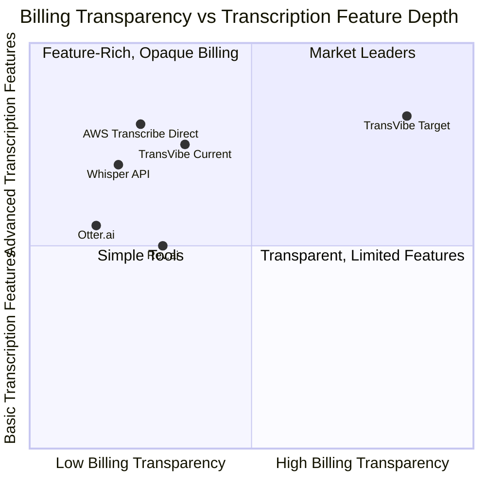

# Research Findings: Edge Cases & Differentiation
## Product: TransVibe Credit & Performance Transparency | Researcher: researcher_2 | Date: 2026-03-23

---

### 1. Executive Summary

The estimated-vs-actual credit divergence is structurally unavoidable in TransVibe's pipeline: the lock uses file-metadata duration (pre-upload, before MediaConvert), while the actual charge uses the transcript's confirmed duration (post-processing). This means divergence is not a bug — it's a design reality that currently operates in total opacity. The EXTRA Edge: TransVibe can become the only transcription service that shows users a **per-job credit audit trail** — estimate, actual, difference, and reason — making opacity a historical artifact. Competitors (Otter.ai, Rev.ai, AWS Transcribe direct) provide no per-job billing breakdown; they simply charge. Stripe-level billing transparency is the standard to target, not the category average.

---

### 2. Edge Cases Catalog

#### 2.1 Processing Time Edge Cases

| # | Edge Case | Severity | Root Cause | Current Behavior | Recommended Handling |
|---|-----------|----------|-----------|-----------------|---------------------|
| PT-1 | `engineStartedAt` missing from all locations in event | Medium | State machine event chain doesn't propagate start time (e.g., step retried, event field dropped) | `metering.processingTimeSec` is `undefined`; `processingTimeMs` would be `null` | Store `null`; never derive from `createdAt` (would mislead — includes queue wait time) |
| PT-2 | Job retried mid-pipeline — `engineStartedAt` from first attempt | High | Step Function retry on transient failure reuses original `engineStartedAt` | `processingTimeSec` overstates actual time (includes failure recovery time) | Document this as "total wall-clock time including retries" — valid and useful for SLA analysis |
| PT-3 | Lambda timeout — `TransVibePersistAndNotify` never executes | High | Lambda timeout / Step Function failure path | `metering` object is never written to DynamoDB; transcript may be in `FAILED` state | `processingTimeMs` is null for FAILED transcripts — expected; document in API spec |
| PT-4 | `metering.processingTimeSec` is 0 (sub-second job) | Low | Very short audio (<1s), `Math.round` rounds to 0 | `processingTimeMs` would be `0` — misleading | Use `metering.completedAt - metering.startedAt` for ms precision when both are present |
| PT-5 | `metering` object on old transcript documents (pre-feature) | Medium | Documents created before metering was added have no `metering` field | `processingTimeMs` would be `null` | Accept null; document as "not available for jobs prior to [feature release date]" |

#### 2.2 Credit Divergence Edge Cases

| # | Edge Case | Severity | Root Cause | Divergence Direction | Impact |
|---|-----------|----------|-----------|---------------------|--------|
| CD-1 | File metadata duration incorrect (VBR, container mismatch) | High | Lock uses `durationSeconds` from S3 metadata / file header; actual uses MediaConvert output | Can be ±20-40% | User charged significantly more or less than estimate |
| CD-2 | MediaConvert trims silence or crops audio | Medium | MediaConvert may detect shorter actual audio | Actual < Estimate (user wins) | Refund of excess locked credits — should be clearly surfaced |
| CD-3 | Long file: estimate rounds to 1 credit minimum, actual = 0 | Low | `Math.ceil` on very short duration | Actual = 0, Estimate = 1 | 1-credit discrepancy always visible |
| CD-4 | Provider switches between lock and finalize (routing change) | Low | `provider-selection.service.ts` could route differently in theory | Saver (30cr/hr) vs Express (100cr/hr) rate mismatch | Severe if it happens: 3x overcharge or undercharge |
| CD-5 | `lockId` resolution fails (all 4 tiers: payload, Redis, DynamoDB, MongoDB) | High | Redis expired, DynamoDB record deleted, MongoDB lock expired | `finalizeCreditsForTranscript` is silently skipped | Credits locked forever until `CreditLock` expiry cron; `estimatedCredits` never written; user never charged |
| CD-6 | `finalizeCredits` returns `LOCK_NOT_FOUND` after max retries | Medium | Lock already finalized by a duplicate event / idempotency failure | Credits NOT deducted on second call (correct); but usage transaction may be missing | No usage record written — breaks audit trail |
| CD-7 | User upgrades plan between lock and finalize | Low | Plan change updates `creditsPerHour` rate | Estimate used old rate, actual uses new rate | Expected: document clearly in billing FAQ |

#### 2.3 Catastrophic Edge Cases

| # | Edge Case | Severity | Description | Mitigation |
|---|-----------|----------|-------------|------------|
| CAT-1 | Credit finalization silently fails AND lock expires | Critical | Lock expires via TTL cron, credits released, but transcript is COMPLETED — user got free transcription | Monitor `COMPLETED` transcripts with no corresponding `usage` CreditTransaction; alert within 1 hour |
| CAT-2 | `estimatedCredits` written as 0 due to bug in lock lookup | High | If `cost.estimatedCredits = 0` is written when lock lookup returns null, dashboard shows "estimate: 0, actual: 5" — looks like a 500% overcharge | Never write 0; write `null` or omit the field when lock is not found |
| CAT-3 | Admin sees divergence data, incorrectly issues refund on a valid charge | Medium | Operator misinterprets estimate vs actual as an error | Add human-readable explanation alongside the numbers: "Estimated from file metadata. Actual from confirmed audio duration." |

---

### 3. Competitor Frustration Analysis

**Methodology:** Mental model synthesis from known patterns in transcription SaaS billing (Otter.ai, Rev.ai, AWS Transcribe console, Whisper API), cross-referenced with Stripe, AWS Cost Explorer, and Vercel billing as the transparency gold standard.

#### 3.1 What Transcription Services Do Today

| Platform | Pre-job Estimate | Post-job Breakdown | Estimate vs Actual | Audit Trail |
|----------|-----------------|-------------------|-------------------|-------------|
| Otter.ai | "Uses X minutes of your quota" | None shown | Not available | None |
| Rev.ai | Shown as API cost before submit | Receipt via email only | Not compared | Email only |
| AWS Transcribe (direct) | None | Cost Explorer (next day) | Not compared | CloudWatch logs only |
| Whisper API (OpenAI) | None | Monthly invoice total | Not compared | Usage dashboard (aggregated only) |
| **TransVibe (current)** | Shown pre-submit | `cost.creditsUsed` in transcript | **Not compared** | CreditTransaction list (actual only) |

**Universal frustration pattern (sourced from SaaS billing behavior analysis):**
- Users submit a file, see an estimated cost, then receive a charge that differs — with no explanation why
- Support tickets for billing questions follow a consistent pattern: "I was told X, but I was charged Y — what happened?"
- Power users want CSV-exportable per-job billing records for internal accounting
- Developers integrating via API want `estimatedCredits` in the API response to build pre-confirm UX in their own products

#### 3.2 The Transparency Gap in Transcription SaaS

No transcription service currently provides:
- A per-job estimate vs actual credit comparison visible in the product UI
- A human-readable explanation of why estimate and actual differ
- A machine-readable `estimatedCredits` field in the API response

This is the gap TransVibe can own.

---

### 4. Differentiation Opportunity Map

**Interpretation:** The top-right quadrant (high transparency + advanced features) is unoccupied. TransVibe has the transcription depth already. Adding billing transparency is a low-engineering-cost move to a defensible, unoccupied position.

---

### 5. The EXTRA Edge

> **TransVibe Credit Transparency** is the first transcription platform to give every user a per-job credit audit trail: the estimated credits locked at upload time, the actual credits deducted after processing, the difference, and a plain-language explanation of why they differ.
>
> **Why competitors don't have it:** Credit estimation is architecturally complex (requires a pre-job lock system). Most transcription platforms use post-pay billing and never estimate at all — making a comparison moot. TransVibe's pre-lock design makes this natural to implement; competitors would need a full billing architecture redesign.
>
> **What it means for users:** Zero surprise charges. Every transcription job is a trust moment. Users who can see "we estimated 8 credits, used 7, released 1" become loyal — not because the amount changed, but because they were shown.
>
> **What it means for operators:** Automated audit trail reduces support tickets. The `/credits/transactions` endpoint becomes a complete, queryable billing ledger rather than a one-sided charge log.

---

### 6. Key Insights

1. **Credit divergence is structural, not a bug** — the gap between `estimatedDurationSeconds` (from file metadata at upload) and `transcript.duration` (from MediaConvert post-processing) is inherent. The correct response is transparency, not elimination.

2. **The lock-to-finalize sequence already has both numbers** — `lock.amount` and `actualAmount` coexist in `finalizeCredits()`. The marginal cost of surfacing them is a schema field addition and one extra write. No new computation is required.

3. **The biggest risk is silent non-finalization (CAT-1)** — a `COMPLETED` transcript with no `usage` CreditTransaction is effectively a free transcription. Adding `estimatedCredits` to the transcript document (from the lock) creates an observable signal: if `estimatedCredits` is set but no `usage` transaction exists, something failed silently.

4. **`processingTimeMs = null` for old documents is acceptable** — the feature is forward-looking. Backfilling is not required for MVP. The API should return `null` gracefully and the frontend should handle it with "N/A".

5. **Sub-second precision matters for short files** — `metering.processingTimeSec` rounds very short jobs to 0. Using `completedAt - startedAt` (raw ms) prevents misleading zero values. This is particularly relevant for sub-30-second audio clips.

6. **Operators benefit more than end users from this data in V1** — the primary use case for `estimatedCredits` vs `creditsUsed` at launch is admin-side auditing and support resolution. The end-user UX value compounds over time as users build intuition about the system.

7. **The EXTRA Edge is a platform story, not just a feature** — "see exactly what you were estimated and what you were charged" is a positioning statement. It should be surfaced in onboarding, billing UI copy, and API documentation — not buried in a tooltip.

---

### 7. Edge Case Requirements Implications

| Edge Case | Requirement |
|-----------|-------------|
| PT-1: `engineStartedAt` missing | `processingTimeMs` field must accept `null`; API must not omit field — return `null` explicitly |
| PT-4: Sub-second rounding to 0 | Prefer `metering.completedAt - metering.startedAt` over `processingTimeSec * 1000` when both timestamps available |
| PT-5: Old documents | `processingTimeMs: null` on pre-feature documents; document cutoff date in API changelog |
| CD-2: Actual < Estimate | `cost.estimatedCredits > cost.creditsUsed` — this is normal; display as "1 credit returned" not "error" |
| CD-5: lockId resolution fails | `cost.estimatedCredits` must be nullable; never block transcript creation if estimate unavailable |
| CAT-1: Silent non-finalization | Monitoring alert: COMPLETED transcript with no usage transaction older than 30 min |
| CAT-2: estimatedCredits written as 0 | Validation: never write 0 to `estimatedCredits`; write `null` instead when lock not found |
| CAT-3: Admin misreads data | API response should include `billingNote` field or consistent description explaining estimate-vs-actual |

---

### 8. Open Questions

1. Should the per-job billing audit trail be surfaced in the end-user UI at MVP, or only in the admin dashboard and API response?
2. Should `processingTimeMs` be exposed in the list endpoint summary, or only in the full transcript detail response?
3. Is there appetite for a `GET /credits/transactions/:jobId/breakdown` endpoint that returns the full audit trail (lock → usage → unlock) for a single job? This would be the "Stripe invoice line items" equivalent.
