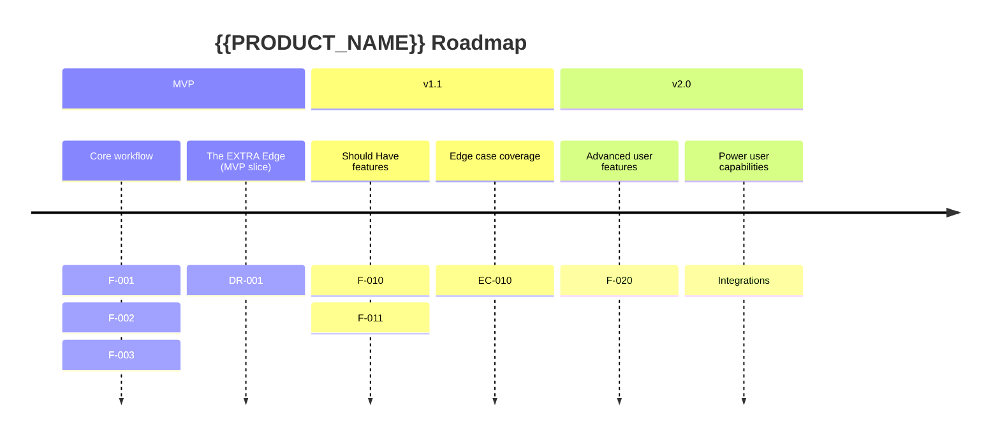

# Product Requirements Document: {{PRODUCT_NAME}}

**Version**: {{VERSION}}
**Authors**: pm_1 (Requirements Architect), pm_2 (Differentiation & Experience PM)
**CPO Approval**: {{PENDING | APPROVED — [timestamp]}}
**Brief ID**: {{BRIEF_ID}}
**Date**: {{DATE}}
**Research Sources**: {{RESEARCH_DOC_RESEARCHER_1}}, {{RESEARCH_DOC_RESEARCHER_2}}

---

## 1. Product Vision

> _One sharp sentence. Not generic. Not aspirational fluff. What this product is, who it is for, and what makes it different._

**{{PRODUCT_NAME}}** is the {{CATEGORY}} that {{SPECIFIC_VALUE_PROP}} for {{TARGET_USER}}, unlike {{COMPETITOR_CATEGORY}} which {{COMPETITOR_LIMITATION}}.

---

## 2. Problem Statement

{{PROBLEM_DESCRIPTION — 2-3 sentences: what is broken today, who suffers, why existing solutions fall short}}

**The Core Gap:**
> _{{THE_GAP — one sentence on the specific unmet need this product solves}}._

---

## 3. Target Personas

### Persona 1: {{NAME}}
- **Who they are**: {{DESCRIPTION}}
- **Context of use**: {{WHEN_WHERE_HOW}}
- **Primary goals**: {{GOALS}}
- **Frustrations with existing solutions**: {{FRUSTRATIONS}} *(source: researcher_{{N}} findings)*
- **Success looks like**: {{SPECIFIC_OUTCOME}}
- **Willingness to pay**: {{HIGH | MEDIUM | LOW}} — {{RATIONALE}}

---

### Persona 2: {{NAME}}
- **Who they are**: {{DESCRIPTION}}
- **Context of use**: {{WHEN_WHERE_HOW}}
- **Primary goals**: {{GOALS}}
- **Frustrations with existing solutions**: {{FRUSTRATIONS}} *(source: researcher_{{N}} findings)*
- **Success looks like**: {{SPECIFIC_OUTCOME}}
- **Willingness to pay**: {{HIGH | MEDIUM | LOW}} — {{RATIONALE}}

---

### Persona 3: {{NAME — Power User}}
- **Who they are**: {{DESCRIPTION}}
- **Context of use**: {{WHEN_WHERE_HOW}}
- **Primary goals**: {{GOALS — will include edge cases and advanced workflows}}
- **Frustrations with existing solutions**: {{FRUSTRATIONS}} *(source: researcher_2 edge case findings)*
- **Success looks like**: {{SPECIFIC_OUTCOME}}
- **Why they matter**: Power users define the ceiling of your product. If you serve them well, you earn the advocacy that grows the product.

---

## 4. The EXTRA Edge

> _This section is mandatory and non-negotiable. The EXTRA Edge is the competitive differentiator identified in researcher_2's findings. It must be fully specced here — not just mentioned._

**The EXTRA Edge:**
> _{{EXTRA_EDGE_STATEMENT — one sentence, sharp and specific}}_

**Why this matters:**
{{WHY_THIS_MATTERS — 2-3 sentences on the market opportunity and user impact}}

**Why competitors don't do this:**
{{WHY_COMPETITORS_DONT — evidence-based explanation}}

**How we will deliver it:**
{{HOW_WE_DELIVER — specific product approach, not vague}}

**Requirements that implement the EXTRA Edge:**
*(See Section 9 — Differentiation Requirements)*

---

## 5. Feature List — MoSCoW Prioritized

### Must Have (MVP — minimum viable product)

> _The smallest coherent set of features that delivers the core value proposition. If it's not here, the product doesn't work for its primary use case._

| # | Feature | Description | Research Source | Persona(s) |
|---|---------|-------------|----------------|-----------|
| F-001 | | | | |
| F-002 | | | | |
| F-003 | | | | |

---

### Should Have (Post-MVP — v1.1 or v2)

> _High-value features that significantly improve the product but are not blocking for initial launch validation._

| # | Feature | Description | Research Source | Persona(s) | Dependency |
|---|---------|-------------|----------------|-----------|------------|
| F-010 | | | | | |
| F-011 | | | | | |

---

### Could Have (Future Consideration)

> _Features worth knowing about but with lower ROI at this stage. Revisit based on user feedback after MVP._

| # | Feature | Description | Research Source | Persona(s) |
|---|---------|-------------|----------------|-----------|
| F-020 | | | | |

---

### Won't Have (Explicitly Out of Scope)

> _Declaring these prevents scope creep. Every item here represents a decision made._

| # | Feature | Reason for Exclusion |
|---|---------|---------------------|
| F-030 | | |
| F-031 | | |

---

## 6. MVP Definition

> _Precise. Defensible. The smallest thing that validates the core value proposition._

**The MVP is:**
{{MVP_DESCRIPTION — 2-3 sentences describing the full MVP scope}}

**MVP Feature Set:**
- F-001: {{FEATURE}}
- F-002: {{FEATURE}}
- *(Must Have features only)*

**MVP is NOT:**
- {{EXCLUSION_1}}
- {{EXCLUSION_2}}

**MVP Success Metrics:**
| Metric | Target | Measurement Method | Time to Measure |
|--------|--------|--------------------|-----------------|
| {{METRIC_1}} | | | |
| {{METRIC_2}} | | | |
| {{METRIC_3}} | | | |

---

## 7. User Stories with Acceptance Criteria

### Epic: {{EPIC_1_NAME}}
> _{{EPIC_1_DESCRIPTION}}_

---

#### US-001: {{STORY_TITLE}}
**As a** {{PERSONA}},
**I want to** {{ACTION}},
**so that** {{OUTCOME}}.

**Priority**: Must Have
**Research trace**: {{RESEARCH_FINDING_REF}}

**Acceptance Criteria:**
```
Given {{CONTEXT}},
When {{USER_ACTION}},
Then {{EXPECTED_RESULT}}.

Given {{CONTEXT}},
When {{USER_ACTION}},
Then {{EXPECTED_RESULT}}.

Given {{ERROR_CONTEXT}},
When {{ERROR_ACTION}},
Then {{ERROR_HANDLING_RESULT}}.
```

**Edge Cases Covered by This Story:**
- EC-{{N}}: {{EDGE_CASE}} → handled by: {{HOW}}

**Out of Scope for This Story:**
- {{EXCLUSION}}

---

#### US-002: {{STORY_TITLE}}
**As a** {{PERSONA}},
**I want to** {{ACTION}},
**so that** {{OUTCOME}}.

**Priority**: Must Have
**Research trace**: {{RESEARCH_FINDING_REF}}

**Acceptance Criteria:**
```
Given {{CONTEXT}},
When {{USER_ACTION}},
Then {{EXPECTED_RESULT}}.
```

---

### Epic: {{EPIC_2_NAME}}

#### US-010: {{STORY_TITLE}}
**As a** {{PERSONA}},
**I want to** {{ACTION}},
**so that** {{OUTCOME}}.

**Priority**: Should Have
**Research trace**: {{RESEARCH_FINDING_REF}}

**Acceptance Criteria:**
```
Given {{CONTEXT}},
When {{USER_ACTION}},
Then {{EXPECTED_RESULT}}.
```

---

## 8. Edge Case Requirements

> _Every edge case identified in research that falls within MVP scope must have a corresponding requirement here._

| # | Edge Case | Severity | Source | Requirement | Acceptance Criteria |
|---|-----------|----------|--------|-------------|---------------------|
| EC-001 | {{EDGE_CASE}} | Critical | researcher_{{N}} | {{REQUIREMENT}} | Given {{X}}, when {{Y}}, then {{Z}} |
| EC-002 | | High | | | |
| EC-003 | | Medium | | | |

**Post-MVP Edge Cases:**
*(Document here — addressed in Should Have or Could Have features)*

| # | Edge Case | Severity | Target Version |
|---|-----------|----------|---------------|
| EC-010 | | | v1.1 |

---

## 9. Differentiation Requirements

> _Each differentiator from research maps to specific, buildable requirements. These are not aspirational — they are specced behaviors._

### DR-001: {{DIFFERENTIATOR_NAME}} — *The EXTRA Edge*

**What it is:** {{DESCRIPTION}}
**Why it wins:** {{HOW_IT_BEATS_COMPETITORS}}
**Research basis:** {{RESEARCHER_2_FINDING_REF}}

**Requirements:**
- DR-001-A: {{SPECIFIC_REQUIREMENT}}
  - Acceptance Criteria: Given {{X}}, when {{Y}}, then {{Z}}
- DR-001-B: {{SPECIFIC_REQUIREMENT}}
  - Acceptance Criteria: Given {{X}}, when {{Y}}, then {{Z}}

---

### DR-002: {{DIFFERENTIATOR_NAME}}

**What it is:** {{DESCRIPTION}}
**Why it wins:** {{HOW_IT_BEATS_COMPETITORS}}
**Research basis:** {{RESEARCH_FINDING_REF}}

**Requirements:**
- DR-002-A: {{SPECIFIC_REQUIREMENT}}
  - Acceptance Criteria: Given {{X}}, when {{Y}}, then {{Z}}

---

## 10. Non-Functional Requirements

### Performance
| Requirement | Target | Measurement | Context |
|-------------|--------|-------------|---------|
| Page / screen load time | < {{N}}ms (p95) | {{HOW}} | {{CONTEXT}} |
| Core action response time | < {{N}}ms | | |
| Concurrent users (MVP) | {{N}} | | |

### Accessibility
- WCAG {{2.1 | 2.2}} Level {{AA | AAA}} compliance
- Keyboard navigation for all primary workflows
- Screen reader compatibility: {{SPECIFIC_REQUIREMENTS}}
- {{ADDITIONAL_ACCESSIBILITY_REQUIREMENTS}}

### Security & Privacy
- Authentication: {{METHOD}}
- Data encryption: {{AT_REST | IN_TRANSIT | BOTH}}
- PII handling: {{GDPR | CCPA | BOTH | N/A}}
- {{ADDITIONAL_SECURITY_REQUIREMENTS}}

### Reliability & Error Handling
- Uptime target: {{N}}% ({{TIMEFRAME}})
- All errors must present a human-readable message with a recovery action — no raw error codes to users
- Empty states must be designed for all data views (not blank screens)
- All destructive actions require confirmation

### Supportability
- All user-facing errors must be logged with enough context to debug
- Admin tooling required: {{YES | NO | WHICH TOOLS}}

---

## 11. Post-MVP Roadmap



| Phase | Feature(s) | Value Delivered | Persona Served | Dependency |
|-------|-----------|-----------------|---------------|------------|
| MVP | | | | None |
| v1.1 | | | | MVP complete |
| v2.0 | | | | v1.1 feedback |

---

## 12. Explicit Out-of-Scope

> _Every item here is a decision. Stating it prevents scope creep during build._

The following are **not** in scope for any phase of this product at this time:

1. **{{ITEM}}** — {{REASON}}
2. **{{ITEM}}** — {{REASON}}
3. **{{ITEM}}** — {{REASON}}

---

## Appendix A: PM Cross-Consultation Log

> _Required. The CPO will reject requirements submitted without this log._

### Topic 1: MVP Scope

| | pm_1 | pm_2 |
|---|---|---|
| **Position** | | |
| **Challenge raised** | | |
| **Evidence** | | |
| **Resolution** | | |
| **Resolution type** | | |

### Topic 2: Differentiation Requirements

| | pm_1 | pm_2 |
|---|---|---|
| **Position** | | |
| **Challenge raised** | | |
| **Evidence** | | |
| **Resolution** | | |
| **Resolution type** | | |

### Topic 3: Edge Case Priority

| | pm_1 | pm_2 |
|---|---|---|
| **Position** | | |
| **Challenge raised** | | |
| **Evidence** | | |
| **Resolution** | | |
| **Resolution type** | | |

### Topic 4: Acceptance Criteria Conflicts

| | pm_1 | pm_2 |
|---|---|---|
| **Position** | | |
| **Challenge raised** | | |
| **Evidence** | | |
| **Resolution** | | |
| **Resolution type** | | |

### Topic 5: Must Have vs. Should Have

| | pm_1 | pm_2 |
|---|---|---|
| **Position** | | |
| **Challenge raised** | | |
| **Evidence** | | |
| **Resolution** | | |
| **Resolution type** | | |

---

## Appendix B: Research Traceability Matrix

> _Required. Every requirement must trace to a research finding._

| Requirement ID | Requirement | Research Source | Researcher | Finding Summary |
|----------------|-------------|----------------|-----------|----------------|
| F-001 | | | researcher_{{N}} | |
| F-002 | | | | |
| EC-001 | | | | |
| DR-001 | | | researcher_2 | |

---

## Appendix C: CPO Cross-Consultation Log

> _Any questions raised to the CPO during requirements drafting._

| # | Question | Raised By | CPO Answer | Impact on Requirements |
|---|----------|-----------|-----------|----------------------|
| 1 | | | | |

---

*Document produced by pm_1 + pm_2 | {{DATE}} | Brief: {{BRIEF_ID}} | Revision: {{REVISION}}*
