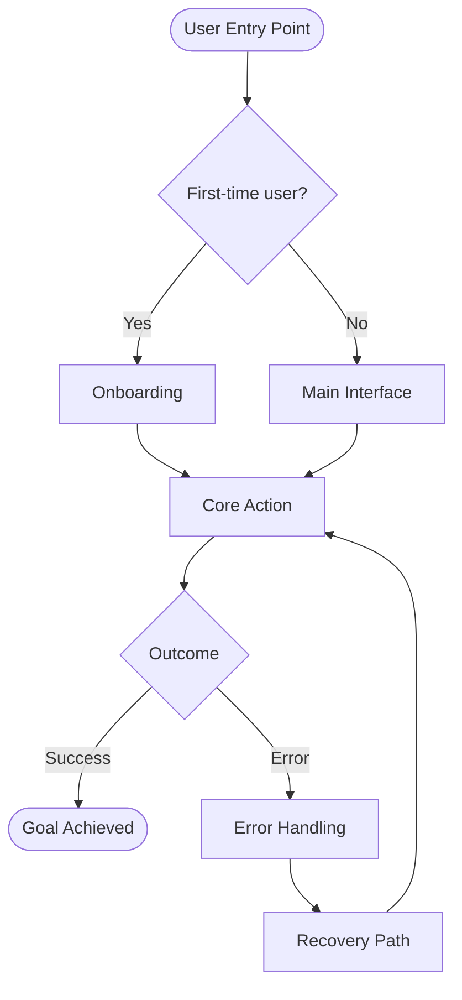
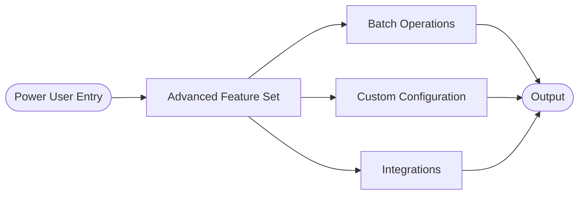
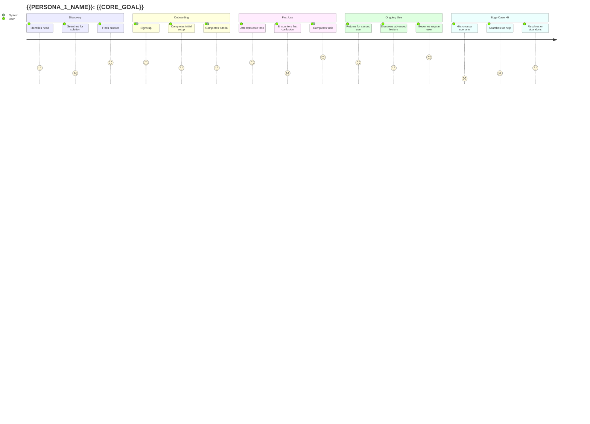
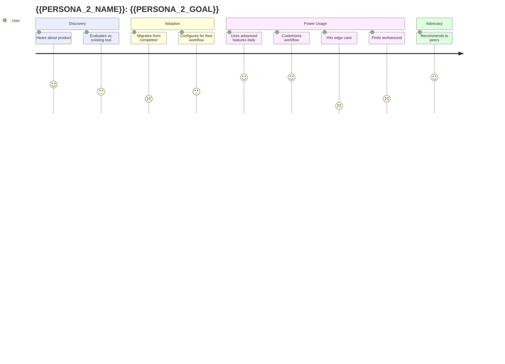
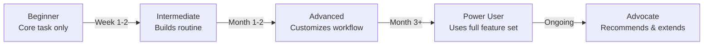

# Research Findings: {{FOCUS_AREA}}

**Product**: {{PRODUCT_NAME}}
**Researcher**: {{RESEARCHER_ID}}
**Brief ID**: {{BRIEF_ID}}
**Plan Version**: {{PLAN_VERSION}}
**Date**: {{DATE}}
**Status**: SUBMITTED

---

## 1. Executive Summary

> _3–5 sentences summarizing the key findings and their strategic implications. Lead with the most important insight._

{{EXECUTIVE_SUMMARY}}

---

## 2. Workflow Analysis
> _[researcher_1 only] Complete end-to-end workflow from first touch to task completion._

### 2.1 Core Workflow — Simple Path

> _The primary happy path: a new user completing the core task for the first time._



### 2.2 Advanced Workflow — Power User Path

> _The complete workflow for a user who has mastered the product._



### 2.3 Workflow Summary Table

| Step | Description | User Goal | Friction Points | Competitors' Approach |
|------|-------------|-----------|-----------------|----------------------|
| 1 | | | | |
| 2 | | | | |
| 3 | | | | |

---

## 3. User Journey Maps

### 3.1 Persona: {{PERSONA_1_NAME}}

> _{{PERSONA_1_DESCRIPTION}}_



**Emotional Low Points Identified:**
- {{LOW_POINT_1}}
- {{LOW_POINT_2}}

**Moments of Delight:**
- {{DELIGHT_1}}
- {{DELIGHT_2}}

---

### 3.2 Persona: {{PERSONA_2_NAME}}



---

## 4. Competitive Landscape

### 4.1 Competitor Overview

```mermaid
quadrantChart
    title Competitive Landscape: {{X_AXIS_LABEL}} vs {{Y_AXIS_LABEL}}
    x-axis Low {{X_LOW}} --> High {{X_HIGH}}
    y-axis Low {{Y_LOW}} --> High {{Y_HIGH}}
    quadrant-1 Leaders
    quadrant-2 Challengers
    quadrant-3 Niche Players
    quadrant-4 Followers
    {{COMPETITOR_1}}: [0.0, 0.0]
    {{COMPETITOR_2}}: [0.0, 0.0]
    {{COMPETITOR_3}}: [0.0, 0.0]
    Our Product (Target): [0.0, 0.0]
```

### 4.2 Competitive Workflow Comparison

| Capability | {{COMPETITOR_1}} | {{COMPETITOR_2}} | {{COMPETITOR_3}} | Gap / Opportunity |
|-----------|-----------------|-----------------|-----------------|-------------------|
| Core workflow | | | | |
| Onboarding | | | | |
| Advanced features | | | | |
| Edge case handling | | | | |
| Error recovery | | | | |
| Customization | | | | |

### 4.3 Competitive Strengths & Weaknesses

**{{COMPETITOR_1}}**
- Strengths: {{STRENGTHS}}
- Weaknesses: {{WEAKNESSES}}
- User sentiment: {{SENTIMENT}} (source: {{SOURCE}})

**{{COMPETITOR_2}}**
- Strengths: {{STRENGTHS}}
- Weaknesses: {{WEAKNESSES}}
- User sentiment: {{SENTIMENT}} (source: {{SOURCE}})

---

## 5. Progression Model
> _[researcher_1 only] How users grow from beginner to power user._



| Stage | User Behavior | Key Feature Used | Drop-off Risk | Trigger to Advance |
|-------|--------------|-----------------|---------------|-------------------|
| Beginner | | | | |
| Intermediate | | | | |
| Advanced | | | | |
| Power User | | | | |

---

## 6. Edge Cases Identified

> _All sections should document edge cases. Researcher_2 will go deeper — researcher_1 notes cases encountered during workflow analysis._

### Edge Case Severity Classification

| Severity | Definition |
|----------|-----------|
| **Critical** | Causes data loss, security issue, or complete workflow failure |
| **High** | Causes significant user frustration or task failure |
| **Medium** | Causes confusion or requires a workaround |
| **Low** | Minor inconvenience, easily worked around |

### Edge Cases Catalog

| # | Edge Case | Severity | Frequency | Competitor Handling | Recommendation |
|---|-----------|----------|-----------|--------------------|----|
| EC-001 | | | Common / Rare | | |
| EC-002 | | | | | |
| EC-003 | | | | | |

---

## 7. Differentiation Opportunities
> _[researcher_2 primary] Areas where this product can out-compete alternatives._

### 7.1 Market Gaps Analysis

| Gap | Why It Exists | User Impact | Difficulty to Fill | Opportunity Size |
|-----|--------------|-------------|-------------------|-----------------|
| | | | | |

### 7.2 The EXTRA Edge

> _The single most important insight from this research — the unique opportunity this product can own._

**The EXTRA Edge Statement:**
> _{{EXTRA_EDGE_STATEMENT}}_

**Why competitors haven't solved this:**
{{WHY_COMPETITORS_HAVENT}}

**How this product can own it:**
{{HOW_PRODUCT_CAN_OWN_IT}}

**User signal that confirms demand:**
{{USER_SIGNAL}}

---

## 8. Key Insights for Product Managers

> _Numbered list of the most actionable insights. These feed directly into requirements._

1. **{{INSIGHT_TITLE}}**: {{INSIGHT_DESCRIPTION}} — *Implication: {{IMPLICATION}}*
2. **{{INSIGHT_TITLE}}**: {{INSIGHT_DESCRIPTION}} — *Implication: {{IMPLICATION}}*
3. **{{INSIGHT_TITLE}}**: {{INSIGHT_DESCRIPTION}} — *Implication: {{IMPLICATION}}*
4. **{{INSIGHT_TITLE}}**: {{INSIGHT_DESCRIPTION}} — *Implication: {{IMPLICATION}}*
5. **{{INSIGHT_TITLE}}**: {{INSIGHT_DESCRIPTION}} — *Implication: {{IMPLICATION}}*

---

## 9. Open Questions

> _Questions research could not fully answer. Flagged for PM or CPO attention._

| # | Question | Why Unanswered | Recommended Next Step |
|---|----------|---------------|----------------------|
| OQ-001 | | | |
| OQ-002 | | | |

---

## 10. Research Methodology Notes

**Methods used:**
- {{METHOD_1}}: {{SOURCES}}
- {{METHOD_2}}: {{SOURCES}}

**Confidence levels:**
- High confidence: {{HIGH_CONF_FINDINGS}}
- Medium confidence: {{MED_CONF_FINDINGS}}
- Low confidence / assumptions: {{LOW_CONF_FINDINGS}}

---

*Document produced by {{RESEARCHER_ID}} | {{DATE}} | Brief: {{BRIEF_ID}}*
